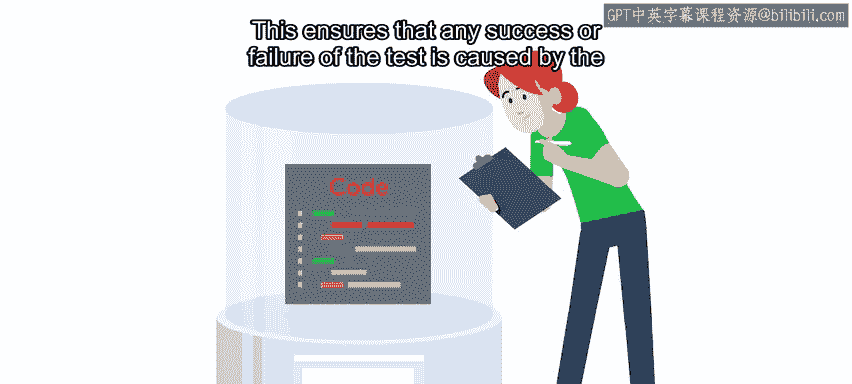
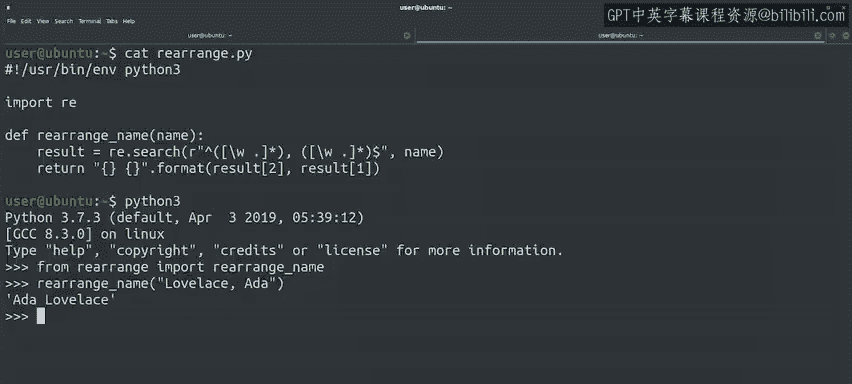

#  133：Python单元测试入门 🧪


在本节课中，我们将要学习什么是单元测试，以及为什么它在软件开发中如此重要。我们将通过一个简单的例子来理解单元测试的基本概念和编写方法。

## 什么是单元测试？

上一节我们介绍了自动测试的多种类型，本节中我们来看看其中最常用的一种：单元测试。

单元测试用于验证程序中**小型、独立**的部分是否正确。这类测试通常与代码一同编写，旨在测试如函数或方法等独立“单元”的行为。单元测试帮助开发者确保每一段代码都完成了其预期的功能。

单元测试的一个重要特性是**隔离性**。单元测试应仅测试其目标代码单元（即被测试的函数或方法）。这确保了测试的成功或失败完全由该单元的行为引起，而非由某些外部因素（如网络中断或数据库服务器无响应）导致。



换句话说，当测试一个函数或方法时，我们希望专注于检查该函数或方法中的代码行为是否正确，而不希望测试因外部原因而失败。

## 单元测试的核心原则

以下是编写单元测试时需要遵循的几个核心原则：

*   **隔离性**：测试应专注于单个代码单元，避免外部依赖。
*   **不修改生产环境**：测试绝不应修改用户交互的**生产环境**。在开发测试时，如果需要与其他软件交互，通常会在**测试环境**中进行，以便完全控制其行为。
*   **验证输入与输出**：单元测试的目标是验证程序的小型、独立部分是否正确。其核心模式可以归结为一个简单的问题：**给定一个已知的输入，我们代码的输出是否符合我们的期望？**

## 一个单元测试的实例

让我们通过一个具体的例子来理解如何实践单元测试。假设我们有一段代码，其功能是将“名, 姓”格式的名字重新排列为“姓, 名”格式。

我们将通过手动验证来开始测试：对于一个给定的输入，检查它是否产生预期的结果。

我们可以在Python解释器中导入并调用这个函数来进行检查。这里使用了一个新的关键字 `from`：

```python
from rearrange import rearrange_name
```

在这个例子中，`rearrange` 是包含 `rearrange_name` 函数的模块名。通过这种方式导入，我们可以在调用函数时不必每次都写模块名。

```python
print(rearrange_name("Lovelace, Ada"))
```

如果函数为我们提供的输入产生了预期的输出（即 `"Ada Lovelace"`），那么它就通过了这个特定的单元测试。



这个测试专注于代码中一个**小型、独立**的部分，并验证了我们对其工作方式的假设。由于测试范围被限制在一个特定的小单元内，这类测试通常运行得非常快，并且调试起来也很简单，因为导致失败的原因非常有限。

## 如何组织单元测试

为我们的代码创建单元测试，意味着需要编写一系列**测试用例**，来验证当我们输入某些参数时，能得到期望的输出。

当然，整个过程的要点在于**自动运行**这些测试，这样我们就不必每次都手动操作。在接下来的课程中，我们将讨论如何在Python中实际编写自动测试。

## 课程总结

本节课中我们一起学习了单元测试的基础知识。我们了解到单元测试是一种用于验证程序小型、独立部分正确性的自动测试方法，其核心在于**隔离性**和**输入/输出验证**。通过一个重排名字格式的简单例子，我们实践了手动测试一个函数的基本步骤，并理解了编写自动化测试用例的必要性。记住，好的单元测试是快速、独立且可重复的，它们是构建可靠软件的重要基石。