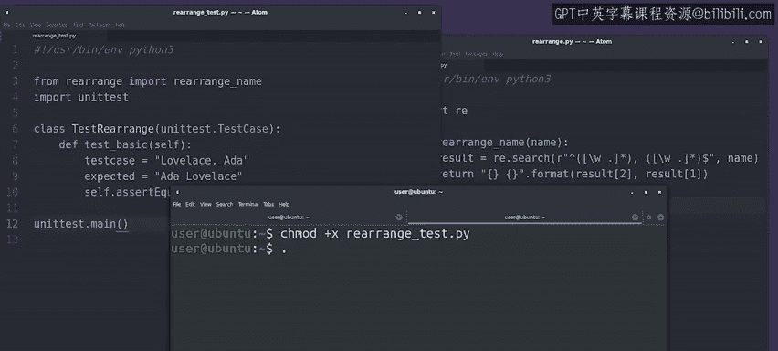

#  134：在Python中编写单元测试 🧪

## 概述

在本节课中，我们将学习如何在Python中编写自动化的单元测试。我们将了解单元测试的基本原理，并通过一个具体的例子来演示如何为Python函数创建和运行测试。

---

## 自动测试的原理

上一节我们介绍了自动测试的基本原理。我们知道，通过自动测试，我们可以根据需要多次运行测试，以确保代码按预期工作。

那么，在Python中我们如何实现这一点呢？我们需要编写一些代码来运行测试并验证输出。这样，我们就可以让计算机为我们完成工作。

为了演示测试工作流程，我们将为上一视频中的`rearrange_name`函数创建单元测试。

---

## 创建测试文件

正如之前提到的，自动测试通常与我们要测试的代码一起编写。在实践中，这意味着创建一个包含测试的单独的Python文件。

惯例是使用与要测试的模块相同的名称来命名脚本，并附加后缀`_test`。因此，对于我们的`rearrange`模块，我们将创建`rearrange_test.py`文件。

我们将测试`rearrange`模块的`rearrange_name`函数，所以让我们像之前在解释器中那样导入该函数。

---

## 使用unittest模块

现在，我们准备好开始编写测试了。为了帮助我们，Python提供了一个名为`unittest`的模块。这个模块包含许多类和方法，让我们可以轻松地为代码创建单元测试。

我们要做的第一件事是导入测试所需的`unittest`模块。`unittest`模块提供了一个`TestCase`类，其中包含许多可以直接使用的测试方法。

为了访问这些功能，我们创建自己的类，该类继承自`TestCase`，从而继承所有这些测试方法。

因此，我们将编写自己的`TestRearrange`类，该类继承自`TestCase`。你还记得语法是什么吗？我们需要将要继承的类包含在括号中。

我们称我们的测试类为`TestRearrange`，并指明它应该继承位于`unittest`模块中的`TestCase`类的功能。

我们在`TestRearrange`类中定义的任何以`test`前缀开头的方法将自动成为可以由测试框架运行的测试。

---

## 编写第一个测试用例

现在，我们准备好编写第一个测试用例了。它将是什么？在上一视频中，我们手动测试了一个简单的情况。让我们将那个手动测试转换为自动测试，以验证基本名称是否被正确格式化。

在这个我们称为`test_basic`的方法中，我们首先设置预期的输入和输出。然后，我们使用从继承的`TestCase`类提供的`assertEqual`方法来验证我们期望的结果是否与实际结果完全一致。

`assertEqual`方法基本上是说我的两个参数相等。如果该语句为真，则测试通过。如果为假，则测试失败，并在运行测试时将错误打印到屏幕上。

---

## 运行测试

好了，我们有了第一个单元测试，那么我们如何运行它呢？在程序的主要部分，我们将调用`unittest.main()`函数，它将为我们运行测试。

现在，我们准备好运行测试了。我们将通过执行刚刚创建的文件来实现这一点。

让我们使脚本可执行，然后运行它。

输出非常详细，打印了一些关于一组测试或测试套件运行时间的信息，以及测试数量和它们是否通过的信息。

就这样，我们测试了第一个函数。这很酷，对吧？我知道这里有很多内容。如果代码令人困惑、复杂或还没有真正理解，那没关系。花时间自己练习并复习内容，直到感觉自然为止。

接下来，我们将测试更多的情况。

---

## 总结

在本节课中，我们一起学习了如何在Python中编写和运行单元测试。我们了解了自动测试的基本原理，创建了测试文件，使用了`unittest`模块，编写了第一个测试用例，并成功运行了测试。通过自动测试，我们可以确保代码按预期工作，提高代码的可靠性和可维护性。