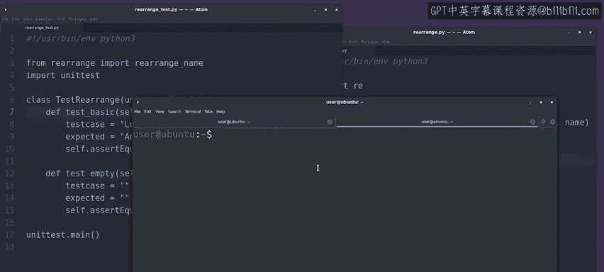
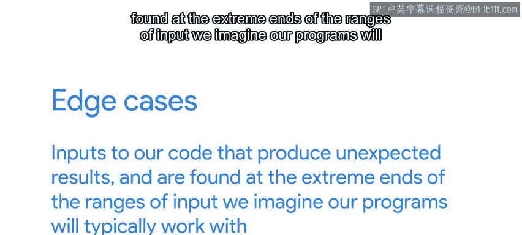
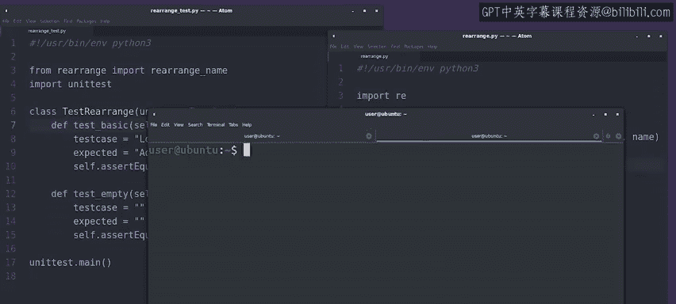

#  135：Python自动化测试与边缘案例处理 🧪


## 概述

在本节课中，我们将学习如何为Python代码编写自动测试，并重点关注如何处理“边缘案例”。边缘案例是指那些在正常操作中可能不会遇到，但会导致程序行为异常的输入。通过编写针对这些情况的测试，我们可以确保代码在各种情况下都能正确运行。

---

## 编写自动测试

上一节我们介绍了自动测试的基本概念。本节中，我们来看看如何为一个具体的函数编写测试。

我们有一个测试套件，但目前只包含一个测试用例。我们需要扩展它。选择测试用例可以锻炼创造力，思考代码可能以哪些不同方式出错，这实际上非常有趣。

我们通常会测试代码在一般情况下的工作状态。😊

但我们也应该看看，当给它一些在正常操作中可能不会遇到的输入时，会发生什么。

例如，如果给我们的函数一个空字符串，会发生什么？

让我们为此添加一个测试并看看结果。在这个案例中，我们测试的是空输入字符串。

我们期望函数在接收到空字符串时返回一个空字符串。



我们使用 `assertEqual` 函数来检查这个行为。

```python
def test_empty(self):
    self.assertEqual(rearrange_name(""), "")
```

好的，让我们运行这个测试。

---

## 发现边缘案例

运行测试后，我们的测试失败了，代码中存在问题。

让我们仔细看看失败提供的信息。毕竟，错误信息就是为此而存在的，对吧？

这个错误告诉我们名为 `test_empty` 的测试失败了，我们看到它失败的原因是 `TypeError`，提示 `None` 是不可下标的。



有趣，我们刚刚发现了一个边缘案例。

边缘案例是指那些能产生意外结果的输入，它们位于我们想象程序通常能处理的输入范围的极端末端。

---

## 处理边缘案例

边缘案例通常需要特殊处理和脚本修改，以使代码继续正确运行。

在我们的字符串重排示例中，我们可以通过在操作 `result` 变量之前执行一个简单的检查来处理这个边缘案例。

```python
def rearrange_name(name):
    result = some_operation(name)
    if result is None or result == "":
        return name
    # ... 其余处理逻辑
```

😊，经过这个修改，如果我们使用正常输入调用函数，仍然会得到之前的结果。如果我们尝试使用空字符串，我们会在检查中捕获它，并返回原始的空字符串。

是否处理这类错误取决于我们希望脚本如何表现。

在我们的具体案例中，当无法重排时，返回原始值是有意义的。

但有时，你可能更希望程序因错误而崩溃，而不是像什么都没发生一样继续运行。

请记住，自动化任务静默失败是不好的。

其他类型的边缘案例通常包括：向期望数字的函数传递零、负数或极大的数字。

在编写测试时考虑这些情况是很好的，因为它们可能导致代码崩溃或以意外方式运行。

有时，做个悲观主义者是有好处的。你可以看到，想出这些例子可能需要一些创造力。

好处是，在编写自动测试时，一旦你想出了一个例子，它就会一直存在。

---

## 验证修复

现在我们已经修复了代码，使其能正确处理这个边缘案例，让我们再次运行测试套件，看看问题是否已解决。

是的，我们的测试通过了。我们修复了代码中的一个错误。通过添加自动测试，我们可以确保它不会再发生。



你能想到我们可能想添加到测试套件中的其他测试用例吗？我们将在下一个视频中探讨更多案例。😊

---

## 总结

本节课中，我们一起学习了如何为Python代码扩展自动测试套件，特别是如何识别和处理边缘案例。我们了解到，边缘案例是位于预期输入范围极端的输入，可能导致意外行为。通过编写针对这些特殊情况的测试，并在代码中添加适当的检查，我们可以使程序更加健壮和可靠。记住，良好的测试习惯是确保自动化脚本长期稳定运行的关键。