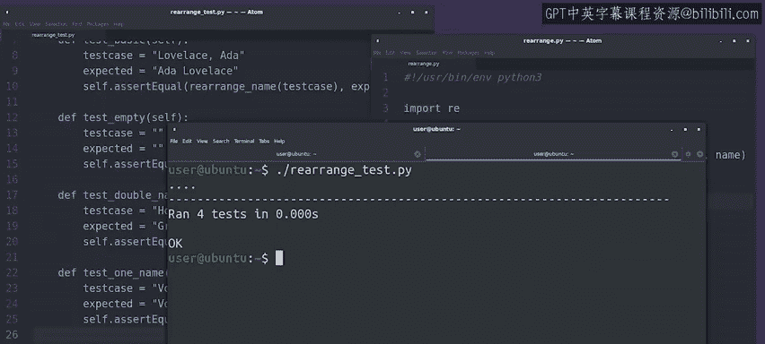

#  136：其他测试案例 🧪

## 概述

在本节课中，我们将学习如何为Python函数设计更多测试案例，以发现并修复潜在的错误。我们将通过实际例子，演示如何逐步完善测试套件，确保代码在各种情况下都能正确运行。

---

## 回顾与引入

上一节我们介绍了如何为函数添加基础案例和边界案例。本节中，我们来看看如何通过更多测试案例进一步验证代码的健壮性。

目前，我们的测试套件已包含一个基础案例和一个边界案例。添加边界案例时，由于函数未正确处理该情况，导致错误产生。我们随后修复了函数。现在，你能想到其他可能导致函数行为异常的例子吗？

## 添加更多测试案例

记得最初编写函数时，我们遇到了包含空格或点的姓名，这会导致正则表达式无法匹配。虽然我们已经修复了这个问题，但添加测试案例来确保代码按预期工作仍然是个好主意。

以下是测试案例：验证包含多个名字的人名是否仍能被正确重排。

运行测试套件，检查是否通过。

现在我们有了三个测试，且全部通过。为了发现更多错误，我们需要发挥创造力，思考其他可能导致代码失败的例子。

## 处理单名情况

考虑只有单个名字的情况。此时，字符串中没有逗号。我们期望函数返回与输入相同的名字。这会正常工作吗？

检查并找出答案。糟糕，这个测试失败了，对Voltaire来说是个坏消息。

这次的测试输出与之前略有不同。它显示了失败的测试名称，即“test_one_name”。但现在，我们看到的不是类型错误，而是断言错误，这意味着原始值与期望值不匹配。

看起来我们的函数返回了一个空字符串，而不是原始名字。这是因为代码中存在一个错误。

## 修复错误

当代码中出现错误时，我们该怎么办？我们修复它。

当我们检查结果是否为`None`时，我们返回了一个空字符串，这使得之前的测试通过。现在的情况是，我们传入了一个不包含逗号的名字，这导致`result`变量为`None`，因此函数返回了空字符串。

修复方法很简单。当`result`为`None`时，我们不返回空字符串，而是返回原始的`name`变量。这样应该就足够了吧？

保存更改，再次运行测试套件。

## 验证修复

太好了，我们修复了所有错误，所有测试都通过了。

在套件中运行测试的一个巨大好处是，我们现在知道所有编写的测试案例都得到了正确处理。我们的代码适用于基础名字、空字符串、双名和单名。

如果发现另一个导致测试失败的情况，我们可以将其添加到套件中，修复错误，然后再次运行整个套件，确保所有其他案例仍然正常工作。

## 总结

本节课中，我们一起学习了如何通过设计多样化的测试案例来完善Python函数的测试套件。我们探讨了如何处理单名情况，并修复了由此发现的错误。通过不断添加和运行测试，我们可以确保代码在各种边缘情况下都能可靠运行。

---

## 后续内容

接下来，我们将提供一份小抄，包含编写单元测试的所有语法，以及更多可能有用的信息指针。之后，你将有机会自己编写一些有趣的测试。