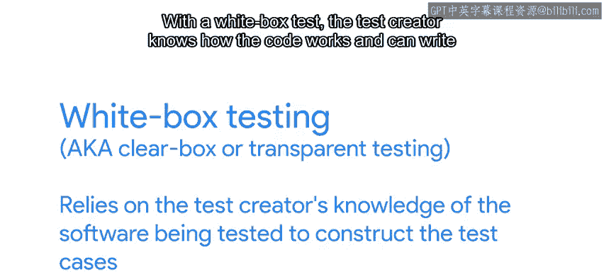
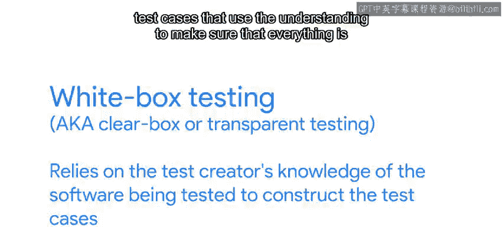
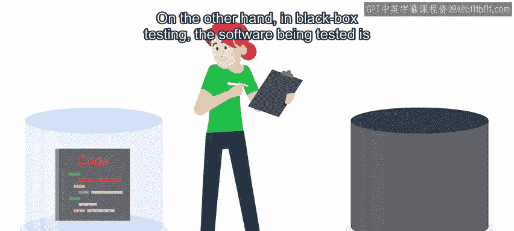
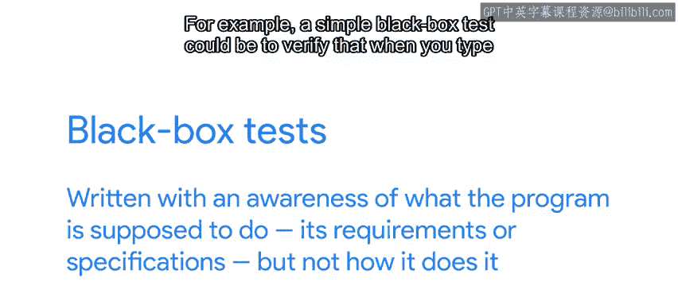

#  137：软件测试基础 - 黑盒测试与白盒测试 🧪

在本节课中，我们将要学习软件测试中的两个核心概念：黑盒测试与白盒测试。我们将了解它们的定义、区别、各自的优缺点以及在实际场景中的应用方式。

---

为了确保软件的行为符合预期，我们可以使用多种不同的测试方法。我们已经详细探讨了单元测试，这是一种编写简单且能有效发现缺陷的强大方法。但软件测试的范畴远不止于此。一个有趣的概念是区分我们的测试属于白盒测试还是黑盒测试。

白盒测试，有时也被称为透明盒测试或玻璃盒测试，依赖于测试创建者对被测软件内部结构的了解来构建测试用例。

在进行白盒测试时，测试创建者知晓代码的工作原理，并可以利用这种理解来编写测试用例，以确保所有功能都按预期执行。

另一方面，在黑盒测试中，被测软件被当作一个不透明的黑盒来对待。

换句话说，测试者不了解软件内部的工作机制。黑盒测试是基于程序应该做什么（即其需求或规格说明）来编写的，而不是基于它如何实现这些功能。

例如，一个简单的黑盒测试可以是验证当你在浏览器中输入 `www.google.de` 时，返回的是谷歌的德国搜索页面。你可能不知道谷歌服务器如何处理你的请求，但你知道最终结果应该是什么。

白盒测试和黑盒测试各有其优势。白盒测试很有帮助，因为测试编写者可以利用对源代码的了解，创建覆盖程序大多数行为方式的测试。黑盒测试则很有用，因为它们不依赖于对系统工作原理的了解。这意味着它们的测试用例不太可能受到代码本身的偏见影响，通常能覆盖到原始脚本编写者未预料到的情况。

并非我们编写的所有测试都必须严格归入某一类别。我们可以编写属于白盒或黑盒的单元测试，这取决于所选择的测试方法。

以下是两种单元测试的区分方式：

*   **黑盒单元测试**：如果在编写任何代码之前，仅根据代码应该实现的功能规格说明来创建单元测试，那么这些测试可以被视为黑盒单元测试。
*   **白盒单元测试**：如果单元测试是在代码开发过程中或之后编写的，并且测试用例的创建基于对软件工作原理的了解，那么它们就是白盒测试。

没有一种方法绝对优于另一种，因为每种方法都为你提供了不同的途径来使代码更可靠。并非所有事物都如此非黑即白，或者用编程世界的话说，并非都是二元的。

作为一名IT专家，你可能需要测试他人运行的软件是否符合你的预期。为此，你可以结合使用黑盒测试和白盒测试。

假设你有一个公司销售产品的在线目录。你可以设计一个黑盒测试，验证当你打开某个特定产品的页面时，该产品的详细信息会正确显示。除此之外，你还可以设计一个白盒测试，直接调用该页面使用的不同函数，检查价格是否以正确的货币显示、描述文本是否正确换行等等。

---

本节课中我们一起学习了黑盒测试与白盒测试的核心概念。我们明确了白盒测试基于对代码内部结构的了解，而黑盒测试则只关注输入与输出是否符合规格。两者在确保软件质量方面扮演着互补的角色，结合使用能更全面地验证系统的可靠性。