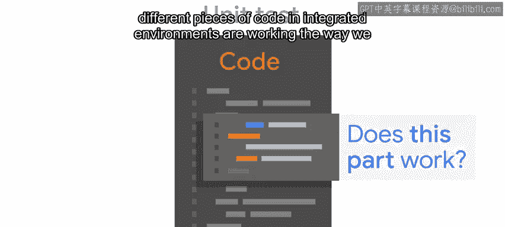
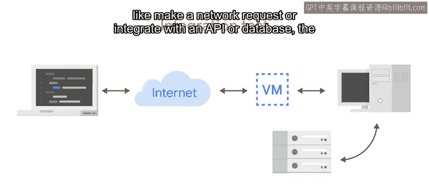
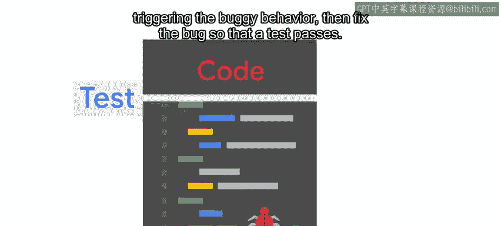
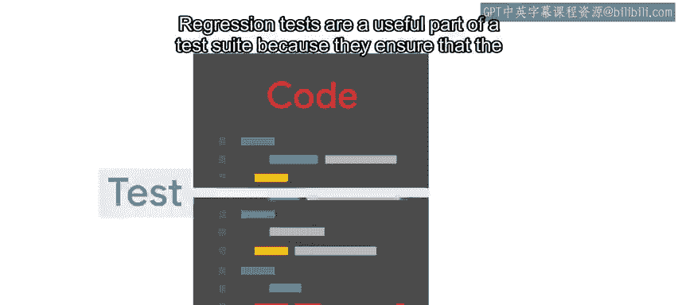
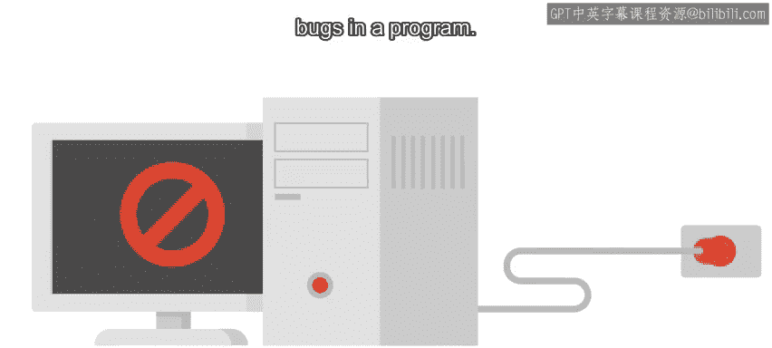
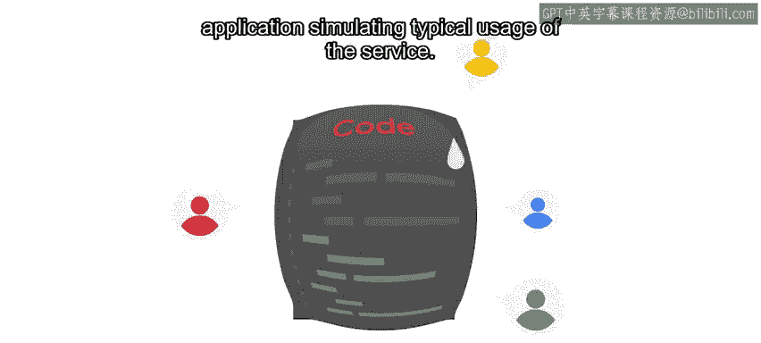

#  138：其他测试类型 🧪

## 概述

在本节课中，我们将要学习单元测试之外的几种常见软件测试类型。我们将探讨集成测试、回归测试、冒烟测试和负载测试，了解它们各自的目的、应用场景以及如何帮助我们构建更健壮的自动化脚本和系统。

---

上一节我们介绍了单元测试，它专注于验证单个函数或方法的预期功能。本节中我们来看看其他几种重要的测试类型，它们从不同层面确保软件质量。

## 集成测试 🔗

集成测试用于验证不同代码模块之间，以及代码与集成环境（如数据库、API）的交互是否按预期工作。

与单元测试不应跨越边界（如发起网络请求）不同，集成测试的目标正是验证这类交互，并确保整个系统协同工作。

集成测试通常将单元测试验证过的独立代码模块组合成组进行测试。根据程序功能及其与相关系统的交互方式，我们可能需要为测试创建一个独立的测试环境，运行待验证软件的测试版本。

如果代码不会对生产环境做出任何更改，我们也可以针对正在运行的系统实际版本运行测试。但通常，为集成测试搭建一个可控的测试环境是更安全的做法。

当公司部署一个较为复杂的系统时，进行集成测试有助于确保所有部分都能按预期组合在一起。

以下是集成测试的一些关键点：
*   设置集成测试通常需要更多工作，因为需要确保拥有所有相关系统的测试版本。
*   集成测试有助于发现单元测试无法检测到的问题，因此额外的努力是值得的。
*   例如，如果要测试的服务与数据库交互，就应该设置一个单独的测试数据库，包含测试用户和测试表。这允许我们在一个可控的环境中运行所有需要的测试，而不会冒险修改生产数据库。

## 回归测试 🔄

回归测试是单元测试的一种变体，通常作为调试和故障排除过程的一部分编写，用于在问题被识别后验证其是否已被修复。

假设我们的脚本存在一个错误，我们正在尝试修复它。一个好的方法是：首先编写一个通过触发错误行为而失败的测试，然后修复错误，使测试通过。

回归测试是测试套件中有用的一部分，因为它们确保相同的错误不会发生两次。同一个错误不能被重新引入代码中，因为引入它会导致回归测试失败。

## 冒烟测试 💨

冒烟测试，有时称为构建验证测试，其名称来源于硬件设备测试中的一个概念：接通给定的硬件设备，看看是否有烟冒出来。

在编写软件时，冒烟测试作为一种健全性检查，用于发现程序中的重大错误。

冒烟测试回答一些基本问题，例如：“程序能运行吗？”这类测试通常在更精细的测试之前进行，因为如果软件连冒烟测试都失败了，基本可以确定其他测试也不会通过。正如俗话所说：“无风不起浪”。

以下是冒烟测试的应用示例：
*   对于Web服务，冒烟测试是检查相应端口上是否有服务在运行。
*   对于自动化脚本，冒烟测试是使用一些基本输入手动运行它，并检查脚本是否成功完成。

## 负载测试 ⚖️

另一种测试类型是负载测试。这些测试验证系统在承受显著负载时的行为表现。要实际执行这些测试，我们需要为应用程序生成流量，模拟服务的典型使用情况。

在部署新版本的应用程序时，负载测试非常有助于验证性能是否没有下降。

例如，我们可能希望在网页每秒收到100个、1000个甚至10,000个请求时，测量网站的响应时间。具体的数字取决于我们对网站将接收多少流量的预期。

## 测试套件 📚

综合来看，一组一种或多种类型的测试通常被称为**测试套件**。多样化的测试类型可以创建一个更健壮的测试套件，有助于确保你的脚本和自动化程序按你的指令执行。

## 总结

本节课中我们一起学习了除单元测试外的几种重要测试类型：**集成测试**验证模块间交互，**回归测试**防止已修复错误复发，**冒烟测试**进行快速健康检查，而**负载测试**评估系统在高压力下的性能。将这些测试组合成**测试套件**，能全方位保障代码质量。软件测试领域还有许多其他类型的测试，我们只触及了最常见的几种。如果你有兴趣了解更多关于软件可能出错的方式以及如何测试，有很多相关的书籍和文章可供参考。

说到测试，我们即将面临一个巨大而困难的测试……开个玩笑。接下来，我们将学习一种称为“测试驱动开发”的技术。