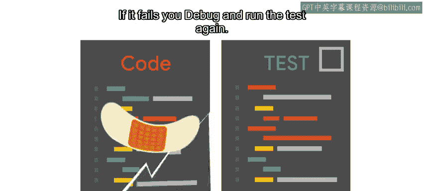
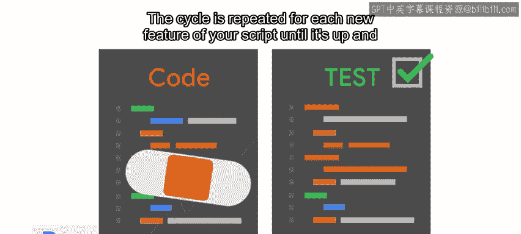

#  139：测试驱动开发 (TDD) 🧪

## 概述

在本节课中，我们将要学习一种名为“测试驱动开发”的编程方法。这种方法强调在编写实际功能代码之前，先编写测试代码。我们将了解其基本流程、优势以及它如何帮助我们编写出更健壮、更可靠的程序。

---

你可能会认为，大多数测试发生在代码编写完成之后。这似乎是一个自然的流程：首先编写脚本，然后编写测试来验证脚本是否按预期工作。

但这并不总是最佳方法。一个称为“测试驱动开发”的过程，要求在编写代码之前先创建测试。这听起来可能有点违反直觉，但它能促使我们编写出更周密、更完善的程序。

当遇到一个可以通过自动化解决的新问题时，你的本能反应可能是打开代码编辑器并开始编写。然而，先创建一些测试，可以确保你已经深入思考了要解决的问题，以及可能用来解决它的不同方法。

先编写测试还有助于你思考程序可能失败和崩溃的方式，这可以带来一些有价值的见解，甚至可能促使你采用更好的方法。

## 测试驱动开发循环 🔄

上一节我们介绍了测试驱动开发的基本理念，本节中我们来看看它的具体实施循环。

测试驱动开发循环通常包括以下步骤：

以下是TDD循环的核心步骤：

1.  **编写测试**：首先为一个新功能编写一个测试，并运行它以确认它会失败（因为功能尚未实现）。
2.  **运行测试（确认失败）**：验证测试确实失败了。这是关键一步，确保测试是有效的。
3.  **编写代码**：编写最少量的、能使该测试通过的代码。
4.  **再次运行测试**：运行测试。如果通过，则进入下一个功能；如果失败，则调试代码并重复此步骤。

这个循环会为脚本的每个新功能重复进行，直到整个程序完成并运行。

因此，在编写下一个Python程序之前，你可能需要思考可以创建哪些测试来确保它按预期工作。

## 延伸学习与总结 📚

上一节我们介绍了TDD的具体操作循环，本节中我们来看看它的更广泛应用和本课程的总结。

如果你想了解更多关于如何使用测试驱动开发方法创建代码的信息，外面有各种各样的资源。其中很多都以Python为中心，但其原理可以应用于你需要使用的任何语言。

希望你已经看到了编写测试来验证代码的好处，并对不同的可用测试技术有了一些了解。请记住，好的测试有助于使你编写的任何自动化和脚本更加健壮、更具弹性且错误更少。拥有可靠的自动化会让每个人的工作更轻松。

许多公司将测试更进一步，将其与版本控制系统和开发流程相结合。当工程师提交代码时，代码会被集成到主代码库中，并通过一个称为“持续集成”的过程自动运行测试以发现错误。虽然很有用，但建立持续集成流程可能是一项艰巨的任务。我们将在后续课程中更多地讨论它。

同时，如果你使用单元测试来验证你编写的代码，那么你已经走在通往更可靠、更健壮的自动化道路上了。

---

## 本节课总结

本节课中我们一起学习了测试驱动开发。我们了解到TDD是一种先写测试、后写代码的开发模式，其核心循环是“红-绿-重构”（即：写失败测试->写代码使测试通过->优化代码）。这种方法能促使我们更深入地思考问题设计，提前发现潜在缺陷，从而编写出质量更高的程序。记住，可靠的测试是构建健壮自动化系统的基石。