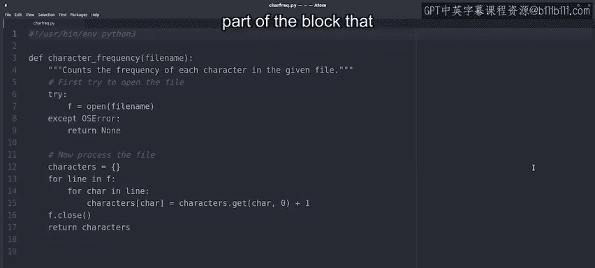
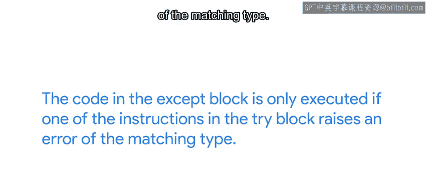

#  140：Python中的try-except结构 🛡️


在本节课中，我们将要学习Python中的`try-except`结构。这是一种强大的错误处理机制，它允许我们的程序在遇到错误时不会立即崩溃，而是能够优雅地处理这些异常情况，并继续执行后续的代码。

## 概述

在我们学习Python的旅程中，已经多次遇到过解释器生成的错误。我们见过`TypeError`、`IndexError`、`ValueError`等错误类型。到目前为止，每当解释器抛出这些错误时，我们通常的做法是修改代码来避免错误。这是一种常见的方法，因为一旦解释器引发错误，程序就会停止运行。而我们不希望脚本在完成其工作之前就结束。

有时，我们可以通过条件判断来轻松地进行验证以避免错误。例如，在我们之前重排姓名函数的例子中，我们检查正则表达式搜索的结果是否为`None`，并在该情况下执行不同的操作。

然而，在其他时候，可能出错的情况太多，以至于检查所有情况变得非常具有挑战性。例如，假设你有一个函数，它打开一个文件并对其进行一些处理。如果文件不存在怎么办？如果用户没有读取文件的权限怎么办？或者如果文件被另一个进程锁定而无法立即打开怎么办？我们可以检查所有这些条件，但如果还有另一个原因导致`open`函数引发错误呢？在这种情况下，更好的方法是使用`try-except`结构。

## `try-except`结构的工作原理

让我们通过一个例子来看看它是如何工作的。下面的`character_frequency`函数读取文件内容，以计算其中每个字符的出现频率。为此，第一步是打开文件。

```python
def character_frequency(filename):
    try:
        f = open(filename)
    except OSError:
        return None
    # ... 后续处理文件的代码
```

在这个例子中，我们把调用`open`函数的语句放在了一个`try-except`代码块中。它的工作原理是：首先，尝试执行我们想要的操作，即打开文件。如果出现错误，程序就会进入与该错误匹配的`except`部分，并执行任何必要的清理操作。这里我们只有一个针对`OSError`错误类型的`except`块，但如果被调用的函数可能引发其他类型的错误，也可以有更多的`except`块。

因此，在编写`try-except`块时，需要记住的重要一点是：只有当`try`块中的某条指令引发了匹配类型的错误时，`except`块中的代码才会被执行。

## 错误处理策略





在这个例子中，在`except`块中，我们返回`None`，以向调用代码表明该函数无法完成请求的任务。当某些操作失败时返回`None`是一种常见的模式，但并非唯一的方法。

我们也可以决定将变量设置为某个基础值，例如数字设为`0`，字符串设为空字符串`""`，列表设为空列表`[]`等等。这完全取决于我们的函数做什么，以及我们需要什么来完成这项工作。

关键点是，当我们有一个可能引发错误的操作时，我们希望使用`try-except`块来优雅地处理这种失败。这个操作可能是打开文件、将值转换为不同的格式、执行系统命令、通过网络发送数据，或者是任何其他可能失败且不易用条件判断来检查的操作。

## 使用`try-except`的注意事项

要使用`try-except`块，我们需要了解我们调用的函数可能引发哪些错误。这些信息通常是函数文档的一部分。一旦我们知道了这些，我们就可以把可能引发错误的操作作为`try`块的一部分，而把错误引发时要采取的行动作为相应`except`块的一部分。

你可能会问自己：我如何引发自己的错误呢？幸运的是，这正是我们接下来要学习的内容。我们将深入探讨如何在必要时引发我们自己的错误。

## 总结

本节课中，我们一起学习了Python中的`try-except`结构。我们了解到，这是一种处理程序运行时可能发生的异常情况的强大工具。通过将可能出错的代码放在`try`块中，并在`except`块中定义错误发生时的处理逻辑，我们可以使程序更加健壮，避免因未处理的错误而意外终止。我们还讨论了不同的错误处理策略，例如返回`None`或默认值。最后，我们提到了了解函数可能引发的错误类型对于正确使用`try-except`结构至关重要。在下一课中，我们将学习如何主动引发自定义的错误。