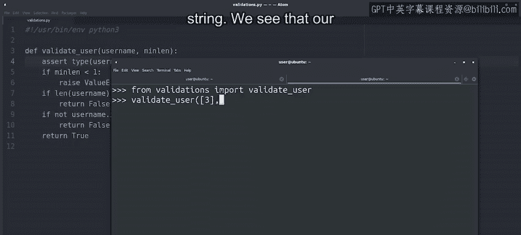

#  141：引发错误 🚨


在本节课中，我们将学习如何在Python中主动引发错误。我们将探讨为什么需要这样做，以及如何使用`raise`和`assert`关键字来确保代码的健壮性。

---

## 概述

在上一节视频中，我们学习了如何处理由被调用函数引发的错误。本节中，我们将探讨在何种情况下需要我们自己主动引发错误，以及如何实现。

---

## 为何需要主动引发错误？

当函数执行所需的条件未满足，且返回`None`或其他基础值不足以表达问题时，我们可能需要主动引发错误。

让我们通过一个例子来理解这一点。

---

## 示例：验证用户名

假设我们有一个函数，用于验证所选用户名是否有效。该函数的一个检查是确保提供的用户名长度至少达到某个最小值，该最小值通过参数接收。

以下是该函数的初始代码：

```python
def validate_user(username, min_len):
    if len(username) < min_len:
        return False
    if not username.isalnum():
        return False
    return True
```

只要提供的值是合理的，这段代码就能正常工作。

---

## 参数检查的必要性

如果`min_len`变量是0或负数，会发生什么？我们的函数将允许空用户名通过验证，这显然不合理。

为了防止这种情况，我们可以在函数中添加额外的检查，以确保接收到的参数是合理的。

在这种情况下，返回`False`会产生误导，因为问题可能不是用户名无效，而是提供的`min_len`值不合理。

因此，我们添加一个检查，确保`min_len`至少为1，否则引发错误。

---

## 使用`raise`关键字引发错误

在Python中，引发错误的关键字是`raise`。我们可以引发Python内置的各种错误，如果标准错误类型不够用，也可以创建自定义错误。

在本例中，我们引发一个`ValueError`，这是一种我们之前遇到过的错误类型，用于指示参数值存在问题。

更新后的代码如下：

```python
def validate_user(username, min_len):
    if min_len < 1:
        raise ValueError("min_len must be at least 1")
    if len(username) < min_len:
        return False
    if not username.isalnum():
        return False
    return True
```

让我们在解释器中测试这段代码。

```python
>>> validate_user("user", 0)
Traceback (most recent call last):
  File "<stdin>", line 1, in <module>
  File "<stdin>", line 3, in validate_user
ValueError: min_len must be at least 1
```

成功！我们的函数按预期引发了错误。

---

## 测试有效参数

现在，让我们用有效参数调用函数，看看是否正常工作。

```python
>>> validate_user("user", 3)
True
>>> validate_user("u", 3)
False
```

一切正常。

---

## 处理非字符串参数

如果我们传递的不是字符串作为用户名，会发生什么？让我们尝试几个例子。

首先，尝试传递一个数字：

```python
>>> validate_user(123, 1)
Traceback (most recent call last):
  File "<stdin>", line 1, in <module>
  File "<stdin>", line 5, in validate_user
TypeError: object of type 'int' has no len()
```

Python解释器引发了错误，因为我们的代码尝试使用`len()`函数，而整数没有长度属性。

接下来，尝试传递一个列表（列表有长度属性）：

```python
>>> validate_user([], 1)
False
>>> validate_user(["item"], 1)
Traceback (most recent call last):
  File "<stdin>", line 1, in <module>
  File "<stdin>", line 7, in validate_user
AttributeError: 'list' object has no attribute 'isalnum'
```

我们得到了不同的错误，因为列表没有`isalnum`方法。

---

## 使用`assert`进行断言检查

`assert`关键字用于验证条件表达式是否为真。如果为假，它将引发一个带有指定消息的`AssertionError`。

我们可以在函数中添加断言，以确保接收到的参数类型正确。

更新后的代码如下：



```python
def validate_user(username, min_len):
    assert type(username) == str, "username must be a string"
    if min_len < 1:
        raise ValueError("min_len must be at least 1")
    if len(username) < min_len:
        return False
    if not username.isalnum():
        return False
    return True
```

现在，如果函数被调用时`username`参数不是字符串，将引发一个带有我们提供消息的错误。

让我们测试一下：

```python
>>> validate_user([], 1)
Traceback (most recent call last):
  File "<stdin>", line 1, in <module>
  File "<stdin>", line 3, in validate_user
AssertionError: username must be a string
```

我们的函数现在会在第一个参数不是字符串时引发`AssertionError`。

---

## `raise`与`assert`的使用场景

通常，我们不需要检查参数的类型。根据函数的功能，允许使用不同类型的参数调用函数可能是完全可以接受的。

断言在调试代码时非常有用，我们可以将其添加到任何我们希望确保变量包含应有值和类型的地方，或者当我们认为不应该发生的事情正在发生时。

但请注意，如果我们要求解释器优化代码以运行更快，断言将从代码中移除。

因此，作为一般规则：
* 使用`raise`来检查在代码正常执行期间预期会发生的情况。
* 使用`assert`来验证不应发生但可能导致代码行为异常的情况。

---

## 总结

在本节课中，我们一起学习了如何在Python中主动引发错误。我们探讨了使用`raise`关键字来引发内置或自定义错误，以及使用`assert`关键字进行断言检查。我们还讨论了这两种方法的使用场景和区别。

通过掌握这些技能，我们可以编写更健壮、更可靠的代码，确保在异常情况下能够给出清晰的错误提示。

---

接下来，我们将学习如何添加测试，以验证我们的函数是否按需引发错误。