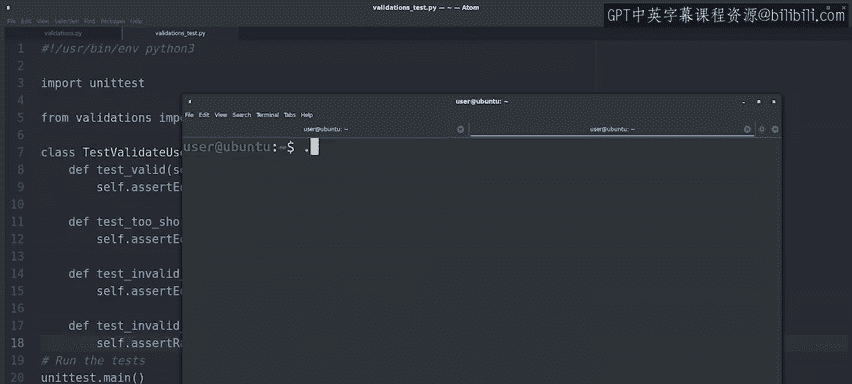

#  142：测试预期错误 🧪

在本节课中，我们将学习如何为函数编写单元测试，特别是如何测试那些在特定情况下**预期会引发错误**的代码。我们将使用Python的`unittest`模块中的`assertRaises`方法来实现这一目标。

---

在之前的视频中，我们探讨了如何为函数创建单元测试，涵盖了基本情况和边界情况。

我们强调应尝试覆盖多种不同的可能情况，以确保函数在所有情况下都能正确运行。

对于某些边界情况，例如我们之前示例中`minlen`参数为负值的情况，预期函数会引发一个错误，我们也需要能够测试这种情况。

那么，我们该如何做呢？答案是使用`unittest`模块提供的`assertRaises`方法。

让我们通过为`validate_user`函数的测试套件添加几个测试用例来具体看看。

以下是现有的测试套件。可以看到，我们已经有一些测试用例，用于检查函数在接收有效参数时是否正常工作。

现在，我们想添加一些其他用例，用于测试函数接收无意义参数（如`minlen`为负值，或`username`是列表而非字符串）时的情况。现在就开始吧。

我们可以看到，`assertRaises`方法的工作方式与我们之前使用的`assertEqual`方法略有不同。

在这种情况下，我们需要首先传入我们预期函数会引发的**错误类型**，然后是**函数名**，以及需要传递给该函数的任何参数。

在幕后，此方法使用`try-except`块调用我们想要测试的函数，并检查它是否确实引发了我们所声明的错误。

好的，让我们运行这个测试套件，验证我们的代码是否正确工作。

---

所有测试都通过了。现在，你已经知道如何测试代码以验证其行为是否符合预期，以及如何测试它在预期情况下是否会引发正确的错误。

课程提供了一个速查表，涵盖了我们在这些视频中看到的所有错误处理语法，随后是另一个让你测试技能的机会。

---

## 总结

本节课中，我们一起学习了如何使用`unittest`模块中的`assertRaises`方法来测试函数在特定输入下是否会按预期引发错误。这是编写健壮单元测试、确保代码在边界和无效情况下也能妥善处理的重要部分。