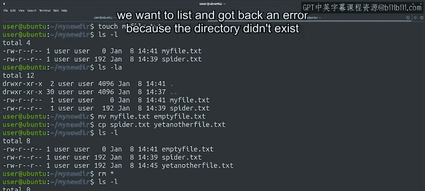

#  145：基本 Linux 命令 🐧


在本节课中，我们将学习一系列在 Linux 操作系统中用于操作文件和目录的基本命令。这些命令是进行系统管理和自动化任务的基础。

我们已经使用过一些 Linux 命令。希望这些命令对你来说并不陌生。

你可能记得，`echo` 是用于向屏幕打印消息的命令。`cat` 是用于显示文件内容的命令。`ls` 是用于列出目录内容的命令。`chmod` 是用于更改文件权限的命令，等等。

正如之前提到的，许多这些命令源自 Unix。在 70 年代设计这些程序的行为方式时，其理念是每个程序应专注于一件事并将其做到极致。这意味着我们拥有许多命令，每个命令都用于执行特定的任务。

我们将快速浏览这些命令，但和往常一样，之后会提供一个速查表供你参考。你有充足的时间来复习这些命令并进行自主练习。

那么，让我们开始吧。

## 创建和导航目录

要创建一个新目录，我们使用 `mkdir` 命令。

```bash
mkdir new_directory
```

要切换到该目录，我们使用 `cd` 命令。

```bash
cd new_directory
```

你可能会注意到，这些命令成功执行后不会向屏幕打印任何内容。这是正常且预期的。我们使用的许多命令在成功时不会打印任何内容，只有在失败时才会打印信息。

要验证 `cd` 命令是否成功，我们可以使用 `pwd` 命令来打印当前工作目录。

```bash
pwd
```

## 操作文件

现在，我们有了一个空目录。我们可以使用 `cp` 命令来复制文件。例如，我们可以复制父目录中的 `spider.txt` 文件。

```bash
cp ../spider.txt .
```

等等，那些点是什么？这些是我们可以用来引用一些特殊目录的快捷方式。

*   `..` 快捷方式代表父目录（上一级目录）的绝对路径。
*   `.` 快捷方式代表当前目录。

因此，上面这个命令是将位于上一级目录的 `spider.txt` 文件复制到当前目录。明白了吗？

我们还可以使用 `touch` 命令创建一个空文件。

```bash
touch myfile.txt
```

至此，我们的目录中有两个文件：我们复制的 `spider.txt` 文件，以及我们使用 `touch` 命令创建的 `myfile.txt` 文件。

## 查看目录详情

让我们使用 `ls -l` 命令查看目录的内容。

```bash
ls -l
```

很好，我们现在通过使用 `-l` 命令行参数调用了 `ls` 命令。记住，命令行参数允许我们改变命令的行为，使其执行我们想要的操作。

不带任何参数时，`ls` 只会列出目录中包含的文件名。通过传递 `-l` 参数，我们获得了分布在多列中的大量额外信息。

小测验时间。这些列分别代表什么？

以下是各列的含义：
*   第一列表示文件的权限。
*   第二列是指向该文件的 inode 数量。
*   第三列和第四列表示文件的所有者和所属组。
*   接着是文件的大小、最后修改日期，最后是文件名。

在我们的例子中，我们有一个复制的文件，大小为 192 字节，以及另一个使用 `touch` 命令创建的文件，大小为 0 字节。

让我们通过调用 `ls -la` 来查看另一个 `ls` 命令行参数。

```bash
ls -la
```

`-a` 标志用于显示隐藏文件，即以点开头的文件。在本例中，唯一的隐藏文件就是我们之前提到的快捷方式：代表当前目录的 `.` 和代表父目录的 `..`。这些目录的大小与其中包含的文件数量有关。

## 重命名、移动和删除文件

要重命名或移动文件，我们使用 `mv` 命令。要复制文件，我们使用之前提到的 `cp` 命令。

```bash
mv myfile.txt emptyfile.txt
cp spider.txt spider_copy.txt
```

我们现在已将 `myfile.txt` 重命名为 `emptyfile.txt`，并创建了 `spider.txt` 文件的一个新副本。这些命令都使用相同的格式：第一个参数是旧文件，第二个参数是新文件。

让我们现在查看目录的内容。

```bash
ls -l
```

我们看到现在有两个大小为 192 字节的文件副本，并且空文件现在名为 `emptyfile.txt`。

要删除这些文件，我们可以使用 `rm` 命令。我们可以逐个删除，也可以使用星号 `*` 一起删除。

```bash
rm spider.txt spider_copy.txt emptyfile.txt
# 或者
rm *
```

星号 `*` 是一个占位符，会被我们目录中所有文件的名称替换。所以我们的目录再次变空了。

## 删除目录

现在让我们删除这个目录。首先，我们需要切换到上一级目录。我们使用 `cd ..` 来实现。再次强调，`..` 是我们用来标识上一级目录的方式。

```bash
cd ..
```

现在，我们可以使用 `rmdir` 命令删除目录。

```bash
rmdir new_directory
```

这个命令只对空目录有效，所以如果我们在目录中留下了任何文件，它将无法工作。



这次，在调用 `ls` 命令时，我们传递了我们想要列出的目录名称，并返回了一个错误，因为该目录已不存在。

```bash
ls new_directory
```

它真的存在过吗？这确实引人深思。

## 总结与后续

无论如何，这是对 Linux 中用于操作文件和目录的一些命令的快速概述。还有很多其他命令需要讨论，但没有足够的时间一一介绍。

我们将在接下来的几个视频中提及其中一些，并在速查表中提供更多相关信息。请务必自行研究和练习使用所有这些命令。

请记住，阅读任何给定系统命令的文档可以帮助你了解更多关于其功能的信息。在 Unix 类系统上，这份文档通常可以在使用 `man` 命令的手册页中找到。

让我们继续前进。接下来，我们将讨论命令行交互的另一个方面：如何重定向 I/O 流。下节课见。

---

**本节课总结**：在本节课中，我们一起学习了 Linux 系统下操作文件和目录的核心命令，包括 `mkdir`、`cd`、`cp`、`mv`、`rm`、`ls`（及其参数 `-l` 和 `-a`）、`touch` 和 `rmdir`。我们还了解了特殊目录快捷方式 `.` 和 `..`，以及通配符 `*` 的用法。这些是进行文件系统管理和后续自动化脚本编写的基础。