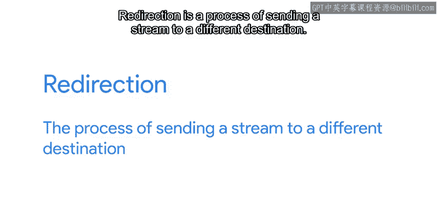
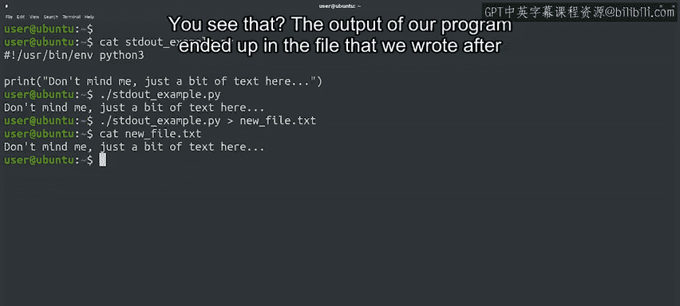
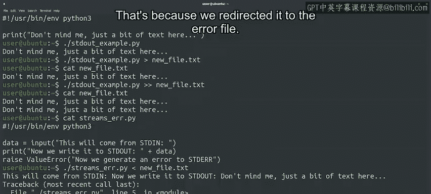

#  146：重定向流 📡


## 概述

在本节课中，我们将要学习操作系统中的**重定向**概念。重定向允许我们改变程序输入和输出的默认目的地，例如将输出保存到文件而非屏幕显示。我们将通过具体示例演示如何使用重定向符号操作标准输入、输出和错误流。

---

## 标准IO流回顾

上一节我们介绍了几种基本的Linux命令。本节中我们来看看如何操作IO流和Bash。

在之前的视频中，我们讨论了标准IO流。默认情况下，输入由文本终端的键盘提供，输出和错误显示在屏幕上。这不仅适用于我们的Python脚本，也适用于所有系统命令。



我们可以使用称为**重定向**的过程来改变这个默认设置。

重定向是将流发送到不同目的地的过程。

## 输出重定向到文件

操作系统为我们提供了这个过程，当我们希望将命令的输出存储在文件中而不仅仅在屏幕上查看时，它非常有用。

要将程序的**标准输出**重定向到文件，我们使用大于符号 `>`。

例如，以下Python程序仅使用print函数打印一行文本：

```python
print("Hello, World!")
```

如果我们运行这个程序而不进行重定向，文本将通过STDOUT正常发送到显示器。

但如果我们使用大于字符 `>` 来重定向输出，则会发生完全不同的事情。

当我们以这种方式运行它时，来自 `script.py` 的STDOUT被重定向到一个名为 `newfile.txt` 的文件。如果该文件不存在，它将被创建。

让我们使用 `cat` 命令查看 `newfile.txt` 的内容。你看到了吗？

我们程序的输出最终出现在大于符号后我们写入的文件中。

请注意，就像我们之前看到的 `open` 函数使用的 `'w'` 文件模式一样，每次我们重定向STDOUT时，目标文件都会被覆盖。




## 追加输出到文件

因此，在使用此重定向时，我们需要格外小心，以免覆盖具有有价值内容的文件。

如果我们希望将重定向的标准输出**追加**到文件，可以使用双大于符号 `>>` 而不是单大于符号。

## 输入重定向

类似地，我们也可以重定向**标准输入**。

我们可以使用小于符号 `<` 来读取文件的内容，而不是使用键盘将数据发送到程序中。

让我们用之前视频中看到的 `stdin_example.py` 文件的新版本尝试一下。

现在，让我们将 `newfile.txt` 的内容重定向到此脚本。在这种情况下，我们在STDIN部分的屏幕上没有看到输入。这是预期的，因为输入是从文件中读取的，所以它只出现在STDout部分，我们看到它读取了两行中的一行。

这也是预期的，因为 `input()` 函数只读取直到遇到换行符。

## 错误流重定向

重定向STDERR以捕获程序中的错误和诊断消息也很有用。

这可以通过使用字符组合 `2>` 来完成，类似于我们之前重定向STDOUT的方式。

让我们再次执行我们的流示例，这次将错误输出重定向到一个单独的文件。

这次我们在屏幕上没有看到错误消息，那是因为我们将其重定向到了错误文件。

让我们看看是否能在该文件的内容中找到任何有用的信息。

啊哈，我们的错误就在那里。



如果你对数字 `2` 感到疑惑，它代表STDERR流的**文件描述符**。在此上下文中，你可以将文件描述符视为一种指向IO资源的变量，在这种情况下是STDERR流。`0` 和 `1` 分别是STDIN和STDOUT的文件描述符。

## 重定向的通用性

需要强调的是，所有这些都不是Python独有的。我们可以以相同的方式操作所有其他命令。

例如，我们可以使用 `echo` 命令并通过将其输出重定向到我们想要创建的文件来创建文件。

```bash
echo "File content" > myfile.txt
```

像往常一样，我们可以使用我们的朋友 `cat` 来查看新文件的内容。

---

## 总结

本节课中我们一起学习了**重定向**的核心操作。我们了解了如何将标准输出（`>` 和 `>>`）、标准输入（`<`）和标准错误（`2>`）重定向到文件，并理解了文件描述符 `0`、`1`、`2` 的基本概念。这些技能对于自动化脚本编写和系统管理至关重要。

在下一个视频中，我们将探讨如何在程序之间进行重定向。