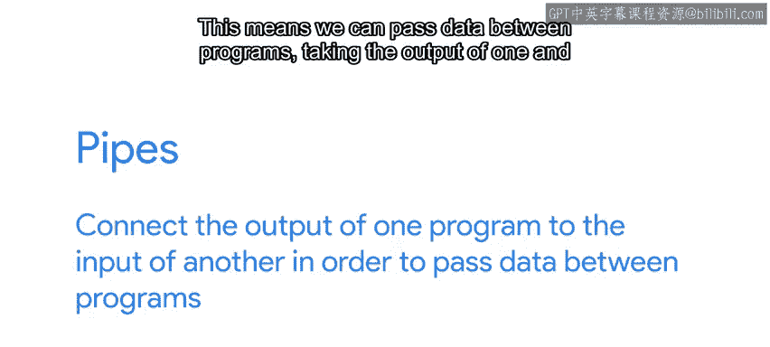
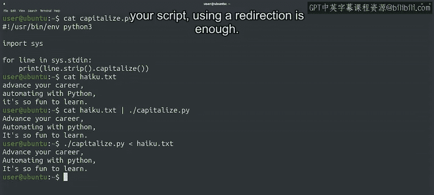

#  147：管道与管道线 🚰


在本节课中，我们将要学习一种强大的IO流重定向方法——管道（Piping）。通过管道，我们可以将多个脚本、命令或程序连接成一个数据处理管道线，从而高效地传递和处理数据。

---

## 管道的基本概念 🔄



上一节我们介绍了文件的重定向操作，本节中我们来看看另一种更强大的IO流重定向方式——管道。

管道能够将一个程序的输出连接到另一个程序的输入。这意味着我们可以在程序之间传递数据，将一个程序的输出作为下一个程序的输入。管道在命令行中用竖线字符 `|` 表示。

使用管道是一个非常有用的工具。它允许我们通过组合不同命令的功能来创建新的命令，而无需将中间结果存储在临时文件中。

以下是管道的一个简单示例：

```bash
ls -l | less
```

在这个例子中，`ls -l` 命令的输出被连接到 `less` 命令的输入。`less` 是一个终端分页程序。当你想查看包含大量文件的目录内容时，这个例子非常有用。`ls` 生成的文件列表通过管道传递给 `less`，后者一次显示一页。我们可以使用 Page Up、Page Down 或方向键上下滚动。查看完毕后，按 `Q` 键退出。

---

## 构建复杂的管道线 🛠️

管道不仅限于连接两个程序，我们可以连接更多程序来构建复杂的数据处理管道线。

让我们通过一个更详细的例子来探索这一点。以下是一个复杂的命令行：

```bash
cat spider.txt | tr ' ' '\n' | sort | uniq -c | sort -nr | head
```

这个命令行看起来很复杂，让我们逐步分解：

1.  **`cat spider.txt`**：首先使用 `cat` 命令获取 `spider.txt` 文件的内容。
2.  **`tr ' ' '\n'`**：然后将这些内容发送给 `tr` 命令（“translate”的缩写）。它获取第一个参数中的字符（这里是空格），并将其转换为第二个参数中的字符（这里是换行符）。基本上，我们是在将每个单词放在单独的一行上。
3.  **`sort`**：接下来，通过管道将结果传递给 `sort` 命令。该命令按字母顺序对结果进行排序。
4.  **`uniq -c`**：排序后的结果再传递给 `uniq` 命令。它显示每个匹配项一次，并通过使用 `-c` 标志，在每个唯一行前加上其出现次数。
5.  **`sort -nr`**：这个输出再次通过管道传递给 `sort` 命令，这次使用 `-nr` 标志，表示按数字从大到小反向排序。
6.  **`head`**：最终输出传递给 `head` 命令，它将前10行打印到标准输出。

虽然步骤很多，但分解后逻辑就很清晰了。重点不是记住所有这些命令，而是要知道我们可以根据需要连接任意多个命令来完成想要的任务。

---

## 在管道中使用Python脚本 🐍

你也可以在管道中使用你的Python脚本。

Python可以通过 `sys` 模块提供的 `sys.stdin` 文件对象从标准输入读取数据。这是一个文件对象，类似于我们使用 `open` 函数获得的对象，并且它已经处于打开状态以供读取。

假设我们想编写一个脚本，读取输入的每一行，然后打印首字母大写的行。为此，我们将利用字符串的 `capitalize` 方法。

脚本如下所示：

```python
#!/usr/bin/env python3
import sys

for line in sys.stdin:
    print(line.strip().capitalize())
```

在这个脚本中，我们遍历 `sys.stdin` 文件对象的内容。记住，当我们遍历一个文件对象时，我们是逐行进行的。对于文件的每一行，我们首先使用 `strip` 方法去除末尾的换行符，然后使用 `capitalize` 方法将行的首字母大写，最后将其打印到标准输出。

现在，让我们使用这个脚本来大写化我们电脑上一个名为 `haiku.txt` 的文件。首先，用 `cat` 查看其内容：

```bash
cat haiku.txt
```

然后，通过将 `cat` 命令的输出与我们的脚本结合，使用管道来大写化我们的俳句：

```bash
cat haiku.txt | ./capitalize.py
```

`cat` 命令将 `haiku.txt` 文件的内容发送到标准输出，我们使用管道将其重定向到我们的脚本。我们的 `capitalize` 脚本使用 `sys.stdin` 文件对象遍历标准输入的每一行，并将大写版本打印到标准输出。

我们还需要指出，我们不一定需要使用管道来将 `haiku.txt` 文件的内容获取到脚本的标准输入。相反，我们可以使用上一节视频中看到的输入重定向操作符，像这样：

```bash
./capitalize.py < haiku.txt
```



一般来说，如果你只需要将某些内容从标准输入获取到你的脚本中，使用重定向就足够了。但是，如果你希望这成为更大命令管道线的一部分，则需要使用管道将它们组合起来。

例如，如果我们只想大写化匹配特定模式的行，我们可以先调用 `grep`，然后通过管道将其连接到我们的脚本：

```bash
grep 'pattern' haiku.txt | ./capitalize.py
```

---

## 总结 📝

本节课中我们一起学习了管道和管道线的强大功能。通过少量练习，创建管道线是一种快速而强大的方式，可以执行许多系统管理任务。当系统命令不具备你所需的功能时，你可以编写一个Python脚本来填补空白，并将其包含在你的管道线中。理解如何重定向IO流在许多情况下以及编写代码时都非常有用。

接下来，我们将深入探讨向计算机上运行的进程发送信号的不同方式。