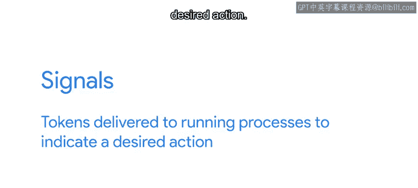
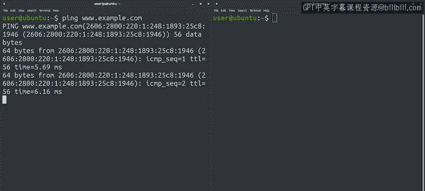

#  148：发送进程信号 📡


## 概述

在本节课中，我们将学习操作系统进程间通信的一种重要方式：**信号**。我们将了解信号是什么，如何通过键盘快捷键和命令行工具发送信号，以及不同信号如何影响进程的行为。掌握这些知识将帮助你更好地控制和管理运行在系统上的程序。

---

## 什么是信号？🤔



上一节我们介绍了管道，它是进程间通信的一种方式。本节中我们来看看另一种通信机制：信号。

当处理操作系统时，我们通常使用许多不同的进程来完成目标。为了使这些进程协同工作，它们需要相互通信。例如，一个程序可能启动一个后台进程，并希望在超时后终止它。除了管道，另一种通信方式就是使用**信号**。

**信号**是传递给正在运行的进程的令牌，用以指示期望的操作。

## 信号的作用 🎯

使用信号，我们可以告诉一个程序我们希望它暂停或终止。我们也可以让它重新加载配置或关闭所有打开的文件。了解如何发送这些信号，能让我们与进程交互，并对其行为有更多控制。

## 如何发送信号？⌨️

有多种方式可以发送信号。以下是几种常见的方法：

### 1. 使用键盘快捷键

让我们在终端中执行 `ping` 命令。`ping` 命令现在正在运行，每秒向网络上的机器发送一次ICMP数据包。它会一直运行，除非我们中断它。

**使用 `Ctrl + C` 中断进程**

要中断它，我们可以使用 `Ctrl + C` 组合键。请注意，当我们中断它时，程序并非突然结束。首先，它会打印一个关于其操作和结果的摘要。在这种情况下的行为非常“礼貌”。其背后的原理是，进程收到了一个表明我们希望它停止的信号。当收到该信号时，进程会执行必要的清理工作以优雅地结束。

`Ctrl + C` 发送的信号叫做 **SIGINT**。这只是我们可以发送的众多信号之一。

**使用 `Ctrl + Z` 暂停进程**

另一个可以用来发送信号的键盘组合是 `Ctrl + Z`。让我们试试这个。

再次运行 `ping`。这次我们用 `Ctrl + Z` 中断它。这次，进程没有正常结束。我们收到一条消息说它“已停止”。发生了什么？我们发送的信号叫做 **SIGSTOP**。这个信号导致程序停止运行，但并未实际终止。不过别担心，我们可以通过执行 `fg` 命令让它再次运行。

`fg` 命令使我们的程序再次运行。它会继续运行，直到我们使用 `Ctrl + C`、`Ctrl + Z` 或其他信号中断它。现在让我们用 `Ctrl + C` 停止它。这次按下 `Ctrl + C`，我们让程序干净利落地结束了。

### 2. 使用 `kill` 命令

要发送其他信号，我们可以使用一个叫做 `kill` 的命令。默认情况下，`kill` 会发送一个名为 **SIGTERM** 的信号，告诉程序终止。

由于 `kill` 是一个独立的程序，我们需要在另一个终端中运行它，并且我们需要知道要发送信号的进程的**进程标识符**。



**查找进程标识符**

要找出我们想发送信号的进程的PID，我们将使用 `ps` 命令，该命令列出当前正在运行的进程。根据我们传递的选项，它会显示不同子集的进程和不同详细程度的信息。对于这个例子，我们将调用 `ps ax`，它列出当前计算机中所有正在运行的进程。然后，我们将使用 `grep` 命令只保留包含我们正在寻找的进程名称的行。

听起来不错。让我们试试看。我们将在第一个终端中运行 `ping`，然后在第二个终端中找到它的PID并终止它。

**实践示例**

我们的 `ps` 和 `grep` 命令发现正在运行的 `ping` 命令的PID是 4619。我们现在可以使用这个标识符，通过 `kill` 命令发送我们想要的信号。

```bash
kill 4619
```

我们现在发送了 SIGTERM 信号，进程被终止了。进程消失了。请注意，在这种情况下，我们没有在最后得到漂亮的摘要。程序只是结束了。

## 其他信号与应用场景 🔄

正如你所料，还有更多我们可以发送的信号，它们可能导致程序做出不同的反应。例如，许多长时间运行的程序，如果我们向它们发送一个特定信号，会从磁盘重新加载其配置。这样，我们可以让程序知道配置有重要更改，并且可以在程序无需停止并重新读取的情况下应用它。

提供网络服务的程序也可能收到一个信号，告诉它们应该完成处理任何当前打开的连接，然后一旦完成就干净地终止。理解这些信号是什么以及如何发送它们，将使你能够与你负责的系统上的进程交互，并使它们按照你的意愿行事。

## 总结 📝

本节课中我们一起学习了进程间通信的关键工具——信号。我们了解了信号是通知进程执行特定操作的令牌，掌握了通过 `Ctrl + C` 发送 **SIGINT**、通过 `Ctrl + Z` 发送 **SIGSTOP** 以及通过 `kill` 命令发送 **SIGTERM** 等信号的方法。我们还学习了如何使用 `ps` 和 `grep` 命令查找进程的PID。理解并运用这些信号，能让你更有效地管理和控制运行在操作系统上的各种进程。