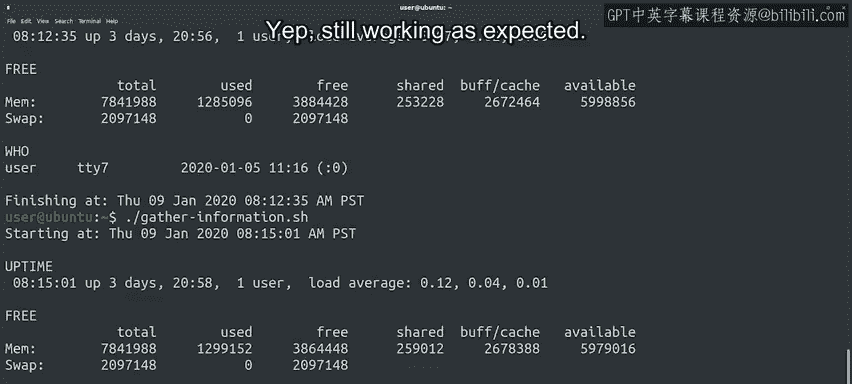

#  149：Google IT Automation with Python 第75课 - 创建Bash脚本 🐚


## 概述

在本节课中，我们将要学习什么是Bash脚本，以及如何创建和运行简单的Bash脚本。我们将通过一个实际的IT调试场景来理解脚本的用途，并学习编写包含多个命令的脚本的基本语法。

---

## 什么是Bash脚本？🤔

在之前的视频中我们提到，Bash是Linux上最常用的Shell。Bash不仅是一个运行我们命令的解释器，它本身也是一种脚本语言。

当我们需要使用大量命令时，就可以用Bash来编写简单的脚本。在接下来的几节中，我们将学习如何编写这些脚本，并了解它们为何有用。

## 为何需要脚本？一个IT场景

让我们从一个例子开始，看看为什么你会需要编写脚本。作为一名IT专家，你有时需要调试一台运行不正常的计算机。

有许多命令可以帮助你了解系统内部情况以进行调试。例如：
*   `ps` 命令可以列出所有当前正在运行的进程。
*   `free` 命令可以显示可用内存量。
*   `uptime` 命令可以告诉你计算机已经运行了多长时间，等等。

每次需要调试计算机时，你都可以手动逐一运行这些命令，再加上你能想到的任何可能有帮助的命令。

但这听起来已经很繁琐了。如果你能运行一个命令，一次性收集所有这些信息呢？

## 创建你的第一个Bash脚本 ✨

好消息是，我们可以通过创建一个Bash脚本来实现这个目标，该脚本包含我们想要调用的所有命令，一个接一个地执行。

让我们从一个简单的脚本版本开始。

以下是我们将看到的脚本，它调用了三个主要命令：`uptime`、`free`和`who`（`who`命令列出当前登录到计算机的用户）。

它使用 `echo` 命令来打印一些其他信息，并通过在命令之间留空行使输出更具可读性。

我们还调用了 `date` 命令来打印当前日期。为了调用这个命令，我们使用了一种特殊的表示法：将命令放在美元符号和括号内 `$(command)`。

这表示命令的输出应该传递给 `echo` 命令并打印到屏幕上。

**脚本示例：**
```bash
#!/bin/bash

echo "Starting diagnostics at $(date)"
echo

echo "Uptime:"
uptime
echo

echo "Free memory:"
free
echo

echo "Logged-in users:"
who
echo

echo "Diagnostics complete at $(date)"
```

## 运行脚本并查看结果 🚀

现在让我们执行我们的Bash脚本，看看会发生什么。

要运行脚本，首先需要确保它具有可执行权限，然后通过 `./` 来调用它（假设脚本文件名为 `diagnostics.sh`）：
```bash
chmod +x diagnostics.sh
./diagnostics.sh
```

运行成功！我们的脚本按预期工作。开始和结束时间是相同的，因为我们执行的操作非常少，计算机完成它们所需的时间不到一秒。

这还不错。一旦我们添加更多操作来收集其他信息，可能需要更长一点时间。

## 脚本的格式：一行或多行 📝

这是一个简单的脚本。我们可以不断向其中添加更多命令，使我们的信息收集命令获取所有与调试相关的信息。

请注意，在目前编写的脚本中，每行有一个命令。这是一种常见的做法，但并不是唯一的方式。

我们也可以使用分号 `;` 将命令分隔开，将它们写在同一行上。

让我们看看那是什么样子。

**单行格式示例：**
```bash
#!/bin/bash
echo "Starting at $(date)"; echo; echo "Uptime:"; uptime; echo; echo "Free:"; free; echo; echo "Users:"; who; echo; echo "Ending at $(date)"
```

现在让我们执行它以检查它是否仍然像以前一样工作。

是的，仍然按预期工作。



---

## 总结 🎯

本节课中我们一起学习了Bash脚本的基础知识。我们了解到Bash脚本可以自动化执行一系列命令，这在IT调试等场景中非常有用。

我们创建了一个简单的诊断脚本，学习了如何将命令组合在一起，并使用 `$(command)` 语法来捕获命令的输出。我们还看到了脚本命令可以分行编写，也可以用分号在同一行内分隔。

难以置信，你现在已经学会了用两种不同的编程语言（Python和Bash）编写脚本。这很酷，对吧？我们才刚刚开始，在接下来的视频中还有更多内容。