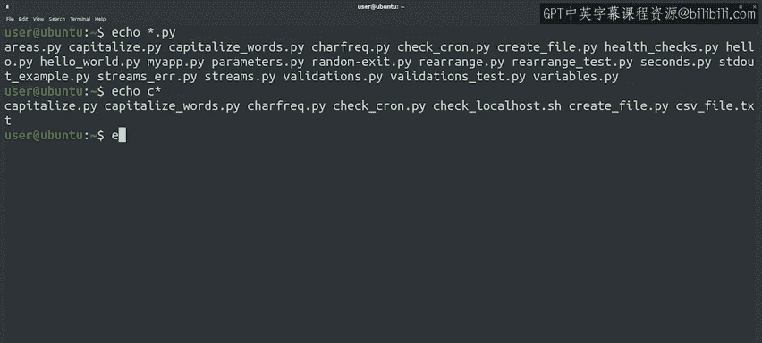

#  150：Google IT Automation with Python 第76课 - 使用变量和通配符 🐚


在本节课中，我们将要学习Bash脚本语言的两个核心概念：变量和通配符。我们将了解如何在脚本中定义和使用变量来存储数据，以及如何使用通配符来匹配和操作文件列表。

---

## 变量基础 📦

正如我们在之前的视频中所说，Bash是一个功能齐全的脚本语言，而不仅仅是按顺序执行命令的工具。我们可以为变量赋值、进行条件操作、执行循环、定义函数等等。由于内容非常丰富，在接下来的几个视频中，我们只涵盖最基础的部分。

让我们从变量开始。与Python类似，Bash允许我们使用变量来存储和检索值。

在之前的视频中，我们了解了环境变量。这些变量是在命令执行的环境中设置的。我们提到过，我们使用等号来设置这些变量。当我们在Bash中想要访问变量的值时，我们需要在变量名前加上美元符号。

除了预定义的环境变量，我们还可以为自己的脚本定义变量。要做到这一点，我们只需为我们想要定义的变量名分配一个值。

**注意**：变量名和等号之间，或者等号和值之间，不能有空格。如果我们尝试在任一侧留空格来定义变量，Shell会抱怨找不到我们正在赋值的命令。

另外，请记住，你在脚本或命令行中定义的任何变量都只在你定义它的环境中是局部的。如果你希望该环境中的命令也能看到这个变量，你需要使用`export`关键字来导出它。

---

## 在脚本中应用变量 ✨

上一节我们介绍了变量的基本概念，本节中我们来看看如何在实际脚本中使用变量。

现在，让我们修改我们的信息收集脚本，并向其中添加一个变量。我们将使用它来美化脚本，在每个命令之间添加分隔线。

为此，我们将定义一个名为`line`的变量，并在其中放入一串破折号。现在，我们将打印这个变量来分隔我们的命令，而不是留空行。

以下是修改后的脚本代码示例：

```bash
#!/bin/bash
line="----------------------------------------"
echo "Starting system information report."
echo $line
uname -a
echo $line
df -h
echo $line
```

现在让我们尝试执行修改后的脚本。完美，你看到了。我们在Bash脚本中设置并使用了变量。

---

## 通配符（Globs）介绍 🌟

让我们继续学习Bash中另一个有趣的功能，称为通配符。通配符是允许我们创建文件列表的字符。

星号（`*`）和问号（`?`）是最常见的通配符。除了说起来很有趣之外，使用这些通配符可以让我们创建文件名序列，我们可以将其用作脚本中调用命令的参数。

你可能以前遇到过它们，但让我们快速回顾一下如何使用它们。

在Bash中，在命令行中使用星号将匹配我们指定格式的所有文件名。

让我们看几个例子。我们可以看到，当我们写`*.py`时，Shell会将其转换为一个列表，其中包含当前目录中所有以`.py`结尾的文件名。

我们也可以将星号放在表达式的末尾，以获取所有以特定前缀开头的文件列表。在这种情况下，我们获取当前目录中所有以字母`c`开头的文件。

我们也可以使用不带前缀或后缀的星号，这将匹配当前目录中的所有文件。



或者，问号符号可用于匹配恰好一个字符，而不是任意数量的字符。我们可以根据需要重复多次。例如，我们可以通过使用五个问号来获取名称中有五个字符的Python文件。

像这样使用通配符可以让我们创建一个可能要操作的文件列表，例如调用其他命令并传递此列表。如果你想在Python中使用此功能，可以通过`glob`模块实现。这听起来可能像外星人说的话，但它实际上非常强大。

---

## 总结 📝

本节课中我们一起学习了Bash脚本中的两个重要工具：变量和通配符。

我们学会了如何定义和使用变量来存储数据，并通过`export`关键字使其在环境中可用。我们还探索了如何使用星号和问号通配符来灵活地匹配和生成文件列表，从而简化文件操作任务。

当然，关于Bash脚本，我们还能做更多事情。在下一个视频中，我们将讨论条件执行。