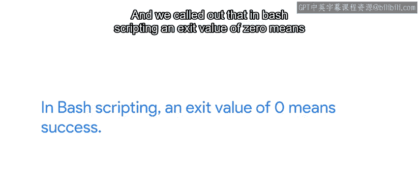
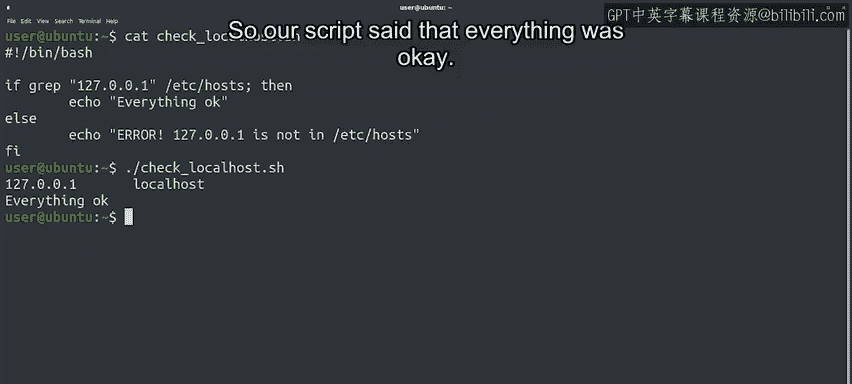
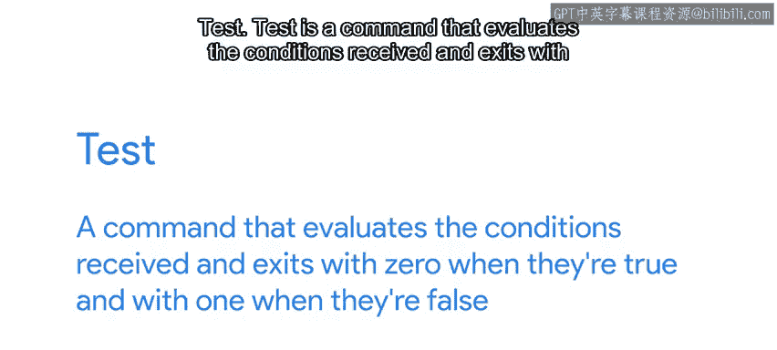
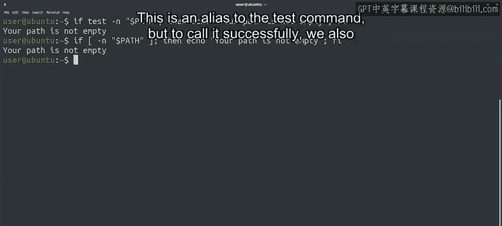

#  151：Bash脚本编程 - 条件执行 🧠


## 概述

在本节课中，我们将学习Bash脚本编程中的一个核心概念：**条件执行**。我们将了解如何根据命令的退出状态或特定条件，让脚本执行不同的分支路径。这类似于Python中的`if/else`语句，但在Bash中，其实现方式和语法有所不同。

---

## 编程的核心概念：条件分支

编程的一个主要概念是能够根据条件分支执行。换句话说，就是让我们的程序根据一个或多个值的不同，表现出不同的行为。

在Python中，我们使用`if`代码块，条件是一个必须求值为`True`或`False`的表达式。

在Bash脚本中，使用的条件基于**命令的退出状态**。



你还记得我们之前讨论过的命令退出状态吗？我们提到过，可以使用`$?`来检查命令的退出状态。并且我们指出，在Bash脚本中，退出值为`0`表示成功。

---

## Bash中的`if`运算符逻辑

Bash中的`if`运算符正是利用了这个逻辑来创建条件表达式。

我们将调用一个命令，如果该命令的退出状态是`0`，那么条件就被视为`True`。

假设我们想验证`/etc/hosts`文件是否包含`127.0.0.1`的条目（它应该包含）。我们知道`grep`命令在找到至少一个匹配项时会返回退出状态`0`，如果没找到匹配项则返回非零值。我们可以利用它来进行验证。

看看下面的脚本，让我们分析一下`if`代码块的语法。

```bash
if grep -q "127.0.0.1" /etc/hosts; then
    echo "Everything is okay"
else
    echo "ERROR! 127.0.0.1 is not in /etc/hosts"
fi
```

我们以`if`关键字开始，后面跟着用于检查成功与否的`grep`命令。在命令的末尾，有一个分号，然后是`then`关键字。之后是条件语句的主体。

我们像在Python中一样使用了缩进。这是一个良好的风格选择，使代码更具可读性，但在Bash中**并非强制要求**。有时，当代码量足够小时，我们可能会将其写在一行。

不过，通常最好将命令放在单独的行中，并使用缩进来清晰地显示条件语句的主体。

我们还为命令未成功完成的情况准备了一个`else`块。最后，使用`fi`关键字结束我们的条件块。

你可以看到，有些东西和Python是一样的：它使用`if`和`else`关键字，检查条件并根据条件的值分支执行。

但也有一些不同：我们需要在开始主体之前写上`; then`，并且需要用`fi`来结束代码块。注意这些异同点，将有助于你更快地熟悉新的编程语言。

---

## 运行脚本并观察结果

好了，让我们运行我们的脚本，看看它会做什么。

```bash
$ ./check_hosts.sh
Everything is okay
```

输出的第一行是我们的`grep`命令生成的，因为默认情况下，`grep`会打印与我们给出的表达式匹配的行。

输出的第二行是我们的脚本生成的。在这个例子中，脚本调用的`grep`命令在文件中找到了该行，并以`0`值退出，所以我们的脚本说一切正常。

如果`grep`没有找到那行，它会以一个非零值退出，我们就会收到不同的消息。

---



## 使用`test`命令评估更多条件

在我们的脚本中，可能还需要检查许多其他条件：一个文件是否存在、两个字符串是否相等、一个数字是否小于另一个数字等等。

为了帮助我们评估这些条件，有一个叫做`test`的命令。`test`是一个评估接收到的条件的命令，当条件为真时以`0`退出，为假时以`1`退出。

让我们看一个例子。在这个例子中，它足够短，我们可以把所有内容写在一行。

```bash
test -n "$PATH" && echo "Your path is not empty"
```



我们为`test`命令使用了`-n`选项，它检查一个字符串变量是否非空。在这个例子中，`PATH`变量非空，所以我们得到了消息。

像这样使用`test`命令非常普遍，还有另一种写法，看起来更像其他编程语言：

```bash
[ -n "$PATH" ] && echo "Your path is not empty"
```

在这种情况下，我们调用的命令是开方括号`[`。这是`test`命令的一个别名。但要成功调用它，我们还需要包含一个闭方括号`]`。

**重要提示**：使用这种语法时，请记住闭方括号`]`前**必须有一个空格**。

我们可以用`test`检查很多东西，但我们不会在这些视频中全部涵盖。我们会在接下来的速查表中包含其中一些，你也可以通过查看`test`的手册页来查看所有内容。

---



## 当前进展与后续展望

到目前为止，你对Bash脚本的样子有了一个粗略的了解。你做得真的很好。记住，如果有不清楚的地方，你随时可以复习内容。


还有很多我们尚未涉及的主题，比如使用循环或管理命令行参数。但在我们深入这些之前，让我们先做一个快速测验。

---

## 总结

在本节课中，我们一起学习了Bash脚本中的**条件执行**。我们了解到：

1.  Bash中的条件基于**命令的退出状态**（`0`表示成功）。
2.  使用 `if command; then ... else ... fi` 结构来创建条件分支。
3.  可以使用缩进来提高代码可读性，但这在Bash中是可选的。
4.  介绍了 `test` 命令（及其别名 `[ ]`）来评估更复杂的条件（如检查变量、文件等）。
5.  通过比较Bash和Python的条件语句，我们注意到了语法上的异同，这有助于学习新的编程语言。

你已经掌握了让脚本做出智能决策的基础。在接下来的课程中，我们将探索更多控制脚本流程的工具。