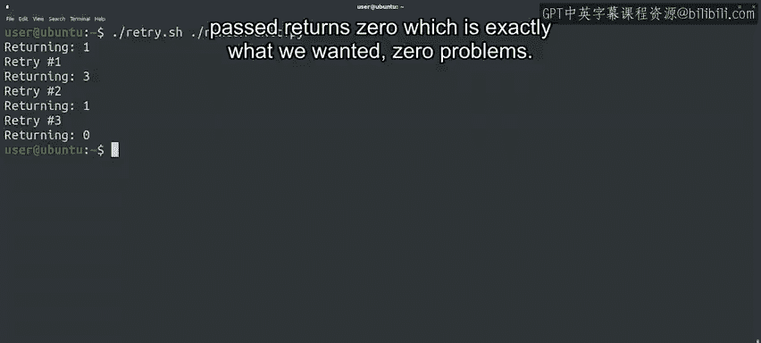

#  152：Bash脚本中的while循环 🌀


## 概述

在本节课中，我们将学习Bash脚本中的while循环结构。我们将回顾已学知识，深入探讨while循环的语法和应用，并通过实际示例展示如何使用while循环重试可能失败的命令。课程内容旨在帮助初学者理解循环在自动化任务中的重要性，并掌握在Bash中实现循环的基本方法。

---

## 回顾与引入

上一节我们介绍了Bash脚本的基础知识，包括变量使用和条件执行。本节中，我们来看看Bash中的循环结构，特别是while循环。

Bash提供了与Python类似的循环结构。我们可以使用while循环在条件为真时迭代，也可以使用for循环遍历元素列表。当然，这些循环的语法略有不同。

循环使计算机能够为我们执行重复性任务。无论是处理一系列数字还是逐行处理文件内容，计算机都会不厌其烦地执行，直到任务完成。

---

## 简单的while循环示例

让我们查看一个Bash中的简单while循环示例。

在这个脚本中，我们使用变量N打印消息，从1计数到5。while循环的条件使用与if块相同的格式。在本例中，我们使用`-le`运算符检查变量n是否小于或等于5。

循环本身以`do`关键字开始，以`done`关键字结束。为了增加变量n的值，我们使用双括号的Bash结构，允许我们对变量进行算术运算。

```bash
n=1
while [ $n -le 5 ]
do
  echo "Iteration number $n"
  n=$((n+1))
done
```

虽然看起来复杂，但退一步看，所有部分都组合在一起。执行此脚本，我们可以看到它按预期工作。

---

## 实际应用：重试失败的命令

现在，让我们让循环更有趣一些。在Bash脚本中使用while循环时，常见的一种模式是循环重试命令多次，直到成功为止。这对于使用网络连接或访问可能被锁定的资源的命令非常有用。这些命令可能因外部原因失败，重试一两次后很可能成功。

为了模拟一个有时成功有时失败的命令，我们有一个小的Python脚本，它会从我们给定的范围内随机返回一个退出值。

```python
import random
import sys

value = random.randint(0, 3)
print("Returning:", value)
sys.exit(value)
```

该脚本使用`random.randint`生成一个0到3之间的值，然后打印所选值并以该值退出。每次调用得到哪个值取决于随机生成，这正好符合我们模拟有时失败有时成功命令的需求。

---

## 重试脚本详解

现在，让我们看看用于重试命令的Bash脚本。

这个脚本比之前的示例稍复杂，但复杂程度有限。一个有趣的差异是我们使用`$1`获取命令行参数的值。在Bash中，我们使用这种方式访问第一个命令行参数。在Python中，我们使用`sys.argv[1]`获取相同的信息。

我们将参数存储在名为`command`的变量中，然后执行while循环，直到命令成功或变量n达到值5。换句话说，如果接收到的命令失败，我们将最多重试五次。

在while循环的主体中，我们首先睡眠几秒钟，然后递增变量并打印重试尝试的次数。

```bash
#!/bin/bash
n=0
command=$1
while ! $command && [ $n -le 5 ]; do
  sleep $n
  ((n=n+1))
  echo "Retry #$n"
done
```

我们调用sleep命令的原因是，如果由于CPU使用率、网络或资源耗尽导致命令失败，等待一段时间再重试可能有意义。因此，我们尝试的次数越多，等待的时间就越长，需要让计算机稍作喘息，从导致命令失败的状态中恢复过来。

在我们的模拟中，命令随机失败，但这个重试脚本适用于任何可能因各种原因失败的其他命令。

要尝试此脚本，我们需要使用随机退出命令作为参数调用重试脚本，如下所示：

```bash
./retry.sh python3 random_exit.py
```

我们可以看到脚本持续执行，直到我们传递的命令返回零，这正是我们想要的——零问题。



---

## 总结

本节课中我们一起学习了Bash脚本中的while循环。我们回顾了循环的基本概念，探讨了while循环的语法，并通过实际示例展示了如何使用while循环重试可能失败的命令。这个最后的示例是Bash中while循环的一个实际应用案例，包含了一些更高级的主题，因此可能感觉复杂。但不要因此止步，可以多次重看本视频，并练习我们介绍的脚本。

准备好后，我们可以在下一个视频中见面，届时我们将探讨Bash中的for循环。