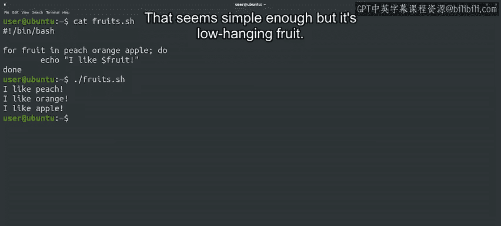
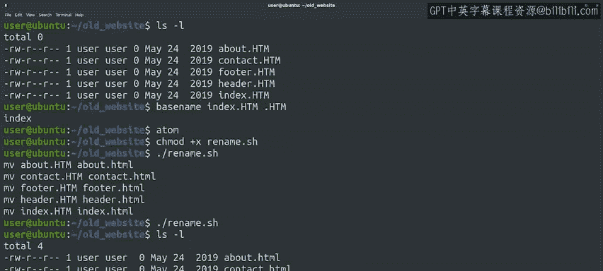

#  153：Bash脚本中的for循环 🚀


在本节课中，我们将学习如何在Bash脚本中使用`for`循环。`for`循环是一种强大的工具，它允许我们对一系列元素执行重复操作。我们将通过一个实际的文件重命名示例，来理解其工作原理和应用场景。

---

## 概述 📋

在Python和Bash中，`for`循环都用于遍历一系列元素。`for`循环的关键在于，它允许我们对序列中的每个元素执行操作。在Python中，序列可以是列表、元组或字符串等数据结构。而在Bash中，我们只需用空格分隔元素来构建序列。

## Bash中的for循环基础

让我们通过一个简单的例子来理解Bash中的`for`循环。在这个例子中，我们将遍历三个不同的水果名称元素。



```bash
for fruit in apple banana orange
do
    echo "I like $fruit"
done
```

注意，`for`循环使用了与之前`while`循环相同的`do...done`结构。现在，让我们执行这个脚本，看看它是否按预期工作。

```bash
./fruit_script.sh
```

输出结果应该是：
```
I like apple
I like banana
I like orange
```

这看起来很简单，但它只是一个基础示例。

## 使用通配符遍历文件列表 🌟

在之前的视频中，我们提到在Bash中可以使用通配符（如`*`和`?`）来创建文件列表。这些列表由空格分隔，因此我们可以在循环中使用它们来遍历符合特定条件的文件列表，例如所有以`.pdf`结尾的文件，或以`IMG`开头的文件等。

让我们通过一个实际例子来看看如何应用。假设您正在将公司的网站从一个Web服务器或软件迁移到另一个。您的网页内容存储在一系列以大写`.HTML`结尾的文件中，而新软件要求它们全部以小写`.html`结尾。手动使用`mv`命令逐个重命名文件可能会非常繁琐且容易出错。相反，我们可以编写一个简短的Bash脚本来完成这个任务。

首先，让我们查看一下当前目录中的文件：


```bash
ls -l *.HTML
```

假设输出如下：
```
-rw-r--r-- 1 user group 1024 Jan 1 00:00 index.HTML
-rw-r--r-- 1 user group 2048 Jan 1 00:00 about.HTML
-rw-r--r-- 1 user group 3072 Jan 1 00:00 contact.HTML
-rw-r--r-- 1 user group 4096 Jan 1 00:00 services.HTML
-rw-r--r-- 1 user group 5120 Jan 1 00:00 products.HTML
```

看起来我们有五个文件需要重命名。那么，如何提取扩展名之前的部分呢？有一个叫做`basename`的命令可以帮助我们。这个命令接受一个文件名和一个扩展名，然后返回不带扩展名的文件名。

例如：
```bash
basename index.HTML .HTML
```
输出：
```
index
```

现在，我们准备好编写脚本来重命名文件了。我们将从包含Bash shebang行开始：

```bash
#!/bin/bash
```

我们的脚本将使用`for`循环遍历所有以`.HTML`结尾的文件：

```bash
for file in *.HTML
do
    name=$(basename "$file" .HTML)
    mv "$file" "$name.html"
done
```

在这个脚本中：
- `for file in *.HTML`：遍历所有以`.HTML`结尾的文件。
- `name=$(basename "$file" .HTML)`：使用`basename`命令提取不带扩展名的文件名，并将其存储在变量`name`中。
- `mv "$file" "$name.html"`：将文件重命名为小写`.html`扩展名。

注意，我们使用双引号包围文件名变量，以确保即使文件名中包含空格，命令也能正常工作。在处理文件名或任何可能包含空格的变量时，这是一个很好的做法。

## 测试脚本 🧪

在运行修改文件系统的脚本之前，最好先在不实际修改文件系统的情况下运行它，以捕获脚本中可能存在的错误。我们可以通过在`mv`命令前添加`echo`来实现这一点：

```bash
for file in *.HTML
do
    name=$(basename "$file" .HTML)
    echo mv "$file" "$name.html"
done
```

保存脚本，使其可执行，并运行它：

```bash
chmod +x rename_script.sh
./rename_script.sh
```

脚本将打印出计划执行的重命名操作。如果一切看起来正确，我们可以移除`echo`，让脚本实际重命名文件：

```bash
for file in *.HTML
do
    name=$(basename "$file" .HTML)
    mv "$file" "$name.html"
done
```

再次运行脚本，这次不会打印任何内容，因为`mv`命令在成功时不会输出任何信息。我们可以通过列出目录内容来检查重命名是否成功：

```bash
ls -l *.html
```

输出应该显示所有文件都已成功重命名为小写`.html`扩展名。



## 总结 🎯

在本节课中，我们一起学习了如何在Bash脚本中使用`for`循环。我们首先介绍了`for`循环的基础语法，然后通过一个实际的文件重命名示例，展示了如何使用通配符遍历文件列表，并利用`basename`命令和`mv`命令完成批量重命名任务。我们还强调了在运行修改文件系统的脚本之前，先通过`echo`命令测试脚本的重要性。

通过掌握这些知识，您可以更高效地处理文件和系统命令，尤其是在与Python脚本结合使用时。接下来，我们将利用这些Bash脚本知识来解决一个有趣的系统管理挑战。敬请期待！