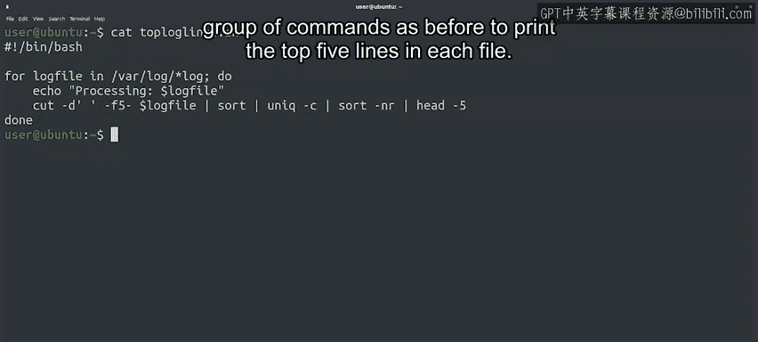

#  154：高级命令交互 🛠️


在本节课中，我们将学习如何利用已掌握的Linux命令行和bash脚本知识，处理系统日志文件，提取关键信息，并通过脚本自动化分析多个日志文件。

## 概述

在之前的课程中，我们学习了如何在Linux命令行和bash脚本中执行各种操作。本节中，我们将把这些新知识付诸实践，探索几个有趣的应用场景。我们将重点关注系统日志文件的分析，学习如何从中提取有用信息。

## 分析系统日志文件

首先，让我们回顾一下老朋友——位于`/var/log/syslog`的系统日志文件。这个文件包含了系统运行的大量信息，因此学会从中获取信息非常重要。

现在，我们使用命令查看该文件的最后10行：

```bash
tail -10 /var/log/syslog
```

我们看到的日志行遵循一个类似的模式。首先，它们包含条目添加到文件的日期和时间，然后是计算机的名称，接着是触发事件的进程名称和PID，最后是实际记录的事件。

## 提取日志事件信息

假设我们有一台计算机负载很高，但不知道原因。为了找出原因，我们需要检查`syslog`中记录最多的事件。为此，我们需要提取不含日期和时间的事件部分。

我们可以使用一个名为`cut`的命令来帮助我们。这个命令允许我们使用字段分隔符只获取每行的部分内容。在这个例子中，我们可以使用空格来分割行。具体操作如下：

```bash
cut -d' ' -f5-
```

在这个例子中，我们传递`-d' '`给`cut`，告诉它我们想使用空格作为分隔符，传递`-f5-`告诉它我们想打印第5个字段及之后的所有内容。这样，我们移除了日期和计算机名称，只保留了进程和事件消息。

## 统计最常见的事件

现在，我们有了关心的信息，可以将其通过管道传递给之前视频中看到的相同命令管道，以找出重复最多的行。如下所示：

```bash
cut -d' ' -f5- /var/log/syslog | sort | uniq -c | sort -nr | head -5
```

如你所见，我们将一系列命令链接在一起，从而获得了`syslog`文件中重复最多的行。

## 自动化分析多个日志文件

`/var/log`目录中还有更多我们可能感兴趣的文件，因此我们可以使用`for`循环遍历`/var/log`中的每个日志文件，并获取每个文件中最重复的行。

我知道你在想什么。对于一行命令链来说，这听起来有点太复杂了。我们最好将其放入一个bash脚本中，类似这样：

```bash
#!/bin/bash
for logfile in /var/log/*.log; do
    echo "Processing: $logfile"
    cut -d' ' -f5- "$logfile" | sort | uniq -c | sort -nr | head -5
done
```

在这个脚本中，我们处理`/var/log`目录中所有以`.log`结尾的文件。然后，我们打印正在处理的文件名，接着使用之前相同的命令组来打印每个文件中的前五行。

让我们执行它，看看实际效果：



```bash
bash analyze_logs.sh
```

很好。我们的脚本显示了`/var/log`中每个文件最常见的行。那里有很多文件。

## 总结

通过本节课程，我们一起完成了bash脚本编写的入门介绍，做得非常出色。现在，你同时掌握了Python和Bash的脚本编写技能，可能会想知道何时使用哪一种。我们将在下一个视频中讨论这个问题。到时见。