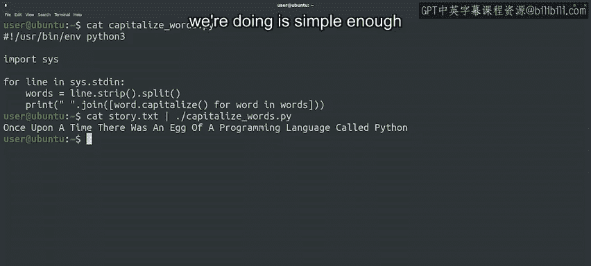
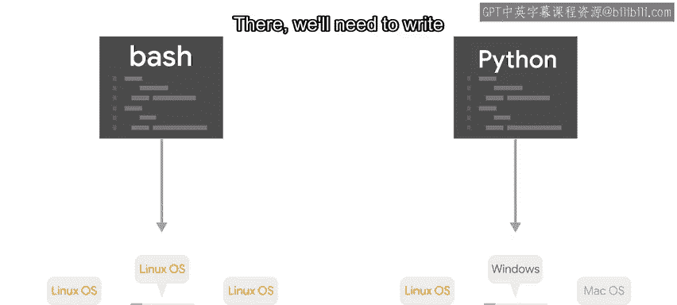

#  155：选择 Bash 还是 Python？🤔


在本节课中，我们将探讨在自动化任务时，如何根据具体情况在 Bash 脚本和 Python 脚本之间做出明智的选择。我们将分析各自的优缺点，并通过实例说明何时使用哪种工具更为合适。

---

通过前面的学习，我们已经了解到，使用系统命令可以完成许多有趣的任务。

我们接触了大量不同的命令，它们能帮助我们操作文件、管理进程、获取计算机信息、处理文件内容以及完成其他各种工作。

## 何时选择 Bash 脚本？⚙️

上一节我们介绍了系统命令的强大功能，本节中我们来看看如何利用 Bash 脚本将它们自动化。

通过使用 Bash 脚本，我们可以快速地将一个仅操作单个文件的命令，转变为一个能自动处理上千个文件的脚本。

这非常强大，对吗？正如我们在日志文件处理的例子中所见，有许多终端命令提供了文本处理功能。

其中很多命令还支持正则表达式，这允许我们对文件中的数据执行一些非常高级的处理。

当这些命令在一个数据处理管道中被串联起来时，它们就成为了处理文本数据的强大工具。

它们可以快速提供我们所需的信息，而无需编写完整的脚本。但正如常言道，能力越大，责任越大。

我们需要小心，不要滥用这种能力，因为它很快就会变得难以阅读。

请看以下这个例子：

```bash
echo "hello world from bash" | sed 's/\b\(.\)/\u\1/g'
```

这个命令行使用了一些我们见过的技巧，以及一些我们尚未深入探讨的内容，例如如何在 Bash 字符串上进行索引操作，以将每个单词的首字母大写。

我们大概都会同意，这个命令行相当难以阅读。如果其中恰好存在一个错误，要找出修复方法将非常困难。

## 转向 Python 的时机 🐍

当一个 Bash 命令行开始变得如此复杂时，更好的主意是编写一个 Python 脚本来处理数据，这种方式更具可读性和可测试性。

一个简单的 Python 脚本可能如下所示：

```python
import sys

for line in sys.stdin:
    words = line.strip().split()
    capitalized_words = [word.capitalize() for word in words]
    print(' '.join(capitalized_words))
```



在这个例子中，我们读取标准输入的每一行，去除空白字符，并将其分割成独立的单词。然后，我们使用列表推导式将每个单词首字母大写，最后用空格将它们重新连接起来并打印输出。

一旦我们有了这个脚本，就可以像下面这样将其作为管道的一部分来执行：

```bash
echo "hello world from bash" | python3 capitalize.py
```

因此，当我们的操作涉及文件和系统命令，并且任务足够简单、脚本能够自我解释时，选择 Bash 是一个好主意。

一旦脚本变得难以理解其意图，最好使用像 Python 这样更通用的脚本语言来编写。

## Bash 与 Python 的权衡 ⚖️

Bash 脚本不如拥有完整 Python 语言及其众多操作字符串、列表和字典的函数那样灵活或健壮。

在使用 Bash 和 Linux 命令时，还有另一个需要注意的问题，我们之前也提到过：它们的可用性取决于我们使用的平台。



某些命令可能在某些操作系统上不存在。在 Linux 机器上编写 Bash 脚本可以非常快速地完成任务，但在 Windows 机器上它将无法工作，在那里我们需要用 PowerShell 编写相同的脚本。

因此，如果你试图完成的任务仅限于当前服务器或运行相同操作系统的服务器群，一个简单的 Bash 脚本就能胜任。

但如果你的代码很复杂，或者需要跨平台工作，那么使用 Python 标准库或其他提供相同功能的外部模块可能会是更好的选择。

## 总结与选择 🎯

本节课中我们一起学习了在自动化任务时如何权衡 Bash 和 Python。

最后一点：在很多情况下，无论是 Bash 脚本还是 Python 脚本，都能很好地解决问题。

在这些情况下，你可以选择你更熟悉、更得心应手的那一个。选择适合你的工具。

希望这一切开始变得清晰明了。无论你选择编写 Bash 脚本还是 Python 脚本，这两种技能在 IT 环境中都将对你大有裨益。