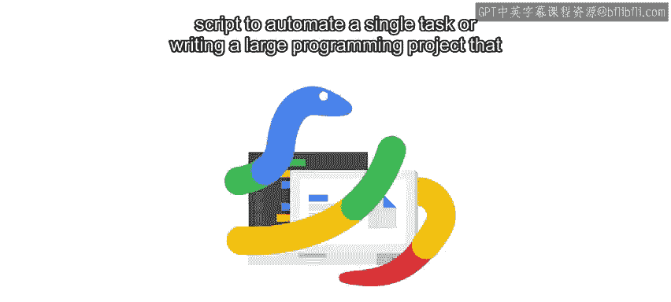
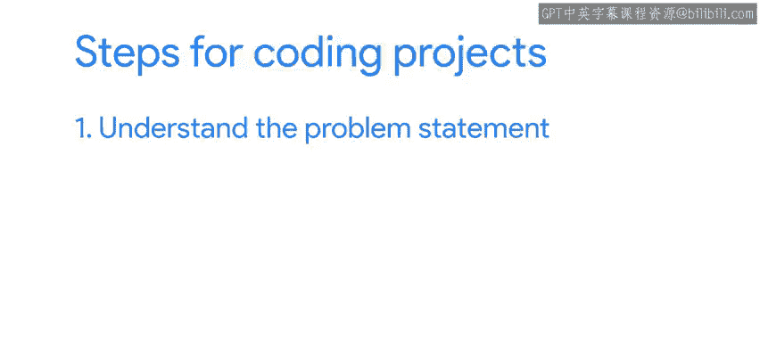
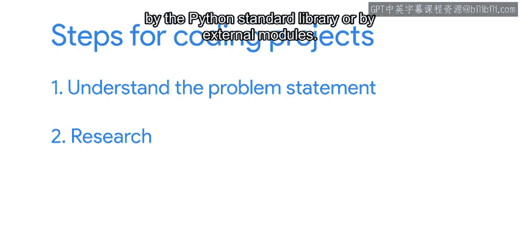
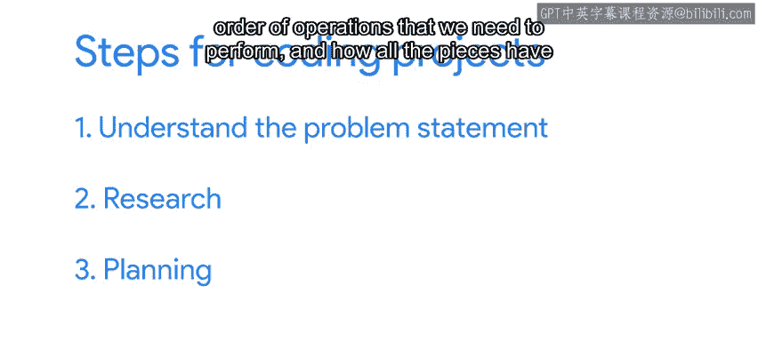
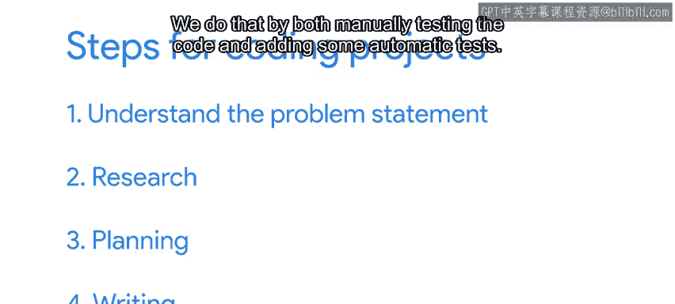

#  158：Python脚本编写流程详解 🐍




在本节课中，我们将学习如何系统性地从头开始编写一个Python脚本。我们将介绍一个经过验证的流程，帮助你更高效、更可靠地完成编码项目，无论是自动化小任务还是处理复杂信息的大型项目。

---

## 第一步：理解问题 📖

上一节我们介绍了课程目标，本节中我们来看看流程的第一步。



首先，必须完全理解问题陈述。这包括明确需要完成的任务，并识别出我们需要编写的程序的**给定输入**和**期望输出**。

**公式表示：**
`问题理解 = 明确任务 + 识别输入 + 定义期望输出`

---



## 第二步：进行研究 🔍

理解了问题之后，下一步是进行研究。

这意味着要弄清楚如何利用Python标准库或外部模块提供的工具来解决问题。我们的目标是避免重复造轮子。无论挑战看起来多么棘手和复杂，很可能已经有人解决过类似的问题。花时间研究现有的资源非常有价值。

以下是研究阶段的关键活动：
*   查阅可能用到的模块、类和函数的文档。
*   理解这些工具应如何应用。
*   学习文档中的示例，并思考它们与我们所需代码的关联。

---

## 第三步：制定计划 📝



知道了要写什么以及可用的工具后，我们应该进行一些规划。

这意味着思考哪些数据类型对我们的解决方案有用，需要执行的操作顺序，以及所有部分如何协同工作以形成我们的解决方案。如果问题复杂，将计划写在纸上或数字文档中会很有帮助。

在许多公司，在此阶段编写设计文档是常见做法，其中详细说明了问题陈述、将用于解决问题的工具以及解决方案的实施计划。让他人评论你的设计有助于确保所有细节都已被理清。

**代码示例（计划伪代码）：**
```python
# 1. 读取输入文件
# 2. 使用正则表达式解析数据
# 3. 将数据转换为字典列表
# 4. 计算统计信息
# 5. 将结果写入输出文件
```

---

## 第四步：编写与测试 ✍️

一旦有了清晰的计划，我们就可以开始实际编写脚本了。



这一步不仅包括编写代码，还包括检查代码是否按预期工作。我们通过手动测试代码和添加一些自动测试来实现这一点。

有时，人们会忍不住跳过充分理解问题、研究工具或规划解决方案的必要时间，直接进入编码阶段。但经验表明，花时间熟悉我们要做的事情以及可用的工具，会在实际实现所需的时间和最终解决方案的质量上产生巨大差异。

---

## 总结与展望 🎯

本节课中我们一起学习了编写Python脚本的四个关键步骤：**理解问题**、**进行研究**、**制定计划**以及**编写与测试**。遵循这个流程可以帮助你更系统、更高效地完成任何编码项目。

在接下来的课程中，我们将揭晓期待已久的最终项目。它究竟是什么呢？我们将在下一个视频中揭晓答案。