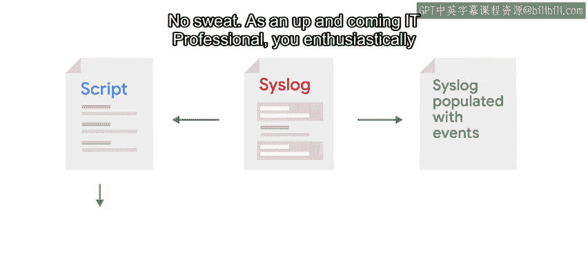
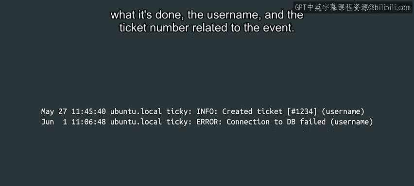

#  159：Python自动化运维项目实战 - 项目问题陈述 🎯

## 概述

在本节课中，我们将学习一个来自谷歌IT自动化课程的实战项目。该项目要求我们编写自动化脚本，处理系统日志文件，并生成两种报告。我们将理解项目背景、日志格式、具体需求以及最终目标。

---

## 项目背景介绍

想象一个场景。您公司的一台服务器运行着一个名为“Ty”的服务。该服务是一个内部工单系统，被公司内许多不同团队用来管理工作。



该服务在成功运行或遇到错误时，会将大量事件记录到Cislog日志中。该服务的开发人员请求您帮助从这些日志中提取一些信息，以便更好地了解软件的使用情况并改进它。

这并不难。作为一名崭露头角的IT专业人士，您热情地接受了这个任务。

因此，作为本课程的最终项目，您将编写一些自动化脚本来处理系统日志，并根据从日志文件中提取的信息生成一系列报告。

---

## 日志格式说明



日志行的格式与我们之前见过的类似。格式如下：

```

```

当服务正确运行时，它会向Cislog记录一条信息（info）消息，说明它做了什么、相关用户名以及事件关联的工单号。

如果服务遇到问题，它会向Cislog记录一条错误（error）消息，指出问题所在以及触发该问题操作的用户名。

---

## 报告需求分析

该服务的开发人员希望从这些数据中得到两种不同的报告。

以下是两种报告的具体要求：

1.  **系统生成的错误排名**
    *   这意味着需要列出所有记录的错误消息，以及每条错误消息出现的次数（不考虑涉及的用户）。
    *   它们应该按从最常见到最不常见的错误进行排序。

2.  **服务使用情况统计**
    *   这意味着需要列出所有使用过系统的用户，包括他们生成了多少条信息消息和多少条错误消息。
    *   此报告应按用户名排序。

---

## 报告可视化方案

为了可视化这些报告中的数据，您需要生成几个网页，这些网页将由运行在该机器上的Web服务器提供服务。

为此，您可以利用系统中已有的一个名为 `csv_to_html.py` 的脚本。该脚本将CSV文件中的数据转换为包含数据表格的HTML文件。

然后将这些文件放入Web服务器用于显示网页的目录中。

---

## 项目最终目标

目标是拥有一个脚本，可以每天自动完成所有必要的工作，无需任何用户交互。

这个脚本不需要自己完成所有工作。它可以调用其他脚本来执行单个任务，然后将结果组合在一起。事实上，我们建议拆分任务，以便每个部分都可以单独编写和测试。

---

## 总结与鼓励

我想您现在思绪万千。您的脉搏可能加快了一点，手心可能已经在键盘上出汗了。别担心，这听起来可能工作量很大，但一旦您理解了问题并做了一些研究和规划，一切都会开始步入正轨。

在下一个视频中，我们将为您提供一些关于如何开始分解此任务的提示。我们开始吧。