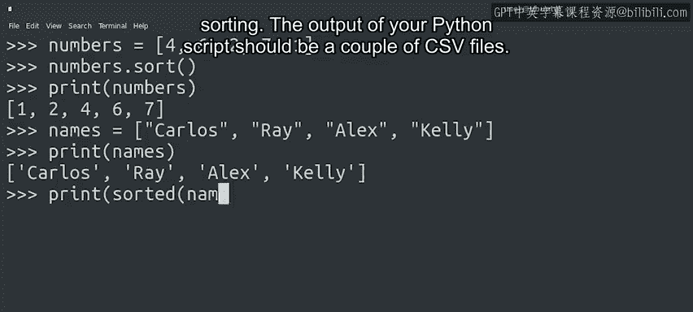
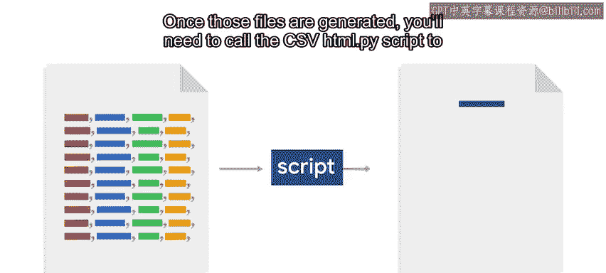

#  160：研究与计划指导 🧭

在本节课中，我们将学习如何将最终项目的复杂问题分解为可管理的小任务，并规划具体的研究与实施步骤。

上一节我们介绍了最终项目的问题陈述。本节中，我们来看看如何将其分解并制定行动计划。

## 分解问题与研究方法

我们已经明确，目标是在系统日志文件中查找特定的日志行。

强烈建议使用正则表达式来完成此任务。这种方式能更轻松地提取所需信息。

为了确定正确的正则表达式，可以使用如 **Regex101.com** 这类网站。它可以帮助你测试表达式并理解其匹配逻辑。

确定一个可能有效的模式后，请在Python解释器中尝试，以验证其能否匹配正确的行并捕获正确的信息。

## 数据处理与结构设计

提取信息后，你需要统计同类错误的数量，以及特定用户的信息和错误消息数量。

你能想到哪种数据结构对此有帮助吗？如果想到了**字典**，那么你的思路是正确的。

你将需要使用几个不同的字典：一个用于统计错误消息，另一个用于统计每个用户的使用情况。

随后，你需要根据不同的条件对字典中的数据进行排序。我们在Python入门课程中学习过排序。

可以随时回看相关视频，并重新阅读Python官方文档中关于排序的部分。

## 输出格式与文件生成

你的Python脚本输出应该是几个CSV文件。每个文件都需包含列名，并按要求的顺序排列数据。

生成这些文件后，你需要调用 `csv_to_html.py` 脚本来基于CSV数据创建HTML文件。

你可以查看该脚本的工作原理，关键在于向其传递两个参数：要读取的CSV文件名，以及要生成的HTML文件名。

最后这一步，你可以选择通过Python脚本或批处理/Bash脚本来完成。由于此步骤仅涉及调用命令和移动文件，我们建议使用Bash脚本来实现，保持简洁明了。

## 实施建议

我们建议你在开始实际实验之前，先进行研究、规划，甚至编写好代码片段。

以下是关键步骤的简要清单：

*   **模式匹配**：使用正则表达式网站设计并测试匹配模式，后在Python中验证。
*   **数据存储**：使用字典来分别统计错误类型和用户活动。
*   **数据排序**：对字典中的数据按需进行排序。
*   **文件生成**：将结果输出为格式正确的CSV文件。
*   **格式转换**：通过调用现有脚本，将CSV文件转换为HTML报告。

## 总结

本节课中，我们一起学习了如何将复杂的日志分析项目分解为清晰的步骤：从使用正则表达式进行模式匹配，到利用字典进行数据统计与排序，最后生成CSV文件并转换为HTML报告。关键在于先研究规划，再动手编码。祝你好运，你能成功完成。