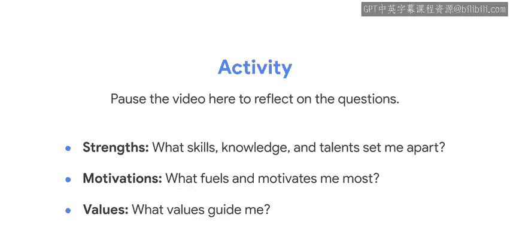
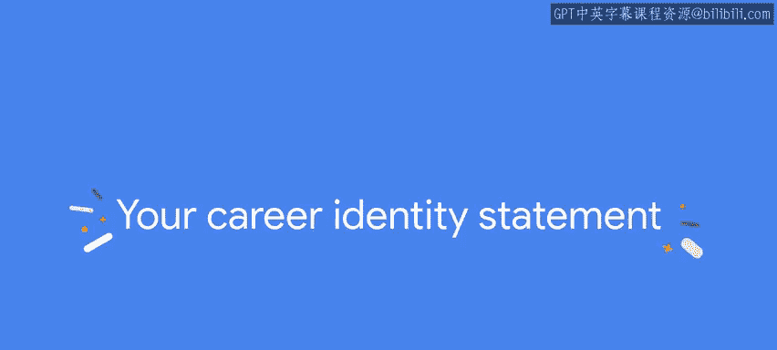
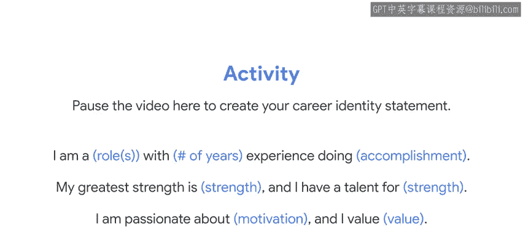

#  161：职业身份探索指南 🧭


在本节课中，我们将学习如何构建和定义你的职业身份。职业身份是你专业旅程的指南针，它基于你的技能、动机和价值观，帮助你明确方向并朝着目标前进。

---

## 什么是职业身份？✨

职业身份是你基于个人特质、现有及未来能提供的专业价值，为职场带来的独特贡献。它由你全部的生活和工作经历塑造，并受到你的优势、动机和价值观的影响。同时，它也是你根据自身方向和目标主动培养的结果。

## 为何职业身份至关重要？💡

你越了解自己、清楚什么能让你成长以及你想去往何方，你就越能选择一条与你的优势、价值观和目标相符的道路。此外，雇主和同事也能更好地理解你能提供什么。这对你自身也有益：研究表明，拥有强大的职业身份能带来积极成果，例如提升工作表现、增强对有意义职业的承诺，甚至改善健康和幸福感。请记住，无论你的生活和工作经历如何，每个人都有可提供的价值。

## 探索职业身份的三大基石 🧱

探索职业身份的最佳方式之一是撰写你自己的职业身份陈述。我们将从分解其三个关键组成部分开始，这些部分将作为构建你个人职业身份陈述的基础模块：你的**优势**、你的**动机**和你的**价值观**。

接下来，让我们更详细地探讨这三个组成部分。

### 1. 你的优势

你的优势是你擅长完成的任务和活动。它们是你通过生活和工作经验获得的技能、知识和才能。

例如，你可能非常注重细节，或者擅长建立人际关系。也许你精通修理汽车，或者由于照顾家人而培养了耐心、同理心和解决问题的能力。

根据职场优势与领导力专家马库斯·白金汉的观点，**优势是一种能增强你自身能力的活动**。要成为优势，你必须擅长它，但它也应该让你感觉更强大、更有能力、更有活力。

对我而言，写作一直是一项优势。我在9岁时读了夏洛蒂·勃朗特的小说《简·爱》，从此爱上了写作。我心想：“那个女孩就是我。我也想写出这样的书。”随后，我在一生中投入了大量时间来发展这项技能，它总能让我充满活力，使其成为我职业身份的核心支柱。

### 2. 你的动机

从优势出发，我们转向下一个关键组成部分：你的动机。

你的动机源于你的热情和目的。了解什么能激励你非常重要，因为这是让你持续前进的动力。

正如我提到的，我热衷于用英语讲故事。我可以沉浸在写作中数小时。但我不仅仅享受讲故事，我还受到激励去帮助他人通过真实的故事讲述来表达他们自己的真相。这是我身份的一个决定性方面，因此也是我职业身份的一部分。

### 3. 你的价值观

我们已经讨论了优势和动机。最后，让我们探讨第三个关键组成部分：你的价值观。

你的价值观反映了对你最重要的事物。它们指导你如何应对决策、发展人际关系和克服挑战。

你可能并不总是意识到自己的价值观，但它们始终伴随着你，即使它们会随时间而变化。这些价值观包括正直、责任和善良等。

我的一些核心价值观是效率和服务他人。我不喜欢混乱。当我看到混乱时，我看到人们在受苦。我的想法会转向：“我如何帮助清理这个？我如何让这更高效？”在我的第一份工作中，我意识到没有人记录如何使用谷歌正在开发的产品。因此，我决定建立一个常见问题和答案的知识库，供我的团队使用，这样每次就不必从头开始。

## 如何构建你的职业身份？🔍

现在我们已经理解了关键组成部分，让我们着手构建你自己的职业身份。

首先，你需要做的就是保持好奇心。从问自己以下三个关于你的优势、动机和价值观的问题开始：


*   **什么技能、知识和才能让我与众不同？**
*   **什么最能激励和驱动我？**
*   **什么价值观在指引我？**

在此处暂停视频可能会有所帮助。拿一张纸或日记本，花10分钟思考这些问题。无需过度思考，只需写下脑海中浮现的内容。你以后随时可以完善或扩展你的答案。

## 深入挖掘职业身份的方法 📝



一旦你回答了这些问题，你还可以做更多事情来深入挖掘你的职业身份。

例如，评估可以帮助你更多地了解自己独特的技能、优势、偏好和价值观。其中许多评估可以在线获取，由一系列关于你的简短选择题组成，并能立即生成个性化的结果。

如果在此之后，你仍想进一步探索，你可以采访几位你的同伴。他们可以是现任或前任同事、同学，甚至是家人和朋友。选择那些非常了解你、并且你信任其诚实和深思熟虑的人。

向他们提问，例如：
*   你会如何向别人描述我？
*   我身上最突出的是什么？
*   我是如何激励你的？

请记住，了解自己的方法还有很多。但一旦你达到了一个阶段，对自己理解自身的优势、动机和价值观感到舒适和自信，你就可以将它们整合到一个职业身份陈述中。



## 撰写你的职业身份陈述 ✍️

职业身份陈述应该有三到四句话，不仅仅是列出你的资历。你还需要揭示你的热情和目的。

以下是一个基本的模板，帮助你开始：

```
我是一名 [角色]，拥有 [年数] 年经验，从事 [成就]。
我最大的优势是 [优势]，并且我擅长 [优势]。
我热衷于 [动机]，并且我重视 [价值观]。
```

以下是我的陈述作为示例：
> 我是一名拥有超过10年经验的内容策略师和产品营销人员，致力于帮助企业利用新技术推动成功。我最大的优势是跨团队协作和提升效率，并且我擅长构思故事和创建营销计划以成功推出技术产品。我热衷于赋能品牌寻找并使用适合他们的解决方案，并帮助新技术的开发者开发出更好、更有效的产品。最重要的是，我重视在工作中保持乐趣、协作、包容和真实。

现在是另一个暂停视频的好时机。拿起那张纸或日记本，开始撰写你的职业身份陈述。



## 持续迭代与应用 🚀

请记住，你的陈述是一个持续完善的过程。随着你获得新的经验和自我认知，你应该重新审视并完善它。例如，在你完成谷歌职业证书之后。

那么，既然你已经写好了职业身份陈述，你应该用它做什么呢？

你的职业身份陈述是一种强大的方式，可以为你携带的所有其他职业发展工具增添清晰度和活力。你可以将其部分内容融入你的简历、领英个人资料、求职信和电梯演讲中。这将帮助你清晰、一致地传达对你重要的事物，并帮助你在同一领域中脱颖而出。它还可以指导你在求职或选择职业道路时更加有意识和有目的性。

## 总结 📚

在本节课中，我们一起学习了职业身份的概念及其重要性。我们探讨了构成职业身份的三大基石：**优势**、**动机**和**价值观**。通过自我提问、评估和他人反馈，你可以深入挖掘这些方面。最后，我们学习了如何将这些元素整合成一份有力的**职业身份陈述**，并了解如何将其应用于实际的职业发展工具中。

为自己探索和建立一个强大的职业身份是一段需要时间和努力的旅程。但请相信，这是值得的。你越了解自己和你的所求，你为职业生涯做出的选择就会越好。随着你不断成长并强化你的职业身份，你的北极星将更加明亮，指引你朝着目标前进。祝你迈向精彩旅程的下一步。