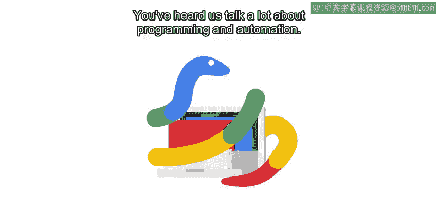

#  001：Git与版本控制入门 🚀

在本节课中，我们将学习版本控制系统（VCS）的基本概念，特别是Git工具。我们将探讨如何使用Git来跟踪代码和配置文件的变更，以及如何通过GitHub进行协作和建立个人作品集。

---

大家好，欢迎回来。我们之前讨论了很多关于编程和自动化的内容。本课程将聚焦于一个略有不同的方面：如何使用版本控制系统（VCS）来跟踪代码和配置文件的不同版本。这些工具对IT领域的每个人都有益，即使不专门用于编程或自动化本身。它们能让我们在出错时轻松回滚，并帮助我们与他人协作。你可能已经在管理配置文件或维护程序脚本源代码的背景下听说过版本控制系统。

在本课程中，我们将向你介绍一个流行的VCS工具——Git，并展示一些使用它的方法。我们还将讲解如何注册一个名为GitHub的服务，以便创建你自己的远程仓库来存储代码和配置。课程结束时，你将能够使用Git存储代码历史，并在GitHub上与他人协作，同时开始创建自己的作品集。如今，许多公司在招聘IT职位时都会要求查看你的GitHub作品集。GitHub作品集能让公司了解你参与过的项目和你编写的代码类型。本课程将帮助你建立自己的作品集。

我是Kenny Soiman，我将担任本课程的讲师。我目前担任Android系统健康与验证的技术项目经理。在我的工作中，我与工程团队和领导层合作，确保为用户发布健康稳定的Android设备。我很高兴能担任本课程的讲师。作为技术项目经理，我的主要挑战是确保所有相关人员对共同愿景保持一致。为了确保项目成功，我的团队会制定叙事、找出所有利益相关者，并确保每个人都在同一页面上。之后是最困难的部分：执行项目直至完成。为此，拥有一个版本控制系统至关重要，每位工程师都可以在其中存储和分享他们创建的代码。这让我们能够跟踪不同的修订版本、回滚有问题的变更，并高效地协作。

在开始之前，我想花一点时间分享我为什么如此兴奋能在这里与大家一起参与这个项目。从小时候起，我就一直痴迷于新技术。我曾经以小额费用修理朋友们的旧坏电脑，并花费数小时尝试修改我的旧视频游戏系统，以便从我最喜欢的游戏中获得更多乐趣。所以，当我发现可以通过从事计算机和酷炫小工具的工作来谋生时，我立刻被吸引了。但有一个问题：当我开始我的第一份IT工作时，很少有人看起来像我。随着我职位的提升，这种差距只会越来越大。我很快意识到，这不仅是IT支持的问题，而是整个科技行业都在努力解决的问题。代表性问题是我想有一天解决的问题。我能做到这一点的唯一方法是以身作则、分享我的知识，并帮助尽可能多的人实现他们的目标。谁知道呢？也许有一天，有人会利用在这里学到的信息来改变世界。记住，当你成名时，记得我哦？好了，关于我的话题就到这里，让我们回到课程。

Git和版本控制有很多内容需要学习。我们将逐步分解，以便你完全理解它的工作原理以及为什么它在你的IT角色中如此有用。无论你是IT支持专家、系统管理员，还是希望扩展技能以转向IT其他角色，在本课程中，你将学习Git的核心功能，以便理解它在组织中如何以及为何被使用。我们将探讨基础和更高级的功能，如分支和合并。我们将演示掌握像Git这样的VCS的实用知识如何在紧急情况或调试时成为救命稻草。我们还将探索如何使用VCS通过远程仓库（如GitHub提供的仓库）与他人协作。

为了完成这些内容，并让你能够跟随视频中的练习，你需要在计算机上安装Git。这也将让你能够与GitHub交互，并将代码上传到那里。在本课程的示例中，我们将展示一系列不同的Python脚本。虽然使用Git不需要了解任何Python知识，但我们建议你具备该语言的基础知识，以便理解我们将演示的示例和功能。如果你已经完成了本项目的Python课程，那么你已经具备了所需知识。如果没有，也没关系，但你可能需要复习一些Python技能以跟上我们的部分示例。此外，由于所有脚本都将使用Python 3，你需要在计算机上安装Python 3才能运行它们。

对于我们的示例，我们将使用Linux计算机，并通过最常见的命令行工具与Linux命令行交互。同样，如果你参加了我们的Python课程，你已经熟悉了所有这些概念。如果你是从本课程开始加入这个项目的，复习一些最基本的Linux命令可能会对你有益。请记住，其中一些主题和视频有点复杂，所以第一次可能无法完全理解。这完全正常。请慢慢来，复习任何不完全清楚的内容。你最终会掌握的。另外，别忘了你可以随时使用讨论论坛与其他学习者联系并提出问题。

好了，我们准备好开始学习Git和版本控制了。让我们开始吧！

---

本节课中，我们一起学习了版本控制系统（VCS）的基本概念，特别是Git工具的重要性。我们了解了Git如何帮助跟踪代码变更、协作开发，以及如何通过GitHub建立个人作品集。接下来，我们将深入探讨Git的具体操作和功能。