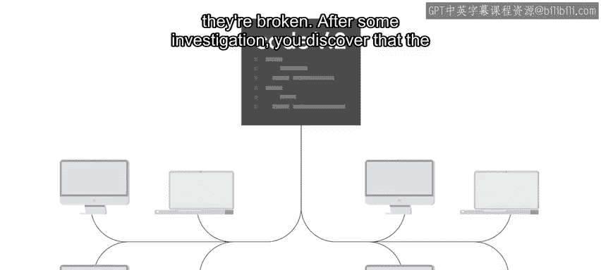
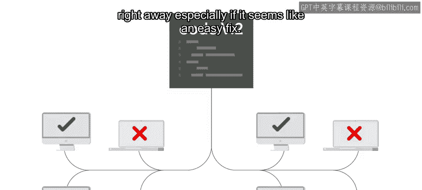
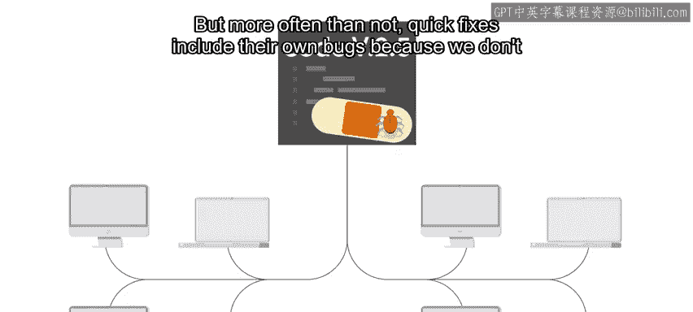
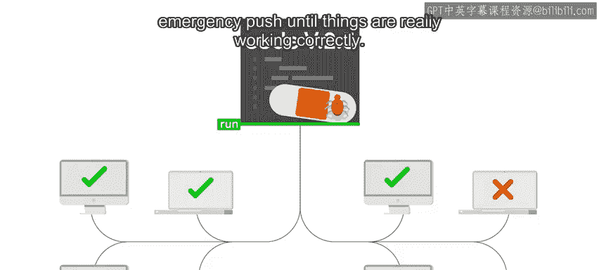
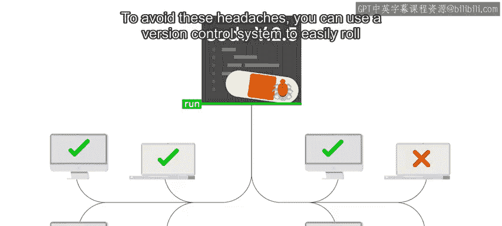
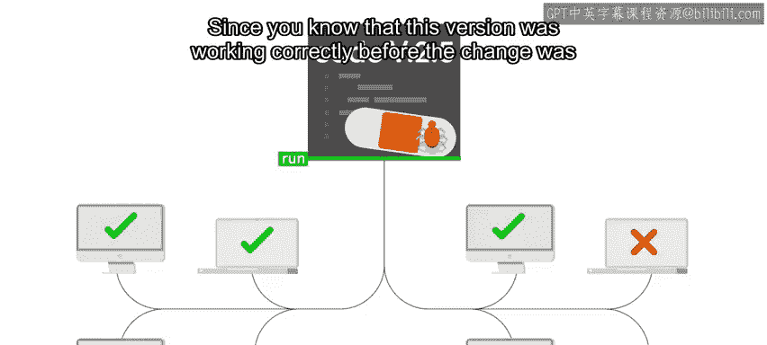
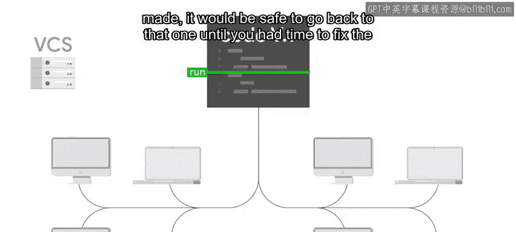
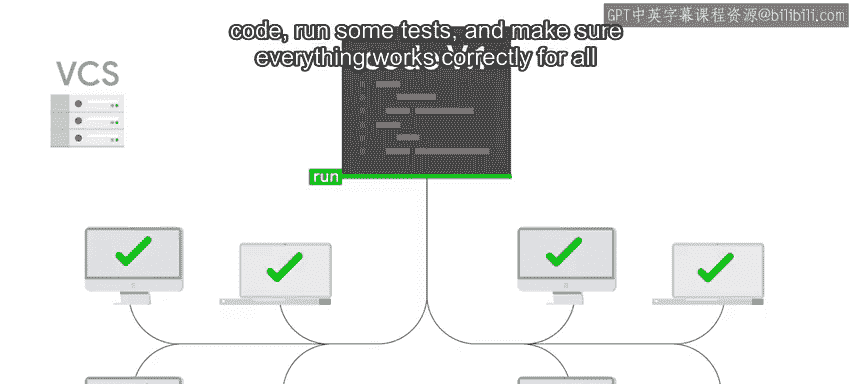
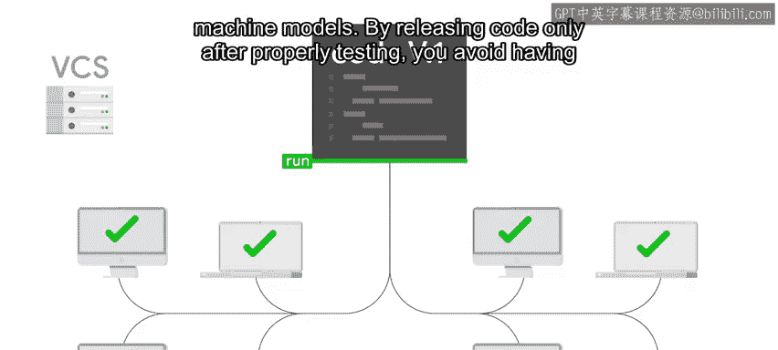

#  002：版本控制介绍 🚀

在本节课中，我们将要学习版本控制的基本概念及其在IT自动化中的重要性。我们将探讨为什么需要版本控制，以及它如何帮助我们管理代码和配置文件的变更。

---

当你在IT领域工作时，你需要管理许多不同文件中的信息。

你编写的自动化脚本可能会随着时间推移而演变。例如，你可能会为脚本添加新功能，或考虑额外的条件，或修改脚本执行所涉及的系统范围。

你还需要管理与基础设施相关的配置，例如应用程序的默认设置或分配给计算机群的IP地址。

随着安全要求的提高、计算机群的扩大或新软件版本的部署，这些信息会随时间而变化。

在IT中管理变更时，拥有组织配置文件和自动化代码的详细历史信息至关重要。

这使管理员能够查看修改了什么以及何时修改的，这对于故障排除至关重要。它还提供了文档记录，让未来的IT专家了解基础设施为何是当前的状态。

此外，它提供了一种完全撤销变更的机制。这样，我们就不必凭记忆撤销更改，从而减少了人为错误的机会。我们将在讨论回滚时看到这一点。

想象一下这个场景：你的团队为负责检查所有计算机健康状况的脚本添加了一项新功能。这项新检查会验证计算机的固件（也称为UEFI）是否已更新到最新版本。

当你推出此更新时，突然发现一半的计算机现在报告为故障。经过一些调查，你发现检查需要考虑不同的计算机型号。

你可能会想快速修复代码，并立即将其推送到受影响的机器上，尤其是当这看起来是一个简单的修复时。但通常情况下，快速修复本身会包含新的错误，因为我们没有花时间正确测试新代码。因此，在第一次修复之后，你可能最终需要进行第二次甚至第三次紧急推送，直到一切真正正常运行。

为了避免这些麻烦，你可以使用版本控制系统轻松地将代码回滚到之前的版本。

由于你知道在做出更改之前，这个版本是正常工作的，因此回退到该版本是安全的，直到你有时间修复代码、运行一些测试，并确保所有机器型号都能正常工作。

只有在经过适当测试后才发布代码，可以避免一次又一次地推送快速修复。版本控制系统让我们能够做到这一点，甚至更多。它们对于维护各种IT资源的健康代码库以及让多人在同一编码项目上协作至关重要。

现在，我们将迈出学习这个新工具的第一步。它将让我们能够跟踪对脚本、配置文件以及任何其他需要跟踪的文档所做的更改。

我们将首先看看人们在不知道版本控制的情况下通常会做什么，然后查看一些相关工具，如`diff`和`patch`。

一旦我们清楚地了解了为什么需要适当的版本控制，我们将开始我们的第一次Git体验。我们将讨论Git是什么以及它是如何工作的。

要跟上课程，你需要在本地计算机上安装Git，并学习如何从命令行使用它。如果这听起来有点吓人，请不要惊慌。我们将指导你，你很快就能上手使用它。

在你的计算机上安装Git后，我们将概述基本的Git工作流程，这将让你开始跟踪你的脚本。

那么，你准备好开始掌控你的代码了吗？我们开始吧。

---

本节课中，我们一起学习了版本控制的基本概念及其重要性。我们了解到，版本控制可以帮助我们跟踪变更、协作开发，并在出现问题时安全地回滚到之前的稳定状态。在接下来的课程中，我们将深入探讨具体的工具和操作。