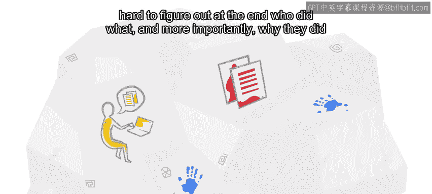
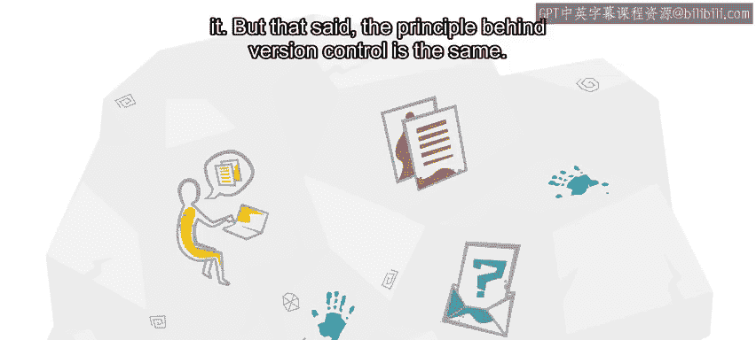
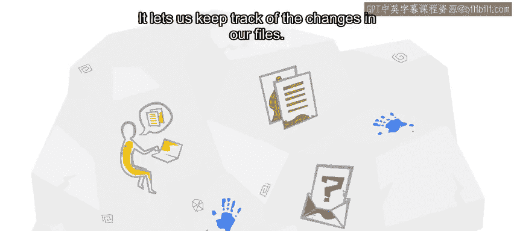

#  003：Git版本控制入门 - 保留历史副本 📜

在本节课中，我们将要学习版本控制的基本概念，特别是如何通过保留历史副本来管理项目的变化。我们将探讨手动版本控制的局限性，并介绍Git如何帮助我们更有效地跟踪变化。

你是否曾参与过一个随时间发展的项目，因此偶尔会创建工作副本，以便在需要时能够回到早期版本？也许你正在一个团队中工作，每天都会将部分工作通过电子邮件发送给团队的其他成员。

然后，你团队中的其他成员会添加他们自己的工作，并将其发送给整个团队。

或者，你可能参与过一个方向不断变化的复杂项目。你感觉某天被删除的一些内容可能以后需要重新添加。因此，每当你要删除一个重要部分时，你都会复制整个项目以防万一。

如果以上任何一点听起来很熟悉，那么你已经接触过最原始的版本控制形式：保留历史副本。这些副本让你可以看到项目之前的样子，并且如果你最终认为最新的更改是错误的，可以回退到那个版本。它们还让你能够看到随时间推移的变化进展，甚至可能帮助你理解为什么进行了某项更改。

我们说这是原始的形式，因为它非常手动且不够详细。首先，你需要记住制作副本。其次，你通常复制整个项目，即使你只更改了一小部分。

第三，即使你将更改通过电子邮件发送给同事，也可能很难弄清楚最终是谁做了什么，更重要的是，他们为什么这样做。

尽管如此，版本控制背后的原理是相同的。它让我们能够跟踪文件中的更改。这些文件可以是代码、图像、配置文件，甚至是视频编辑项目。无论你正在处理什么。在本课程中，我们将看到Git帮助我们跟踪更改的多种方式，以及我们如何使用它与他人协作或回退更改。我们将使用一些在版本控制领域具有特殊含义的术语。

但不要让这些术语吓到你。归根结底，我们所做的只是更好地控制我们的历史副本。

假设你有同一代码在不同时间点制作的两个副本。你如何比较它们？请继续观看下一个视频，你将会找到答案。

---

本节课中我们一起学习了版本控制的基本目的——通过保留历史副本来跟踪和管理项目的变化。我们认识到手动方法的局限性，并初步了解了Git等现代工具如何提供更高效、更详细的解决方案。在下一节中，我们将深入探讨如何具体比较这些历史副本。