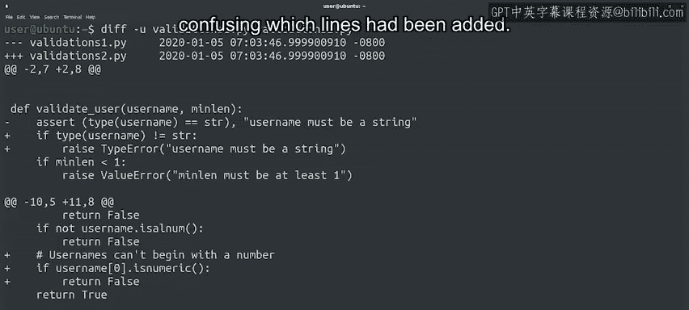

#  004：比较文件差异 📄


在本节课中，我们将学习如何使用命令行工具自动比较两个文件或目录之间的差异，而无需手动逐行检查。我们将重点介绍 `diff` 工具及其不同输出格式，并简要提及其他可视化比较工具。

---

## 概述

想象一下，你拥有同一代码的两个副本，并且希望查看它们之间的差异。

你会怎么做？你可以在编辑器中并排打开两个文件，先看一个，再看另一个，以找出差异。但这种方法极易出错。我们是人类，仅凭肉眼比较，注定会遗漏一些差异。

幸运的是，存在更好的方法。你可以使用一些精巧的工具来自动完成此任务。

我们可以使用 `diff` 命令行工具来比较两个文件甚至两个目录，并以几种格式显示它们之间的差异。

---

## 使用 `diff` 命令

让我们通过一个例子来查看。我们有两个文件：`rearrange1.py` 和 `rearrange2.py`，它们包含同一函数的两个不同版本。

首先，使用 `cat` 命令查看它们的内容：

```bash
cat rearrange1.py
cat rearrange2.py
```

你能发现差异吗？也许可以，但这并不十分明显。

让我们使用 `diff` 命令，这样我们就不必费力地用眼睛去发现差异了。

```bash
diff rearrange1.py rearrange2.py
```

当我们调用 `diff` 命令时，它只输出两个文件之间不同的行。

当我们只有两行输出时，找到差异就容易多了，对吗？

注意每行开头的符号：

*   `<` 符号告诉我们该行从第一个文件中被**移除**了。
*   `>` 符号告诉我们该行在第二个文件中被**添加**了。

换句话说，旧行被新行替换了。

在这个例子中，我们有一行被新的一行替换。这是在修改代码时常见的变化，但不是唯一可能的情况。

---

## 理解 `diff` 的输出格式

让我们查看另一个例子。这里有更多的变化发生。

我们可以看到 `diff` 将变化分成两个独立的部分：

1.  以 `5c5,6` 开头的部分显示第一个文件中的一行被第二个文件中的两行不同内容替换了。
    *   开头的数字表示第一个文件和第二个文件中的行号。
    *   数字之间的 `c` 表示一行被**更改**了。
2.  以 `11a13,15` 开头的部分显示第二个文件中新增的三行。
    *   `a` 代表**添加**。

但第二个部分看起来有点奇怪，不是吗？看起来我们添加了一个 `return` 和一个 `if` 条件，但没有 `if` 块的主体。这是怎么回事？

为了更好地理解这一点，我们可以使用 `-u` 标志来告诉 `diff` 以另一种格式显示差异。

让我们查看一下：

```bash
diff -u rearrange1.py rearrange2.py
```

这种统一格式与我们之前看到的格式有很大不同。

它显示了带有一些上下文的变更行，使用减号 `-` 标记被移除的行，使用加号 `+` 标记被添加的行。

额外的上下文让我们能更好地理解我们正在查看的变更。我们可以看到新文件实际上有一个全新的 `if` 块，它是看起来非常相似的条件链的一部分。这就是为什么我们之前看到的 `diff` 输出中，哪些行被添加了有点令人困惑。

---

## 其他文件比较工具

市面上有很多工具可以比较文件。`diff` 是最流行的一个，但不是唯一可用的。

例如，`wdiff` 会高亮显示文件中发生变化的单词，而不是像 `diff` 那样逐行工作。

为了提供更多帮助，还有许多图形化工具可以并排显示文件，并使用颜色高亮差异。



这类工具的例子包括 **MELD**、**Kdiff3** 或 **Vimdiff**。

我们可以使用这些工具来为我们看到的变更提供更好的上下文。

---

## 总结

在本节课中，我们一起学习了如何自动比较文件差异。我们介绍了 `diff` 命令行工具的基本用法，理解了其默认输出和统一格式（`-u`）输出的含义。我们还了解到，除了 `diff`，还有像 `wdiff` 以及 MELD 等图形化工具可以帮助我们更直观地进行比较。

我们已经讨论了如何查看两个文件之间的差异。那么，如何利用这些差异来应用变更呢？这将在下一个视频中介绍。