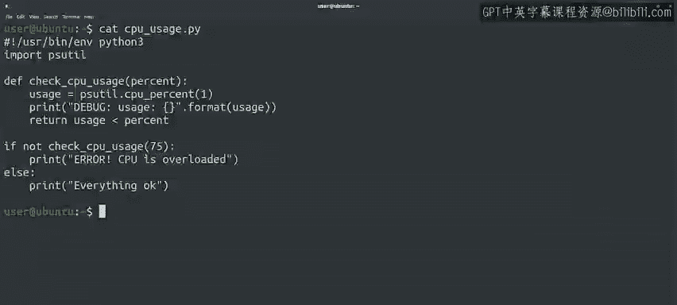

#  005：应用更改 🛠️


在本节课中，我们将学习如何通过生成和应用差异文件（diff文件）来高效地协作修改代码。我们将重点介绍`diff`和`patch`这两个命令行工具，它们能帮助我们清晰地展示代码变更，并自动将这些变更应用到原始文件中。

---

## 概述

想象一下，一位同事向你发送了一个存在错误的脚本，并请求你帮助修复问题。


当你理解了脚本的问题所在后，你可以向他们描述需要修改的内容。例如，你可以指出：“函数只能返回值，我认为你本意是使用`sys.exit`。此外，你重复进行了两次千兆字节转换，这会导致脚本始终失败。”

然而，如果代码很复杂，仅靠描述可能仍然难以理解。为了让变更更清晰，你可以向他们发送一个包含变更的差异文件（diff），这样他们就能看到修改后的代码是什么样子。

---

## 生成差异文件

为了生成差异文件，我们通常使用如下命令行格式：
```bash
diff -U old_file new_file > change.diff
```
需要提醒的是，大于号 `>` 将 `diff` 命令的输出重定向到一个文件。因此，通过这个命令，我们生成了一个名为 `change.diff` 的文件，其内容就是 `diff -U` 命令的输出。

使用 `-U` 标志可以包含更多上下文信息，这有助于阅读文件的人理解变更的来龙去脉。生成的文件通常被称为 **差异文件** 或 **补丁文件**。

它包含了旧文件和新文件之间的所有变更，以及理解这些变更并将其应用回原始文件所需的额外上下文信息。

---

## 应用差异文件

现在，假设你是接收包含变更的差异文件的一方，并且你想将它应用到你编写的脚本上。

你可以仔细阅读收到的差异文件，然后手动遍历需要更改的文件并应用修改。但这听起来像是大量可以自动化完成的手动工作，不是吗？

确实如此。有一个名为 `patch` 的命令正是用来做这件事的。`patch` 命令接收由 `diff` 生成的文件，并将变更应用到原始文件上。

让我们通过一个例子来查看这个过程。假设我们有一个检查计算机负载是否过高的小脚本，如下所示：

```python
# 示例脚本：检查CPU使用率
import psutil

cpu_usage = psutil.cpu_percent()
if cpu_usage > 75:
    print("错误：CPU负载过高！")
else:
    print("一切正常。")
```
这个脚本使用 `psutil` 模块检查当前正在使用的CPU百分比。当负载高于阈值（本例中为75%）时，它会打印一条错误信息。当负载低于阈值时，它则报告一切正常。

我们将这个脚本分享给了几位同事，其中一位告诉我们脚本运行不正确。即使计算机完全超载，脚本也会报告一切正常。这位同事非常热心，他们给我们发送了一个包含问题修复方案的差异文件。

让我们查看一下这个差异文件。我们可以看到同事做了两处修改：
1.  他们为 `cpu_percent` 函数添加了参数 `1`。
2.  他们添加了一行调试代码，用于打印函数返回的值。

同事解释说，在不带参数调用 `cpu_percent` 函数时，我们没有对一段时间进行平均，因此调用总是返回 `0`。

现在我们有了差异文件，我们想将它应用到我们的脚本上，该怎么做呢？

我们将使用 `patch` 命令。我们将把想要打补丁的文件名（本例中是 `cpu_usage.py`）作为命令的第一个参数传递。然后，我们将通过标准输入提供差异文件。还记得怎么做吗？我们将使用小于号 `<` 将文件内容重定向到标准输入。

让我们实际操作一下：
```bash
patch cpu_usage.py < cpu_usage.diff
```
我们告诉 `patch` 命令，将来自 `cpu_usage.diff` 的变更应用到我们的 `cpu_usage.py` 文件上。我们得到一行输出：“文件已打补丁”，这意味着我们已成功应用了变更。

让我们通过查看脚本内容来验证一下。很好，我们看到文件已按照同事提供的变更进行了修改：`cpu_percent` 函数现在以参数 `1` 被调用，并且添加了调试打印行。



当我们对脚本满意后，可以移除调试行，但目前我们先保留它。

---

## 为何使用差异与补丁？

你可能会想，为什么要经历所有这些“差异”和“补丁”的麻烦，而不是直接发送整个文件呢？这有几个原因。

主要原因是原始代码可能已经发生了变化。在我们的例子中，同事用来准备修复的代码可能不是最新版本。通过使用差异文件而不是整个文件，我们可以清楚地看到他们修改了什么，无论他们使用的是哪个版本。`patch` 命令能够检测到文件已做的更改，并会尽力应用差异。虽然它并非总能成功，但在许多情况下是可以的。

另一个原因是项目结构。在这个案例中，我们是为单个小文件打补丁。但有时你可能需要修改一个庞大项目中的一堆大文件。假设你正在修改一个包含100个不同文件、按功能排列在不同目录中的项目树里的4个文件。如果你发送整个文件，你需要指定这些文件应该被放置在哪里。正如我们提到的，我们可以对整个目录结构进行差异比较，在这种情况下，差异文件可以指定每个变更文件应该放置的位置，而无需我们进行任何手动操作。很酷，对吧？

---

## 总结

在本节课中，我们一起学习了如何生成差异文件以及如何使用 `patch` 命令应用其内容。我们了解了通过 `diff -U` 生成包含上下文的补丁文件，以及使用 `patch <file> < diff_file` 来应用变更。我们还探讨了在协作中使用差异和补丁方法相对于直接发送整个文件的优势，特别是在处理可能已更改的代码或复杂项目结构时。

在下一个视频中，我们将把所有内容整合起来，看一个在现实世界中如何使用 `diff` 和 `patch` 的实际例子。