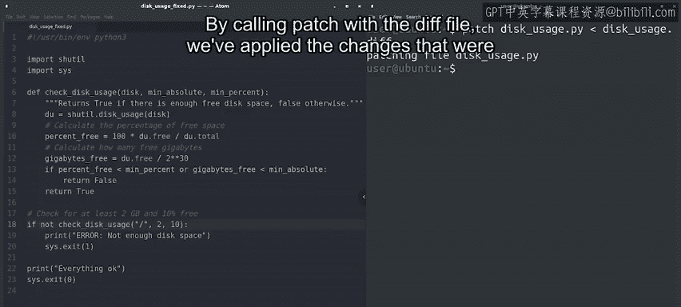

#  006：差异和补丁的实际应用 🛠️


在本节课中，我们将学习如何在实际场景中应用 `diff` 和 `patch` 命令。我们将通过帮助同事修复一个存在错误的Python脚本来演示整个过程，从识别问题、生成修复补丁，到最终应用补丁使脚本恢复正常。

---

## 概述

想象这样一个场景：一位同事请求我们帮助修复一个名为 `disk_usage.py` 的脚本。该脚本的目标是检查当前已使用的磁盘空间，并在空间不足时打印错误信息。然而，脚本目前因存在几个错误而无法运行。我们将通过修复这些错误来演示如何使用 `diff` 和 `patch` 工具。

## 准备文件副本

在进行任何修改之前，我们首先为脚本创建几个副本。这是为了避免直接修改原始文件，并保留一个干净的版本用于比较。

以下是具体步骤：
*   我们将一个副本命名为 `disk_usage_original.py`，它将保持未修改状态，用于后续的比较。
*   我们将另一个副本命名为 `disk_usage_fixed.py`，我们将在这个文件上准备我们的修复。

现在我们已经有了文件的副本，接下来我们将编辑 `disk_usage_fixed.py` 版本并实际修复其中的错误。

## 识别并修复错误

这个文件包含一些代码。在我们尝试理解其功能以及问题所在之前，让我们先执行它，看看会得到什么结果。

```bash
python3 disk_usage_fixed.py
```

Python解释器报错了。它提示“在函数外使用了return语句”。查看代码，我们可以清楚地看到有一个 `return` 语句不在任何函数内部。

你可能记得，在Python中，`return` 语句只能在函数内部使用。那么如何修复这个问题呢？这里有几个选项：
*   我们可以将当前代码转换成一个函数，然后在脚本的主体部分调用这个函数。
*   我们可以使用 `sys.exit()` 来使 `return` 的数字成为脚本的退出代码。退出代码是导致程序以相应值退出的代码。

目前，我们选择第二种方案。我们将 `return` 语句替换为 `sys.exit()`。

好的，我们已经做了修改。让我们再次执行这个新版本的脚本。

```bash
python3 disk_usage_fixed.py
```

糟糕，我们修复了语法错误，但现在脚本告诉我们磁盘空间不足。但我们知道实际上我们确实有一些可用空间，这是怎么回事？

如果你仔细观察代码，可能会注意到脚本将字节转换为吉字节（GB）时进行了两次转换。调用 `check_disk_usage` 函数时传递的参数是 `2 * (2**30)`。你可能记得，双星号 `**` 运算符用于计算幂。在这个例子中，`2**30` 是1GB对应的字节数。所以，`2 * (2**30)` 就是2GB。

但这仅当 `check_disk_usage` 函数期望的参数单位是字节时才成立。如果我们查看该函数的代码，会发现它内部已经将可用字节数除以了 `2**30`。换句话说，我们进行了两次GB转换：一次在调用函数时，一次在函数内部。我们需要去掉其中一次转换。让我们修改调用函数的方式，直接传递 `2`（表示2GB）作为参数。

```python
# 修改前
check_disk_usage(“/”, 2*2**30, 2*2**30)
# 修改后
check_disk_usage(“/”, 2, 2)
```

好的，让我们再试一次。

```bash
python3 disk_usage_fixed.py
```

现在它正常工作了。

## 生成并应用补丁

现在我们需要将修复发送给同事，以便他们可以修复自己的脚本。为此，我们将使用刚学到的技术生成一个差异（diff）文件，如下所示：

```bash
diff -u disk_usage_original.py disk_usage_fixed.py > disk_usage.diff
```

让我们使用 `cat` 命令检查 `diff` 文件的内容。

```bash
cat disk_usage.diff
```

很好，这个文件包含了我们想要的所有更改。这就是我们需要发送给同事，让他们用来修补自己文件的内容。

那么，他们该如何应用这个补丁呢？他们会像下面这样运行 `patch` 命令：

```bash
patch disk_usage.py < disk_usage.diff
```



通过使用 `diff` 文件调用 `patch` 命令，我们已经应用了修复错误所必需的更改。让我们检查一下 `disk_usage.py` 现在是否可以成功执行。

```bash
python3 disk_usage.py
```

成功！

## 总结

在本节课中，我们一起学习了如何查看文件之间的差异、生成 `diff` 文件来汇总我们的更改，然后使用 `patch` 命令应用这些更改。然而，这仍然是一个非常手动的过程，而版本控制系统在这方面可以提供极大的帮助。


在进入下一节关于版本控制的内容之前，你可以在接下来的速查表中找到我们刚刚介绍的命令总结。请查看速查表，然后完成练习测验，以确保你掌握了所有这些知识。