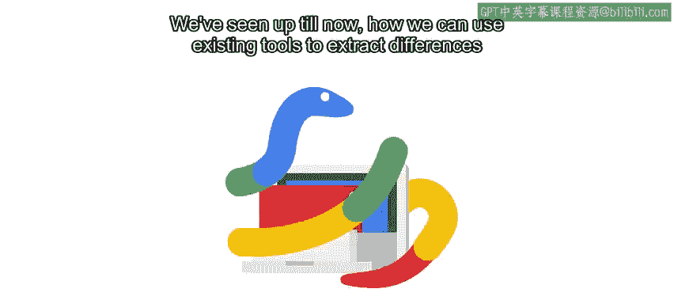
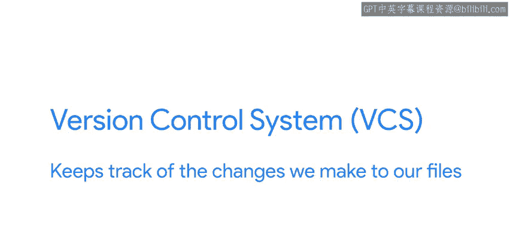
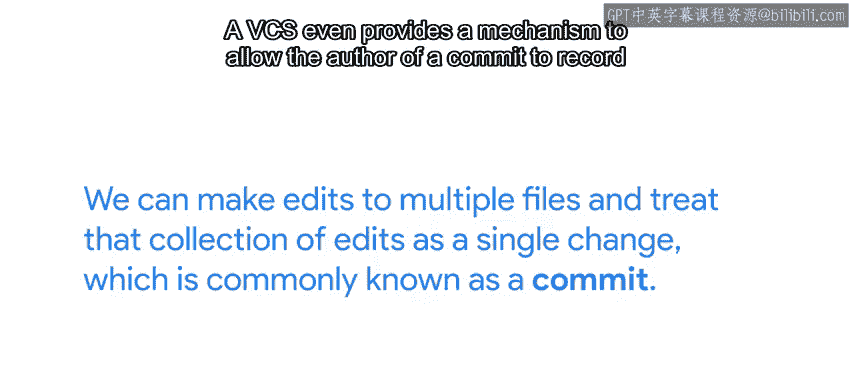
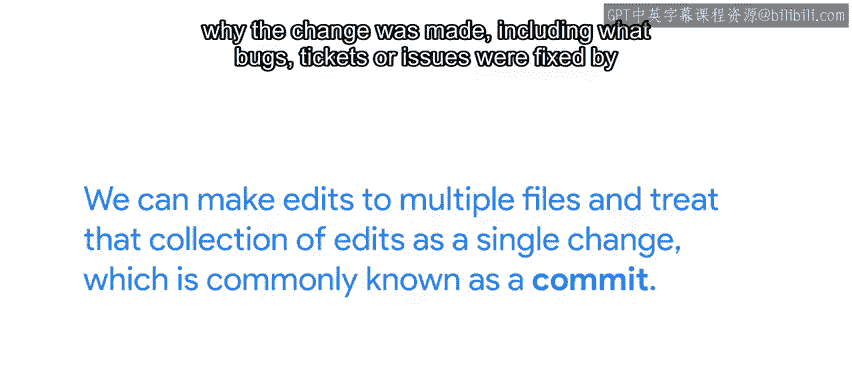

#  007：什么是版本控制？📚

在本节课中，我们将要学习**版本控制系统**（Version Control System, VCS）的基本概念。我们将了解它是什么、为什么它比简单的文件备份更强大，以及它如何帮助我们更高效地管理文件（尤其是代码）的变更历史。

---

## 概述

到目前为止，我们已经学习了如何使用现有工具来提取文件不同版本之间的差异，并将这些变更应用到原始文件中。这些工具非常有用，但在大多数情况下，我们不会直接使用它们。相反，我们会通过一个**版本控制系统**（VCS）来使用它们。

版本控制系统会跟踪我们对文件所做的更改。

---

## 版本控制系统的作用

通过使用VCS，我们可以知道更改是何时做出的以及是谁做出的。它还能让我们在发现某个更改不理想时，轻松地**回滚**该更改。此外，通过允许我们合并来自许多不同来源的更改，它使得协作变得更加容易。

初看起来，版本控制系统可能像是一个复杂甚至令人望而生畏的工具。但如果你仔细观察，你会发现它本质上只是一个存储文件的系统。然而，与只保存文件最新版本的普通文件服务器不同，VCS会跟踪我们在保存更改时创建的所有不同版本。

---

## VCS的种类与核心功能

市面上有许多不同的版本控制系统，每种都有其自身的实现方式以及各自的优缺点。但无论VCS在内部如何实现，它们都始终围绕着访问我们文件的历史记录这一核心功能。

它们让我们能够：
*   检索文件或目录的过去版本。
*   查看谁更改了哪些文件。
*   了解每个文件是如何被更改的。
*   知晓文件是何时被更改的。

在此基础上，我们还可以对多个文件进行编辑，并将这组编辑视为一个单一的变更单元，这通常被称为一次 **`提交（commit）`**。

---

## 提交信息的重要性

VCS甚至提供了一种机制，允许提交的作者记录**为什么**要进行此次更改，包括此次更改修复了哪些错误、工单或问题。当试图理解一系列复杂的更改或调试某些难以捉摸的问题时，这些信息可能是救命稻草。因此，请务必在你的提交中记录这些额外信息，以真正致力于编写更好的代码。

---

## VCS的应用场景

在任何生产软件的组织中，VCS都是管理代码的关键部分。文件通常被组织在**代码仓库（repositories）** 中，这些仓库包含独立的软件项目或只是将所有相关代码分组。

如果有很多人参与软件开发，一些开发人员可能只能访问其中的部分仓库。一个仓库的使用者可以少至一人，也可以多至数千名贡献者。

正如我们之前提到的，版本控制系统不仅可以用于存储代码。我们还可以用它来存储配置文件、文档、数据文件或任何其他我们需要跟踪的内容。

---

## 文件类型与VCS的适用性

由于像 `diff` 和 `patch` 这样的工具的工作方式，VCS在跟踪**文本文件**时特别有用，因为文本文件可以用 `diff` 进行比较，并用 `patch` 进行修改。

我们也可以在VCS中存储图像、视频或任何其他复杂的文件格式，但在比较这些文件格式时，检查版本之间的差异并不容易，并且可能无法自动合并对文件旧版本所做的更改。

---

## 总结

本节课中，我们一起学习了版本控制系统（VCS）的基础知识。你现在对版本控制系统是什么以及它如何工作有了基本的了解。

你可能会问自己：我真的需要这个吗？难道我不能只是偶尔备份一下我的代码吗？我们将在下一个视频中回答这个问题。