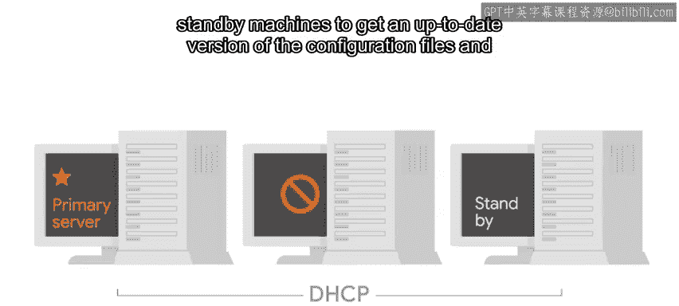
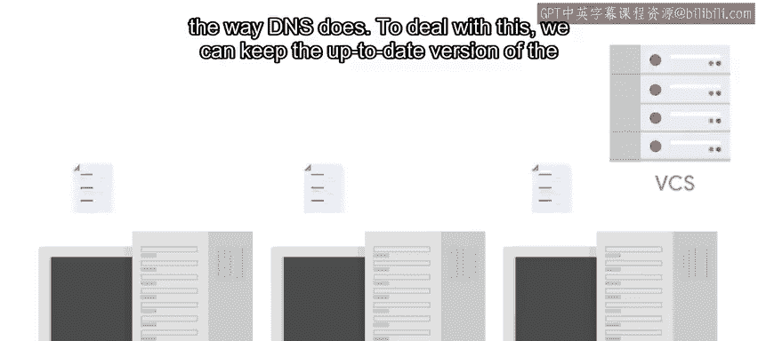

#  008：版本控制与自动化 🛠️

在本节课中，我们将学习版本控制系统（VCS）如何帮助IT专家，即使是在单人团队中，也能提升工作效率和系统可靠性。我们将探讨VCS如何像一台“时间机器”一样工作，并了解它在管理代码和配置文件方面的实际应用。

---

乍一看，为IT专家设置和学习使用版本控制系统似乎需要大量工作。

如果你所在的IT团队中只有你一个人编写代码，甚至整个团队只有你一个人，使用VCS可能显得小题大做。

那么，即使你不需要与他人共享脚本或协作，VCS也能提供帮助吗？

简短的回答是肯定的。即使在只有一人的IT部门中，VCS也具有不可估量的价值。

VCS不仅存储你的代码和配置，还存储这些代码和配置的历史记录。

版本控制系统可以像一台时间机器一样运作，让你洞察过去的决策。

每当你做出更改后编写提交信息时，就像是当前的你在向未来的你（或未来可能处理相同脚本和配置的其他人）解释你的决策。

这可以帮助你避免在三个月后盯着自己或他人编写的一段代码，却困惑于它的工作原理甚至它为何存在。

使用VCS，你可以查看、跟踪和选择项目历史中的快照，因此你所做的任何工作都不会丢失。

由于我们可以使用VCS来存储代码和配置文件，我们可以使整个IT系统更具可扩展性和可靠性。

例如，假设你将公司的DNS区域文件存储在VCS中。

> 如果你不记得了，DNS区域文件是一个配置文件，用于指定网络中IP地址和主机名之间的映射关系。

当你更新区域信息时，务必使用清晰易懂的提交信息。

这样，你将能够获取区域文件中新IP地址和主机名的元信息，例如它们何时被添加以及出于何种目的。

如果在添加新条目后出现任何问题，你可以依赖VCS来告诉你更改前文件的样子。

然后，你可以快速恢复到旧版本，以便迅速修复问题，稍后再找出错误所在。

由于VCS提供了审计跟踪，此功能增强了你所操作系统的可靠性。你可以确切地知道要将区域文件回滚到哪个版本，从而减少了修复问题所需的时间。

通常，最好先快速回滚并阻止错误，然后再花时间找出问题所在。你可以在“止血”后再进行修复。

找出错误可能会占用宝贵的时间，更糟糕的是，你的首次解决方案尝试可能本身就有错误。

让我们看另一个不同的例子。

DHCP守护进程的配置可以在两台或多台机器上复制，其中一台作为主服务器，另一台作为备用机器。

当主服务器正常运行时，备用机器不会做太多工作。

但如果主服务器因任何原因宕机，备用机器可以变为主服务器并开始响应DHCP查询。为此，所有机器上的配置文件必须完全相同。

> 这是因为DHCP协议不像DNS那样，提供一种让备用机器获取配置文件最新版本的方式。

为了解决这个问题，我们可以将DHCP配置的最新版本保存在版本控制系统中。

并让机器从VCS下载配置。

这意味着所有机器都将拥有完全相同的文件。这已经足够方便了，但在使用一段时间后，你肯定会看到其他好处。

假设你在周末收到一个紧急警报，告诉你你的DHCP服务器没有响应任何查询。

你查看更改历史，发现周五晚上添加的一个更改包含了一个重复条目，导致服务器行为异常。

通过使用VCS，你可以轻松回滚更改，并使服务器迅速恢复正常。

当需要更换新服务器时，你可能会遇到第二个意想不到的好处。

通过将所有服务器配置保存在版本控制系统中，自动化部署新服务器的任务会变得容易得多。

你是否开始看到版本控制系统有多么有用了？

你甚至可能想到一些情况，如果当时将文件保存在VCS中，本可以让你省去不少麻烦。

正如我们开始时所说，在本课程中，我们将使用Git，它是当今最流行的版本控制系统之一。

接下来，我们将了解一点Git的历史以及它如此特别的原因。

---

在本节课中，我们一起学习了版本控制系统（VCS）在IT自动化中的核心价值。我们了解到，即使对于单人团队，VCS也能通过保存完整的历史记录和提供快速回滚能力，显著提升工作的可靠性和效率。通过管理DNS区域文件和DHCP配置等实际例子，我们看到了VCS如何像“时间机器”一样帮助我们追踪决策、快速修复问题并简化系统部署。