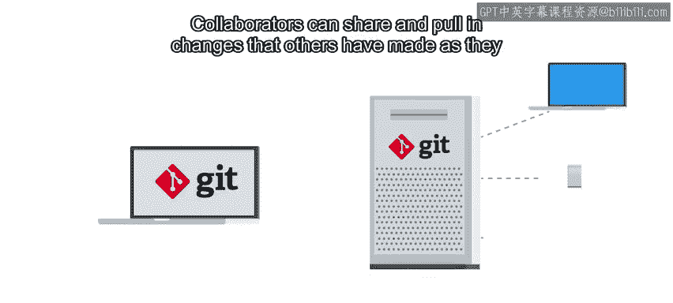
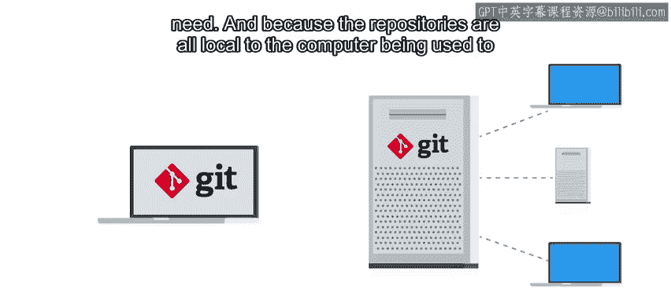
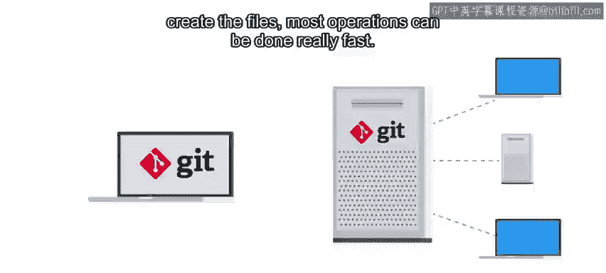

#  009：什么是Git？ 🗂️

在本节课中，我们将要学习版本控制系统（VCS）的基本概念，并重点介绍一个名为Git的流行工具。我们将了解Git是什么、它为何被创建、它的核心特点以及它与其他系统的不同之处。

## 什么是版本控制系统？

上一节我们介绍了版本控制系统（VCS）的概念。本节中我们来看看一个具体的VCS工具——Git。

Git是一个由Linux内核的发起者Linus Torvalds在2005年创建的版本控制系统。它是一个免费的开源系统，可以在Unix、Windows和Mac OS等平台上安装。

Linus最初创建Git是为了帮助管理Linux内核的开发工作。这项工作之所以困难，是因为大量地理上分散的程序员需要协作编写大量代码。当时已有的VCS工具无法满足Linus对系统工作方式和性能的要求，因此他决定自己编写一个。如今，Git已成为最流行的版本控制系统之一，被用于数百万个项目中。

## Git的分布式架构

与一些围绕单一服务器进行集中式管理的版本控制系统不同，Git采用的是分布式架构。这意味着每个为代码库做贡献的人，都在自己的开发机器上拥有该代码库的完整副本。

以下是分布式架构带来的几个关键优势：

*   **独立协作**：协作者可以根据需要，分享和拉取其他人所做的更改。
*   **高速操作**：由于代码库都存储在本地计算机上，大多数操作都可以非常快速地完成。
*   **灵活部署**：如果你想与他人协作，通常可以在一台服务器上设置一个代码库，作为大家交互的中心枢纽。

## Git的工作模式

Git不依赖任何集中式服务器来控制或组织其工作流程。Git可以作为一个独立的程序、一个服务器或一个客户端来工作。

这意味着你可以在单台机器上使用Git，甚至无需网络连接。或者，你可以将Git作为服务器安装在你想要托管代码库的机器上，然后从另一台（甚至同一台）机器上使用Git作为客户端来访问该代码库。

Git客户端可以通过HTTP、SSH或Git自己的专用协议与Git服务器进行网络通信。如果你想深入了解Git的架构或通信协议，我们会在后续阅读材料中提供更多信息的链接。

## Git的适用场景

因此，Git可以在有网络或无网络连接的情况下使用。它既适用于只有一名开发者的小型项目，也适用于拥有数千名贡献者的大型项目。你可以用它来跟踪仅自己可见的私人工作，也可以通过将代码托管在GitHub、GitLab等公共服务器上来与他人分享你的工作。你是否开始体会到Git的强大之处了？

## 术语说明：VCS vs. SCM

在网上查找信息时，你可能会注意到Git的官方网站叫`git-scm.com`，并好奇结尾的“SCM”代表什么。这实际上是另一个与VCS类似的缩写，代表“源代码管理”。虽然这两个术语意思相同，但我们通常更倾向于使用VCS，因为正如我们已经指出的，这些系统实际上可以用来存储的远不止源代码。

## 为什么选择Git？

在本课程中，我们选择Git是因为它的流行度、跨平台支持以及丰富的功能集。不过，与IT世界中的大多数事物一样，还有许多其他工具可以用来完成相同的任务，例如Subversion或Mercurial等其他VCS程序。如果你认为另一个VCS可能更适合你的需求，可以自由尝试其他选择。

但在我们深入探讨如何使用它之前，让我们再做一个快速测验，以确保到目前为止的所有内容都清晰明了。

---

本节课中我们一起学习了Git的基本概念。我们了解到Git是一个分布式版本控制系统，它允许开发者在本地拥有完整的项目副本，从而实现高效、灵活的协作。我们还探讨了Git的适用场景以及它与其他术语（如SCM）的关系。在接下来的课程中，我们将开始学习如何使用Git进行实际操作。