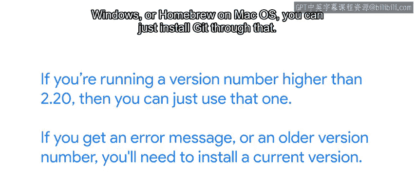

#  010：Git入门与安装 🛠️

在本节课中，我们将学习版本控制系统Git的基础知识，并完成在您计算机上的安装步骤。Git是一个强大的工具，能帮助我们高效地管理代码和文件的变更历史。

## 概述

首先，我们需要在计算机上安装Git。安装过程会根据您使用的操作系统有所不同。我们将分别介绍在Linux、macOS和Windows系统上的安装方法。

## 检查现有Git版本

在开始安装之前，最好先检查您的计算机上是否已经安装了Git。

以下是检查方法：
*   打开命令行工具。
*   输入命令 `git --version` 并执行。
*   如果返回的版本号高于2.20，则可以直接使用现有版本。

如果系统提示错误信息，或显示的版本号过旧，您就需要安装或更新Git。

## 通过包管理器安装

如果您使用的是带有包管理器的操作系统，安装Git会非常便捷。

以下是各系统的安装命令：
*   **Linux (APT)**: `sudo apt install git`
*   **Linux (YUM)**: `sudo yum install git`
*   **Windows (Chocolatey)**: `choco install git`
*   **macOS (Homebrew)**: `brew install git`

## 手动下载安装

如果您不使用包管理器，可以从Git官方网站下载最新的可执行安装程序。

安装过程如下：
1.  访问Git官网，下载对应您操作系统的安装程序。
2.  运行下载的安装程序。
3.  按照屏幕上的提示完成安装。

### 在Linux上安装

在Linux系统上，安装和使用Git非常直接。

您可以使用包管理器命令进行安装，例如 `apt install git` 或 `yum install git`。安装完成后，Git就可以在命令行中使用了。

### 在macOS上安装

在macOS上，安装过程同样简单。

您甚至可以在终端中直接运行 `git --version` 命令。如果Git尚未安装，系统会询问您是否要安装，并自动为您下载和安装。

或者，您也可以从官网下载安装程序，并按照提示完成安装。安装完成后，您可以像使用其他命令行工具一样使用Git。

### 在Windows上安装

在Windows系统上安装Git需要多一些配置步骤。

下载并运行安装程序后，您需要经过一系列配置选项。这些选项通常有预选的默认值，保持默认设置通常是最佳选择。但请注意“选择默认编辑器”这个选项，您可能需要将其更改为您熟悉的编辑器，例如Notepad++或VS Code。

Windows版Git安装的一个特点是，它预装了一个名为MinGW64的环境。这个环境让我们能够在Windows上使用与Linux相同的命令和工具。因此，您可以在Windows机器上练习一些Linux命令行工具。

在Windows机器上安装Git后，您可以从Linux命令行使用Git。如果您在安装过程中关于PATH环境变量的选项选择了默认设置，那么您也可以从PowerShell命令行运行Git。

如果您想更深入了解Windows安装过程中的每个选项，可以观看可选视频，我们将讨论可用选项以及何时可能需要选择与默认不同的设置。

## 命令行与图形界面

在本课程中，我们将重点介绍如何使用命令行来操作Git。

一些集成开发环境（IDE）提供了通过图形界面与Git交互的功能，如果您觉得那样更顺手，使用它们完全没有问题。我们专注于命令行，是因为它是标准方式，并且一旦您掌握了命令行的使用，您就一定能够使用任何图形化工具。

## 总结

本节课我们一起学习了如何在不同操作系统上安装Git。我们介绍了检查现有版本、通过包管理器安装以及手动下载安装的方法。安装完成后，您就可以在命令行中使用Git来管理您的项目了。

在下一个视频中，我们将深入了解在Windows机器上安装Git时可设置的各种选项。如果您已经成功安装了Git，可以直接跳到后续的课程内容。