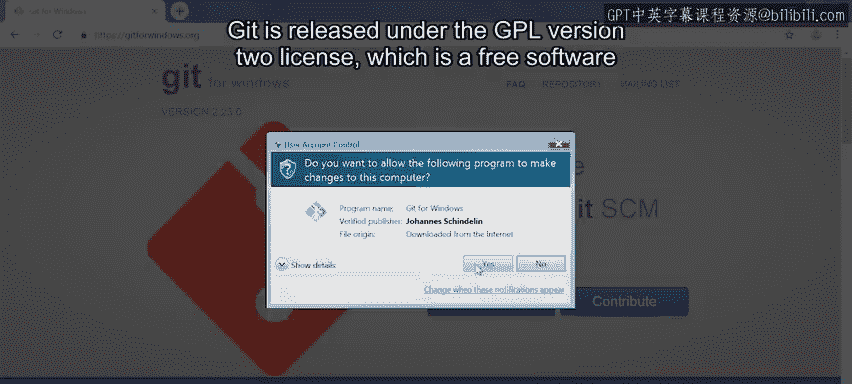
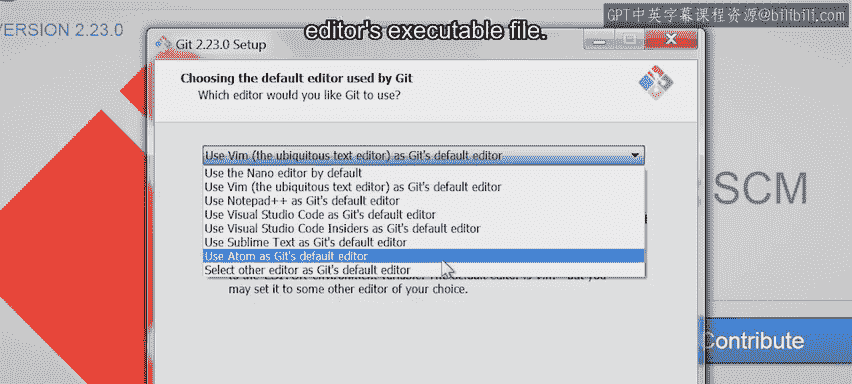
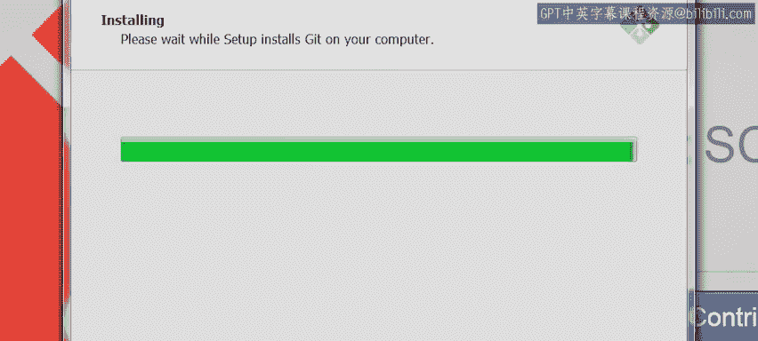

#  011：在 Windows 上安装 Git（可选） 🖥️

## 概述

在本节课中，我们将学习如何在 Windows 操作系统上安装 Git 版本控制系统。我们将详细介绍安装过程中的各个选项及其含义，确保您能顺利完成安装并理解每个配置的作用。

## 下载 Git 安装程序

首先，我们需要从 Git 官方网站下载适用于 Windows 的最新版本安装程序。

您可以从 `gitforwindows.org` 网站获取安装包。这个软件包不仅包含 Git 核心程序，还附带了一系列在后续课程中可能会用到的实用工具。

## 安装过程详解

下载完成后，我们就可以开始安装过程了。以下是安装过程中各个步骤的详细说明。

### 1. 许可协议

启动安装程序后，首先看到的是软件许可协议窗口。Git 基于 GNU 通用公共许可证第二版（GPL v2）发布，这是一个自由软件许可证。这意味着您可以查看 Git 的源代码以了解其工作原理，甚至可以修改它以实现不同的功能。

我们接受此许可协议并继续安装。

### 2. 选择安装路径

接下来是选择安装路径。通常，保持默认路径即可。

### 3. 选择组件

这个窗口允许我们选择要安装的附加组件。默认情况下，Git 会与 Windows 资源管理器集成，允许我们在当前文件夹中运行 Git 命令行或图形界面。

该软件包还包含一个扩展，用于改善大型文件（如音频或视频文件）在版本控制系统中的存储支持。建议保持此选项启用。

安装程序还会将 Git 配置文件注册为应用文本编辑器打开的文件，并将 `.sh` 文件注册为应用 Bash 执行的文件。这些选项都很合理，建议保持选中。

您还可以根据需要启用其他选项，例如在桌面显示图标、在控制台使用 TrueType 字体，或启用自动更新检查。

### 4. 选择开始菜单文件夹

安装程序会提示您选择创建快捷方式的开始菜单文件夹名称。使用默认名称即可。

### 5. 选择默认文本编辑器

这是您很可能需要调整的选项。您需要选择一个您习惯使用的文本编辑器。

安装程序已经列出了一些可选编辑器，如 Notepad++、Visual Studio Code 或 Sublime Text。您甚至可以输入其他编辑器的可执行文件路径来手动选择。

在本课程的所有示例中，我们将使用 Vim。因此，我们在此次安装中选择 Vim。

**请注意**：该软件包本身不包含任何这些图形化编辑器，您需要单独安装您选择的编辑器。

### 6. 调整 PATH 环境变量

此选项决定了我们如何从命令行执行 Git。

*   **第一个选项**：Git 只能通过软件包自带的命令行工具访问。
*   **第二个选项（默认选中）**：允许我们从自带的命令行工具和 Windows 命令提示符中执行 Git。
*   **第三个选项**：将 Git 附带的类 Unix 工具也添加到 Windows 命令提示符的 PATH 中。选择此选项后，任何与操作系统命令同名的命令都将来自此软件包，而非基本的操作系统命令。

我们保持第二个选项选中，因为它既方便使用，又不会干扰本地工具。

### 7. 选择 HTTPS 传输后端

此窗口让我们选择如何验证用于 HTTPS 连接的 SSL 证书。

我们可以选择使用 Git 附带的 OpenSSL 库，或使用原生的 Windows 安全通道库。如果您需要与公司内部系统交互，可能需要选择第二个选项。

由于我们只与 GitHub 交互，因此保持默认选项选中。

### 8. 配置行尾转换

用于指示行尾的字符在 Windows、Linux 和 macOS 之间是不同的。Git 软件包允许我们决定如何处理这些差异。

*   **默认选项**：在本地文件中存储 Windows 风格的行尾，但在 Git 存储的文件中使用 Unix 风格的行尾。当您使用 Windows 计算机与使用其他操作系统的协作者合作时，此选项效果很好。
*   **第二个选项**：在本地复制文件时保持行尾不变，并在 Git 存储的文件中使用 Unix 风格的行尾。如果您使用的是类 Unix 操作系统，或者您是唯一在 Windows 上通过类 Unix 编辑器进行编辑的人，此选项效果很好。
*   **第三个选项**：不进行任何转换。如果您尝试与使用不同操作系统的人合作，此选项效果不佳，因此仅当所有协作者都运行与您相同的操作系统时才推荐使用。

我们保持第一个选项选中并继续。

### 9. 配置终端模拟器

该软件包自带一个终端模拟器，它具有许多不错的功能，例如更好的 Unicode 支持和可滚动的长命令历史记录。我们保持此选项选中。但如果您更习惯使用 Windows 默认的控制台窗口，也可以选择它。

### 10. 其他选项

接下来，还有一些额外的选项可供选择启用。我们保持默认设置。这样，我们将获得 Git 文件系统缓存带来的性能改进，并且能够使用 Git 凭据管理器。

我们不需要在仓库中使用符号链接，因此保持该选项禁用。

### 11. 实验性功能

在安装之前，最后一个提示让我们选择要启用的实验性功能。这里提供的功能会随着时间的推移而变化，一些被采纳，一些被放弃。您可以决定是使用前沿功能，还是选择已经过充分测试的功能。

我们今天不打算冒险，因此不启用实验性功能。我们直接点击“安装”来开始安装过程。

## 完成安装

现在，Git 正在我们的机器上安装。安装完成后，我们就可以随时使用 Git 的所有功能了。

## 总结

本节课中，我们一起学习了在 Windows 系统上安装 Git 的完整步骤。我们详细探讨了安装过程中的各个配置选项，包括组件选择、默认编辑器设置、PATH 环境变量调整、行尾转换处理以及终端模拟器的选择。理解这些选项有助于您根据自身需求进行定制化安装，为后续的版本控制操作打下坚实基础。

如果您需要更多帮助，可以在接下来的阅读材料中找到关于 Git 安装的更多信息链接。