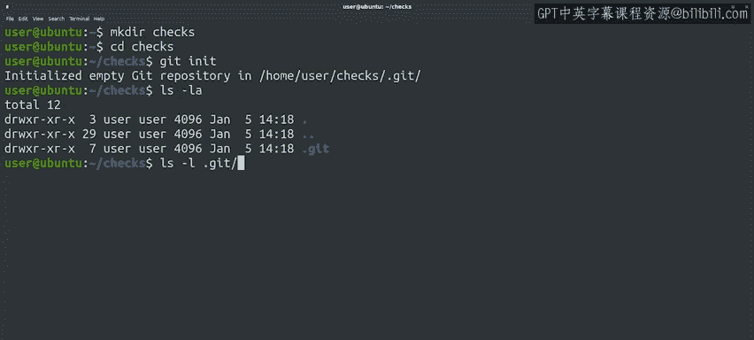
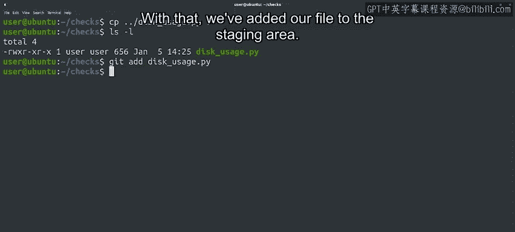
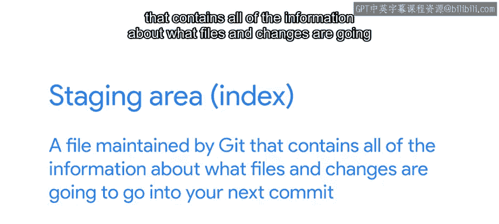
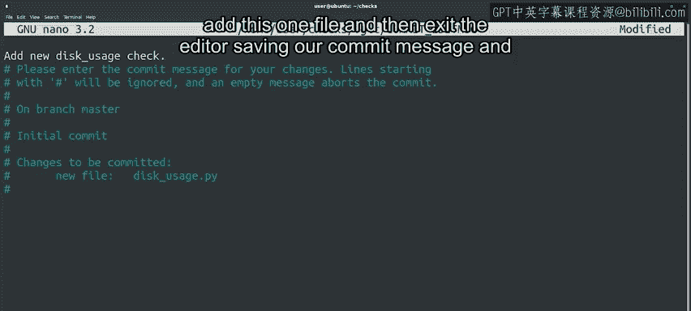

#  012：Git入门 🚀


在本节课中，我们将学习Git版本控制系统的基础概念和基本操作。我们将了解如何配置Git、初始化仓库、跟踪文件更改，并完成第一次提交。

---

开始使用Git时，我们需要学习一系列概念，以理解文件如何组织以及我们的文件如何被跟踪。

在接下来的视频中，我们将介绍一些主要的Git概念。

如果其中任何概念起初看起来令人困惑，请不要惊慌。

随着我们扩展Git知识，我们将深入探讨所有这些概念。

让我们从设置一些基本配置开始。记得我们说过，版本控制系统会跟踪谁进行了哪些更改。

为此，我们需要告诉Git我们是谁。我们可以使用`git config`命令，然后将`user.email`和`user.name`的值设置为我们的电子邮件和姓名。

像这样：
```bash
git config --global user.email "you@example.com"
git config --global user.name "Your Name"
```
我们使用`--global`标志来声明我们希望为使用的所有Git仓库设置此值。

我们也可以为不同的仓库设置不同的值。

完成此设置后，有两种方法可以开始使用Git仓库。

我们可以使用`git init`命令从头创建一个仓库。

或者，我们可以使用`git clone`命令复制一个已存在于其他地方的仓库。

我们将在课程后面讨论远程仓库。

现在，让我们从创建一个新目录开始，然后在该目录内创建一个Git仓库。

当我们运行`git init`时，我们在当前目录中初始化一个空的Git仓库。

我们收到的消息提到了一个名为`.git`的目录。



我们可以使用`ls -la`命令检查该目录是否存在，该命令会列出以点开头的文件。

我们也可以使用`ls -la .git`命令查看其内部，并了解它包含的许多不同内容。

这个目录称为Git目录，你可以将其视为Git项目的数据库，用于存储更改和更改历史记录。

我们可以看到它包含许多不同的文件和目录。

我们不会直接接触这些文件中的任何一个。我们将始终通过Git命令与它们交互。

因此，每当你克隆一个仓库时，这个Git目录就会被复制到你的计算机上。

每当你运行`git init`创建一个新仓库时，就像我们刚才所做的那样，就会初始化一个新的Git目录。

Git目录之外的区域是工作树。


工作树是你的项目的当前版本。

你可以将其视为一个工作台或沙盒，你可以在其中对文件执行所有想要的修改。

这个工作树将包含所有当前被Git跟踪的文件，以及我们尚未添加到跟踪文件列表中的任何新文件。

目前，我们的工作树是空的。让我们通过将之前视频中看到的`disk_usage.py`文件复制到当前目录来改变这一点。

好的，我们现在在工作树中有了一个文件，但它目前未被Git跟踪。为了让Git跟踪我们的文件，我们将使用`git add`命令将其添加到项目中，将要添加的文件作为参数传递。

这样，我们就将文件添加到了暂存区。

暂存区，也称为索引，是Git维护的一个文件，其中包含有关哪些文件和更改将进入下一次提交的所有信息。

我们可以使用`git status`命令获取有关当前工作树和待处理更改的一些信息。

让我们检查一下。





我们看到我们的新文件被标记为待提交。

这意味着我们的更改当前在暂存区中。

要将其提交到Git目录，我们运行`git commit`命令。现在让我们试试。

当我们运行此命令时，我们告诉Git我们想要保存更改。它会打开一个文本编辑器，我们可以在其中输入提交消息。如果你愿意，可以将使用的编辑器更改为你首选的编辑器。

在我们的例子中，这台计算机将nano配置为默认编辑器。

我们得到的文本告诉我们，我们需要编写提交消息。

并且要提交的更改是我们添加的新文件。

我们稍后将深入探讨提交消息。现在，让我们输入一个简单的描述，说明我们做了什么，即添加了这个文件。

然后退出编辑器，保存我们的提交消息。

这样，我们就创建了我们的第一个Git提交。

接下来，我们将更详细地讨论Git仓库中每个跟踪文件的生命周期。



---

在本节课中，我们一起学习了Git的基本配置、仓库的初始化、工作树与暂存区的概念，以及如何通过`git add`和`git commit`命令来跟踪并提交文件的更改。这是使用Git进行版本控制的第一步。