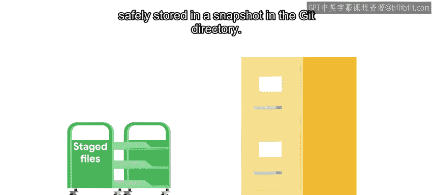
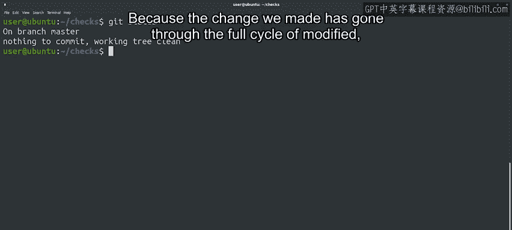

#  013：跟踪文件 📁


在本节课中，我们将学习Git如何跟踪文件的变化。我们将详细探讨文件的三种主要状态，并通过一个实际例子演示从修改文件到提交更改的完整工作流程。

---

在上节课中，我们提到任何Git项目都包含三个部分：**Git目录**、**工作树**和**暂存区**。Git目录存储了所有文件和更改的历史记录。工作树包含了项目的当前状态，包括我们做出的任何更改。暂存区则包含了被标记为要包含在下一次提交中的更改。

为了更清晰地理解，可以将Git视为代表你的项目（即代码和相关文件）以及一系列快照。每次你进行提交时，Git都会记录下那一刻项目状态的新快照。这个快照精确地捕捉了所有文件在某个时间点的样子。这些快照共同构成了你项目的历史，其信息存储在Git目录中。

现在，让我们深入了解如何跟踪文件更改的细节。

---

## 文件的跟踪状态与三种状态

当我们使用Git时，文件要么是**已跟踪的**，要么是**未跟踪的**。已跟踪的文件是快照的一部分，而未跟踪的文件尚未成为快照的一部分，新文件通常就属于这种情况。

每个已跟踪的文件可以处于以下三种主要状态之一：**已修改**、**已暂存**或**已提交**。

以下是每种状态的含义：

*   **已修改**：这意味着我们对文件进行了更改，但尚未提交。更改可以是添加、修改或删除文件内容。Git会注意到我们对文件的任何修改，但不会存储这些更改，除非我们将它们添加到暂存区。
*   **已暂存**：当我们标记这些更改以进行跟踪时，已修改的文件就变成了已暂存的文件。换句话说，对这些文件的更改已准备好提交到项目中。所有已暂存的文件都将成为我们拍摄的下一个快照的一部分。
*   **已提交**：当文件被提交时，对其所做的更改会安全地存储在Git目录的快照中。

通常，一个被Git跟踪的文件会经历以下流程：首先，当我们以任何方式更改它时，它会变为**已修改**状态。然后，当我们标记这些更改以进行跟踪时，它会变为**已暂存**状态。最后，当我们将这些更改存储在版本控制系统（VCS）中时，它会被**提交**。

---

## 实际操作演示

让我们在示例Git仓库中实际操作一下。



首先，使用 `ls -la` 命令检查当前工作树的内容，然后使用 `git status` 命令查看文件的当前状态。

```bash
ls -la
git status
```

运行 `git status` 后，Git会告诉我们很多信息，包括我们当前在 `master` 分支上（我们将在课程后面学习分支）。目前，请注意它显示“没有要提交的内容”且“工作树是干净的”。

现在，让我们修改一个文件来改变这个状态。例如，我们将在脚本向用户显示的消息末尾添加句号。

修改完成后，再次调用 `git status` 查看新的输出。Git再次提供了大量信息，包括一些我们可能想使用的命令提示，这些提示在熟悉Git时非常有用。可以看到，我们更改的文件现在被标记为“已修改”，并且“尚未暂存以备提交”。

让我们通过运行 `git add` 命令来改变这个状态，并将 `disk_usage.py` 文件作为参数传递。

```bash
git add disk_usage.py
```

当我们调用 `git add` 时，我们是在告诉Git，我们希望将该文件中的当前更改添加到待提交的更改列表中。这意味着我们的文件现在是暂存区的一部分，一旦我们运行下一个Git命令 `git commit`，它就会被提交。

这次，我们不打开编辑器，而是使用 `-m` 标志传递提交消息，说明我们在句子末尾添加了句号。

```bash
git commit -m “在句子末尾添加了句号”
```

现在我们已经提交了暂存的更改，这在Git目录中创建了一个新的快照。该命令向我们显示了所做更改的一些统计信息。

让我们做最后一次状态检查。

```bash
git status
```

我们看到，再次显示没有要提交的更改，因为我们所做的更改已经完成了从**已修改**到**已暂存**再到**已提交**的完整周期。

---

## 总结



本节课中，我们一起学习了Git跟踪文件的核心机制。


总结一下工作流程：我们在工作树中处理**已修改**的文件。当它们准备好后，我们通过将这些文件添加到暂存区来**暂存**它们。最后，我们**提交**暂存区中的更改，这会为这些文件拍摄快照，并将它们存储在Git目录的数据库中。

如果其工作原理还不是完全清楚，请不要担心，通过更多的练习会逐渐掌握。在下节课中，我们将把所有内容整合起来，回顾使用Git时的典型工作流程。