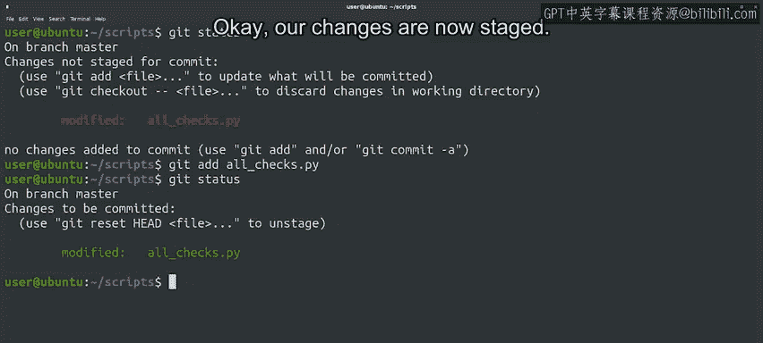

#  014：Git基本工作流 🚀


在本节课中，我们将学习Git在日常工作中的基本使用流程。我们将回顾Git的核心概念，并通过一个具体的例子，演示如何创建文件、跟踪更改、暂存修改以及提交快照。

---

在之前的视频中，我们讨论了使用Git所涉及的一些基本概念。我们了解到，每个仓库都会有一个Git目录、一个工作树和一个暂存区。并且，文件可以处于三种不同的状态：已修改、已暂存和已提交。

让我们通过观察日常使用Git时的常规工作流，再次回顾这些概念。

## 初始化仓库与配置

首先，所有我们希望用Git管理的文件都必须是一个Git仓库的一部分。我们可以在任何文件系统目录中运行 `git init` 命令来初始化一个新的仓库。

例如，让我们使用 `mkdir` 命令创建一个名为 `scripts` 的目录，然后进入该目录并初始化一个空的Git仓库。

```bash
mkdir scripts
cd scripts
git init
```

我们闪亮的新Git仓库现在可以用来跟踪其内部文件的更改了。但在开始之前，让我们使用 `git config -l` 命令查看当前的配置。

配置信息中有很多内容，我们暂时不会全部介绍。请特别注意 `user.email` 和 `user.name` 这两行，我们在之前的视频中简要提到过。如果你使用共享仓库，出于隐私考虑，这些信息将出现在公开的提交日志中。在处理私人工作和向公共仓库提交代码时，你可能希望使用不同的身份信息。我们将在下一篇阅读材料中包含更多关于更改此信息的细节。

好的，我们的仓库已准备就绪，但目前是空的。

## 创建并跟踪新文件

让我们在其中创建一个文件。我们将从一个Python脚本的基本框架开始，这将帮助我们演示Git工作流。

和任何Python脚本一样，我们从 `shebang` 行开始。目前，我们将添加一个空的 `main` 函数，稍后再填充内容。最后，我们将调用这个 `main` 函数。

```python
#!/usr/bin/env python3

def main():
    pass

if __name__ == "__main__":
    main()
```

我们已经创建了文件。这是一个我们希望执行的脚本，所以让我们使其可执行。

```bash
chmod +x all_checks.py
```

然后，让我们使用 `git status` 命令检查仓库的状态。

正如我们之前提到的，当我们在仓库中创建一个新文件时，它最初是**未跟踪**的。我们可以对文件进行各种更改，但在我们告诉Git跟踪它之前，Git不会对未跟踪的文件做任何处理。

你还记得我们必须使用什么命令来让Git跟踪我们的文件吗？没错，我们需要调用 `git add` 命令。这个命令会立即将一个新文件从未跟踪状态移动到**已暂存**状态。正如我们稍后将看到的，它也会将处于已修改状态的文件更改为已暂存状态。

请记住，当文件被暂存时，意味着它已被添加到暂存区，并准备好提交到Git仓库。

```bash
git add all_checks.py
```

## 提交更改

要提交已暂存的文件，我们使用 `git commit` 命令。当我们这样做时，它只会提交已添加到暂存区的更改，未跟踪的文件或未暂存的已修改文件将被忽略。

不带参数调用 `git commit` 将启动一个文本编辑器。这将打开你设置为默认编辑器的程序。如果默认编辑器不是你想要的，有很多方法可以更改它。我们将在下一篇阅读材料中包含更多关于更改默认编辑器的信息。

现在，让我们用 `nano`（这是当前计算机的默认设置）来编辑我们的提交信息。我们将说明我们的更改是“创建了一个空的 all_checks.py 文件”，然后保存并退出。

```bash
git commit
# 在打开的编辑器中输入：Creating an empty all_checks.py file
```

太好了！我们刚刚记录了项目中代码的一个快照，该快照存储在Git目录中。请记住，每次我们提交更改时，都会拍摄另一个快照，并用我们以后可以查看的提交信息进行注释。

## 修改现有文件

好的，这就是我们添加新文件的方式，但通常我们会修改现有的文件。所以，让我们在脚本中添加更多内容来看看这个过程。

我们将添加一个名为 `check_reboot` 的函数，用于检查计算机是否等待重启。为此，我们将检查 `/var/run/reboot-required` 文件是否存在。这是当某些软件需要重启时，在我们计算机上创建的一个文件。当然，由于我们使用了 `os.path.exists`，我们需要在脚本中添加 `import os`。

```python
#!/usr/bin/env python3
import os

def check_reboot():
    """Returns True if the computer has a pending reboot."""
    return os.path.exists("/run/reboot-required")

def main():
    pass

if __name__ == "__main__":
    main()
```

我们已经向文件中添加了一个函数。让我们再次使用 `git status` 检查当前状态。



我们的文件显示为**已修改**，但**未暂存**。要暂存我们的更改，我们需要再次调用 `git add`。

```bash
git add all_checks.py
```

好的，我们的更改现在已暂存。

接下来我们需要做什么？你说对了。我们必须调用 `git commit` 将这些更改存储到Git目录中。这次我们将使用另一种设置提交信息的方式：调用 `git commit -m`，然后传递我们想要使用的提交信息。

```bash
git commit -m "Added the check_reboot function"
```

## 总结

至此，我们已经演示了基本的Git工作流：我们对文件进行更改，使用 `git add` 暂存它们，然后使用 `git commit` 提交它们。你是否开始对这个过程感到更熟悉，并看到它如何融入你的其他任务中了？

如果还有任何不完全清楚的地方，请记住，熟悉这些概念的唯一方法就是练习。请随时在你的计算机上尝试这些示例，直到你熟悉这些命令。

在本节课中，我们一起学习了Git的基本工作流，包括初始化仓库、创建和跟踪文件、暂存修改以及提交更改。下一节，我们将讨论如何编写有用的提交信息。