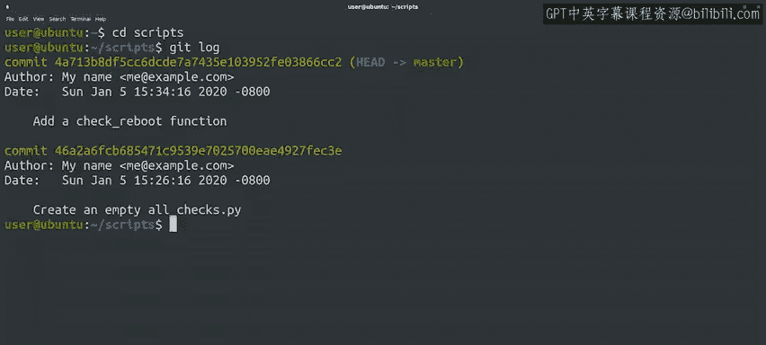

#  015：如何编写有效的Git提交消息 📝


在本节课中，我们将学习如何为Git提交编写清晰、信息丰富的提交消息。这是版本控制中一项至关重要的技能，能帮助你和你的团队在未来更好地理解代码的变更历史。

## 概述

在之前的课程中，我们学习了如何将变更的快照提交到Git仓库。现在，我们将更深入地探讨什么才是好的提交消息。在使用版本控制系统时，编写清晰、信息丰富的提交消息非常重要。未来的你、其他开发者或IT专家在阅读提交消息时，会非常感激这些上下文信息，因为它们有助于理解代码或配置的某些部分。

## 什么是好的提交消息？

编写提交消息时，心中想着你的读者会很有帮助。几周或几个月后，阅读消息的人会想知道你做了哪些更改？这些更改中，哪些部分特别重要或难以理解？是否有额外的信息可以帮助读者，例如设计文档的链接或工单系统中的票据链接？

与编写代码的风格指南类似，你的公司可能对编写提交消息有特定的规则。即使没有，遵循一些通用准则也能确保你的提交消息尽可能清晰和有用。

## 提交消息的结构

一个提交消息通常分为几个部分。

以下是提交消息的标准结构：

1.  **第一行**：提交的简短摘要，通常不超过50个字符。
2.  **一个空行**：用于分隔摘要和详细描述。
3.  **详细描述**：详细说明变更的原因，以及任何特别有趣或难以理解的地方。通常每行不超过72个字符。

当你运行 `git commit` 命令时，Git会打开你选择的文本编辑器，让你编写提交消息。

## 一个良好的提交消息示例

一个好的提交消息可能如下所示：

```
修复用户登录时的空指针异常

- 当用户名为空时，`validate_user` 函数会抛出 `NullPointerException`。
- 在调用 `user.getName()` 之前添加了空值检查。
- 关联的工单编号为 #JIRA-123。
```

第一行通常保持在50个字符左右。第一行之后是一个空行，其余文本通常保持在72个字符以内。这段文本旨在提供变更的详细解释。它可以引用此变更将修复的错误或问题，也可以在相关时包含更多信息的链接。行数限制可能有些烦人，但它们有助于使提交消息对读者来说更易于消化。

## 使用 `git log` 查看提交历史

有一个用于显示这些提交消息的Git命令，叫做 `git log`。

这个命令不会为我们进行任何换行，这意味着如果我们不遵守推荐的行宽限制，长的提交消息会超出屏幕边缘，难以阅读。

现在，让我们回到之前进行过两次提交的示例 `scripts` 目录，看看 `git log` 对那两次提交有什么说法。

看看Git在日志中跟踪了哪些信息。它在短短几行中打包了大量信息。

对于每次提交，列出的第一项是它的标识符，这是一长串字母和数字，用于唯一标识每次提交。列表中的第一次提交还显示 `HEAD` 指针指向 `master` 分支。如果这对你来说像天书，别担心。我们将在后面的视频中详细讨论 `HEAD` 和 `master` 的含义。

对于每次提交，我们看到提交者的姓名和电子邮件，这被标记为作者。然后我们得到提交的日期和时间。最后，显示提交消息。由于我们刚刚开始处理仓库，我们的提交消息非常简短。

随着我们进行的工作变得更加复杂，我们可能会编写更长的描述，包含更多细节。

## 避免不良做法

有时，人们可能想写一些简短的内容，比如“更新”、“更改”或“修复”作为提交消息的描述。**请不要这样做**。

回到仓库的历史记录中，发现没有足够的上下文来理解更改了什么以及为什么更改，这是非常令人沮丧的。多花几秒钟写一个更好的描述是值得的，这在未来会变得非常宝贵。

遵循这些准则可以帮助使你的提交消息真正有用，现在的投入将在以后得到回报。



## 总结

本节课中，我们一起学习了如何编写有效的Git提交消息。我们了解了提交消息的标准结构，包括简短的摘要和详细的描述部分。我们还探讨了为什么好的提交消息对团队协作和未来维护至关重要，并学习了如何使用 `git log` 命令查看提交历史。记住，多花一点时间编写清晰的提交消息，是对未来自己和团队成员的宝贵投资。

接下来，我们将为你提供一份速查表，列出到目前为止我们看到的所有Git命令，以及你可能觉得有用的额外信息的链接。之后，请进入下一个练习测验，以确保你完全理解了所有这些新概念。