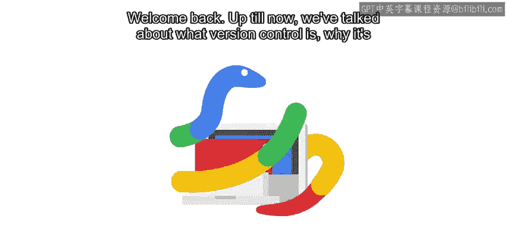

#  017：模块2 - 本地Git使用详解 🚀

在本节课中，我们将深入学习Git的高级功能，包括快捷操作、信息查看、撤销更改以及分支管理。这些技能将帮助你更高效地使用版本控制系统。

---

上一节我们介绍了Git的基本概念和基础操作。本节中，我们将探索Git的一些强大特性，从提高效率的快捷方式开始。

## 获取更多信息与快捷操作 🔍

Git提供了多种命令来获取仓库的详细状态和历史信息。同时，掌握一些快捷方式可以显著提升工作效率。

以下是几个常用的信息查看命令：

*   `git status`：查看工作目录和暂存区的状态。
*   `git log`：查看提交历史记录。
*   `git diff`：显示尚未暂存的改动内容。

## 撤销更改：版本控制的核心能力 ↩️

能够回退更改是版本控制系统最有用的功能之一。根据不同的情况，我们需要采用不同的回退技术。

接下来，我们将学习几种撤销更改的方法。根据你需要撤销的内容，可以选择不同的技术：

1.  **丢弃文件的修改**：使用 `git checkout -- <file>` 命令可以放弃工作目录中对某个文件的所有修改，将其恢复到最近一次提交的状态。
2.  **修正错误的提交**：如果你提交了错误的内容，可以使用 `git commit --amend` 命令来修改最近一次的提交信息或内容。
3.  **回滚到历史快照**：使用 `git revert <commit>` 或 `git reset` 命令可以将项目回退到某个指定的历史版本。

## 探索分支概念 🌿

最后，我们将了解另一个重要概念：分支。分支允许你在独立的开发线上工作，而不会影响项目的主代码。

分支的用途非常广泛：

*   开发实验性功能。
*   维护无法直接合并的多个软件版本。
*   同时进行多个不同特性的开发。

我们将深入探讨什么是分支、何时以及如何使用它们，并学习如何处理合并时可能出现的冲突。

---

必须承认，其中一些概念可能比较复杂。因此，我们强烈建议你跟随课程在电脑上实际操作，尝试我们演示的命令，并自行练习，直到熟练掌握这些技巧。

记住，如果对任何内容有不清楚的地方，你可以随时回看之前的视频进行复习。如果在尝试后仍然感到困惑，请务必利用讨论区寻求帮助。

---

本节课中，我们一起学习了Git的高级功能，包括查看信息的命令、多种撤销更改的方法以及分支管理的基础。通过实践这些技巧，你将能更加自如地运用Git来管理你的项目。