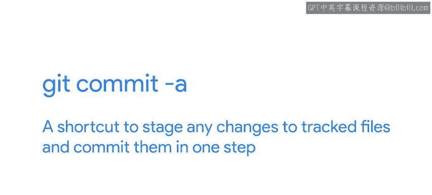
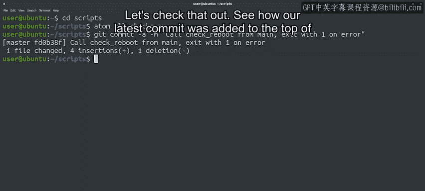
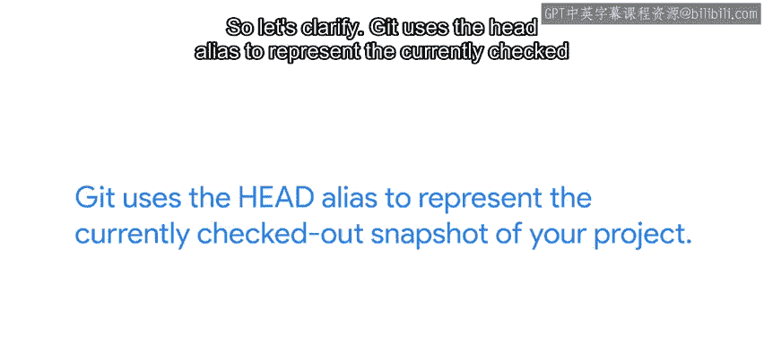

#  018：跳过暂存区域 🚀

在本节课中，我们将要学习如何使用 Git 的一个快捷方式，跳过“暂存”步骤，直接将工作目录中的修改提交到仓库。这对于处理简单、明确的更改非常有用。

## 概述

上一节我们介绍了 Git 的基本工作流程：修改文件、暂存更改、提交更改。本节中我们来看看如何通过 `git commit -a` 命令跳过中间的暂存步骤，实现快速提交。

## 跳过暂存步骤

当我们介绍基本的 Git 工作流程时，我们指出该过程通常是：进行更改、暂存它们，然后提交它们。暂存和提交之间的独立步骤允许我们在一次提交中暂存多个更改。

但是，如果我们已经知道当前的更改就是我们想要提交的更改，我们可以跳过暂存步骤，直接进行提交。无需彩排。

我们通过使用 `git commit` 命令的 `-a` 标志来实现这一点。

这个标志会在执行提交之前，自动暂存所有**已被跟踪且被修改**的文件，让我们可以跳过 `git add` 步骤。

起初，你可能会认为 `git commit -a` 只是 `git add` 后跟 `git commit` 的快捷方式。

但这并不完全正确。`git commit -a` 不适用于新文件，因为那些文件是未被跟踪的。

实际上，`git commit -a` 是一个快捷方式，用于暂存所有对**已跟踪文件**的更改，并在一步中提交它们。

如果被修改的文件从未被提交到仓库，我们仍然需要先使用 `git add` 来跟踪它。

## 实践操作

让我们修改之前视频中的示例脚本，并尝试这个新标志。

我们将修改我们的 `main` 函数，使其调用我们之前编写的 `check_reboot` 函数。

如果存在待处理的重启，我们将打印一条消息，然后以退出状态码 `1` 退出我们的程序。

由于我们使用了 `sys` 模块，我们需要导入它。

好的，现在我们已经完成了更改，准备尝试新的 `-a` 标志。

我们还将使用 `-m` 标志来直接添加提交消息。这次我们会说“调用 check_reboot 并在错误条件下以状态码 1 退出”。

以下是操作步骤：

1.  修改脚本文件。
2.  使用 `git commit -a -m "调用 check_reboot 并在错误条件下以状态码 1 退出"` 命令。

成功！这些快捷方式在进行我们知道想要直接提交的小更改时非常有用，无需将它们保留在暂存区，也无需编写冗长复杂的描述。

请记住，当你使用 `-m` 快捷方式时，你只能写简短的消息，并且无法使用我们之前讨论过的关于提交描述的最佳实践。

因此，它最好只用于那些确实不需要额外上下文或解释的小改动。简短而精悍。

**注意**：当你使用 `-a` 快捷方式时，你跳过了暂存区，这意味着在创建提交之前，你无法添加任何其他更改。

所以你需要确保你已经包含了你想在该次提交中包含的所有内容。

## 提交结果与 HEAD 指针

最终，使用像 `-a` 这样的快捷方式就像使用常规的提交工作流程一样，提交将连同消息一起出现在日志中，就像往常一样。让我们来检查一下。

看，我们最新的提交被添加到了提交列表的顶部。注意 `HEAD` 指示器现在已经移动到了最新的提交。

你可能想知道，这个 `HEAD` 是什么，它指向哪里？我们会经常遇到它，所以让我们来澄清一下。

Git 使用 `HEAD` 别名来表示你项目中**当前已检出**的快照。

这让你知道工作目录的内容应该是什么。在这种情况下，当前快照是项目中的最新提交。

我们很快就会学习分支，在那种情况下，`HEAD` 可以指向项目中不同分支的一个提交。

我们甚至可以使用 Git 回到过去，让 `HEAD` 代表应用最新更改之前的旧提交。

在所有情况下，`HEAD` 都用于指示当前已检出的快照是什么。这就是 Git 标记你在项目中位置的方式。可以把它想象成一个书签，你可以用它来跟踪你所在的位置。

即使你有好几本书要读，书签也能让你从上次停下的地方继续阅读。

当你运行像 `diff`、`branch` 或 `status` 这样的 Git 命令时，Git 将使用 `HEAD` 这个“书签”作为其执行任何操作的基础。

当我们学习如何撤销操作和执行回滚时，我们会看到 `HEAD` 的使用，我们将在后面的视频中更多地讨论分支。

作为一种快捷方式，通常可以简单地将 `HEAD` 视为指向当前分支的指针，尽管它的功能可能比这更强大。

## 总结

本节课中我们一起学习了如何使用 `git commit -a` 命令跳过暂存步骤，快速提交对已跟踪文件的修改。我们了解了这个快捷方式的适用场景（小改动、已跟踪文件）和注意事项（不适用于新文件、无法添加额外更改）。我们还引入了 `HEAD` 指针的概念，它像一个书签，标记了当前工作目录所对应的项目快照位置，是 Git 许多操作的基础。接下来，我们将深入探讨如何在提交前后获取更多关于我们更改的信息。