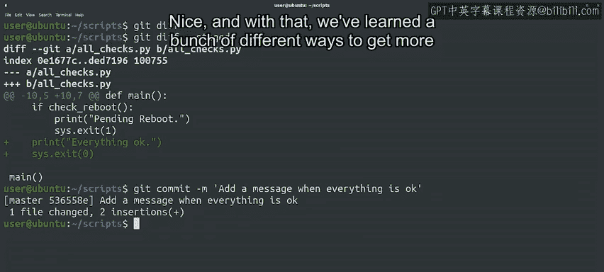

#  019：获取更多有关更改的信息 📝

在本节课中，我们将学习如何使用Git命令获取比默认信息更详细的提交历史与更改内容。我们将重点介绍 `git log` 的不同参数、`git show` 命令以及如何查看未提交的更改。

---

我们已经了解了 `git log` 如何显示当前Git仓库中的提交列表。默认情况下，它会打印提交信息、作者和更改日期。这很有用，但如果我们需要在仓库的更改历史中仔细排查，以找出导致最近故障的原因，我们可能还需要查看每次提交中实际更改的代码行。

## 使用 `git log -p` 查看补丁详情

为了用 `git log` 实现这个目的，我们可以使用 `-p` 标志。这里的 `p` 代表“补丁”，因为使用此标志会显示每次提交所创建的补丁。

让我们来试试。其输出格式与我们之前视频中看到的 `diff -u` 输出格式相同。它用加号 `+` 显示新增的行，用减号 `-` 显示删除的行。

由于现在显示的文本量超过了屏幕的显示范围，Git会自动使用一个分页工具，允许我们使用 `Page Up`、`Page Down` 和方向键进行滚动。提交仍然是一个接一个地显示，但现在每个提交占据的空间大小不同，这取决于该次提交中添加或删除了多少行代码。

使用这个选项，我们可以快速查看仓库中文件的具体更改。这在试图追踪最近导致工具故障的更改时尤其有用。

## 使用 `git show` 查看特定提交

如果我们不想一直向下滚动直到找到我们真正感兴趣的提交，另一个选择是使用 `git show` 命令。该命令以提交ID作为参数，将显示该提交的信息及其关联的补丁。

我们将在后面的视频中更详细地讨论提交ID，但现在请记住，这是我们在 `log` 输出中“commit”一词旁边看到的标识符。

让我们通过先列出仓库中的当前提交，然后为列表中的第二个提交调用 `git show` 来查看一下。首先，按 `Q` 键退出分页视图。

## 使用 `git log --stat` 查看更改统计

我们已经展示了如何使用 `git log` 列出提交，以及使用 `git log -p` 显示关联的补丁。`git log` 另一个有趣的标志是 `--stat`。这将使 `git log` 显示关于提交中更改的一些统计信息，例如哪些文件被更改，以及添加或删除了多少行。

让我们用我们的仓库试试看。`git log` 还有很多其他选项，我们无法一一介绍。你可以随时查阅参考文档或手册页以了解更多信息。

正如我们之前提到的，你不需要记住所有这些内容，通过使用，你自然会熟悉不同的命令和标志。重要的是要记住，所有信息都存储在仓库中，当你需要时，它们触手可及。

## 查看未提交的更改

那么，尚未提交的更改呢？到目前为止，每当我们对文件进行更改时，我们都会使用 `git add` 将它们添加到暂存区，然后用 `git commit` 提交，或者直接使用 `git commit -a` 提交。

这很好用，但这意味着我们必须确切知道我们做了哪些更改。有时，我们可能需要一段时间才能准备好提交。我们称之为“提交困难症”。

开个玩笑。但想象一下，你一直在为一个脚本添加一个复杂的新功能，这需要进行彻底的测试。在提交之前，你需要确保它能正常工作，检查是否覆盖了所有测试用例，等等。在这个过程中，你发现了代码中需要修复的错误。因此，当你进行到提交步骤时，不记得所有更改是很自然的。

为了帮助我们跟踪，Git提供了 `git diff` 命令。让我们对脚本做一个新的更改，然后试试这个命令。我们将为用户添加另一条消息，说明检查成功时一切正常，然后以状态码0退出，而不是1。

好的，我们已经做了更改，现在保存它，看看 `git diff` 给我们显示什么。同样，这个格式与我们之前视频中看到的 `diff -u` 输出格式相同。在这种情况下，我们看到唯一的更改是我们添加的额外行。如果我们的更改更大，涉及多个文件，我们可以传递一个文件名作为参数，以查看与该特定文件相关的差异，而不是同时查看所有文件。

## 在添加更改前进行审查

在添加更改之前，我们可以做的另一件事是使用带 `-p` 标志的 `git add` 命令。当我们使用这个标志时，Git会显示将要添加的更改，并询问我们是否要暂存它。这样，我们可以检测是否有任何我们不想提交的更改。让我们试试这个。

我们已经暂存了更改，现在可以提交了。如果我们再次调用 `git diff`，它不会显示任何差异，因为默认情况下 `git diff` 只显示未暂存的更改。相反，我们可以调用 `git diff --staged` 来查看已暂存但未提交的更改。

使用这个命令，我们可以在调用 `git commit` 之前查看实际的暂存更改。现在让我们提交这些更改，这样它们就不再是待处理状态了。我们将说明我们添加了一条一切正常时的消息。

很好，通过以上学习，我们掌握了一系列获取更多关于更改信息的不同方法。

---

## 总结

本节课中，我们一起学习了如何深入查看Git仓库的更改历史。我们介绍了：
*   使用 `git log -p` 查看每次提交的详细补丁信息。
*   使用 `git show <commit-id>` 快速查看特定提交的详情。
*   使用 `git log --stat` 获取提交的统计概览。
*   使用 `git diff` 查看工作目录中未暂存的更改。
*   使用 `git add -p` 交互式地暂存部分更改。
*   使用 `git diff --staged` 查看已暂存但未提交的更改。

我们涵盖了很多内容，如果这些命令还不完全明白，请花时间复习和练习。接下来，我们将探讨当我们需要删除或重命名仓库中的文件时会发生什么。是时候进行一些“仓库整理”了。