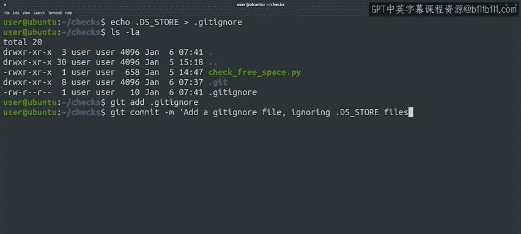

#  020：Git文件删除、重命名与忽略 🗑️📁


在本节课中，我们将学习如何使用Git管理文件的生命周期，包括删除不再需要的文件、重命名文件以及设置规则忽略特定文件，以保持仓库的整洁。

---

## 删除文件

上一节我们介绍了如何添加和提交文件。本节中，我们来看看如何从Git仓库中删除文件。

假设你决定清理一些旧脚本，并希望将它们从仓库中移除。或者，你进行了一些重构，使得某个特定文件变得过时。你可以使用 `git rm` 命令从仓库中删除文件。该命令会停止Git对该文件的跟踪，并将其从Git目录中移除。

文件夹的删除遵循相同的工作流程，因此你需要编写提交信息，说明删除的原因。

让我们在包含一个我们决定不再需要的文件的`checks`仓库中尝试此操作。

以下是操作步骤：

1.  首先使用 `ls` 查看目录内容。
2.  然后使用 `git rm` 删除文件。
3.  再次使用 `ls` 检查内容。
4.  最后使用 `git status` 检查状态。

```bash
ls
git rm old_script.py
ls
git status
```

我们看到，通过调用 `git rm`，文件从目录中被删除，并且此更改已暂存，准备在下次提交中提交。

现在，我们通过调用 `git commit` 并设置一条消息来提交，表明我们删除了不需要的文件。

```bash
git commit -m "删除不再需要的旧脚本文件"
```

与往常一样，提交时会得到一堆统计信息。请注意它报告的所有删除内容。这些都是文件中不再存在的行，并且它声明文件本身已被删除。

---

## 重命名文件

接下来，我们探讨如何管理文件名。如果一个文件的名称不准确怎么办？例如，你可能开始编写一个你认为只做一件事的脚本，但后来它扩展到了更多用例。或者相反，如果你命名脚本时认为它会非常通用，但结果却更具体。你可以使用 `git mv` 命令来重命名仓库中的文件。

让我们将现有的脚本重命名为 `check_freespace.py`，然后查看 `git status` 对此有何说明。

```bash
git mv check.py check_freespace.py
git status
```

状态显示文件已被重命名，并清晰地显示了旧名称和新名称。与前面的示例一样，更改已暂存但未提交。让我们再次调用 `git commit` 来提交它。

```bash
git commit -m "将 check.py 重命名为 check_freespace.py"
```

`git mv` 命令的工作方式类似于Linux上的 `mv` 命令，因此既可用于重命名，也可用于移动文件。如果我们的仓库中包含更多目录，我们可以使用相同的 `git mv` 命令在目录之间移动文件。

---

## 使用 .gitignore 忽略文件

从我们的示例中你可能已经看出，`git status` 的输出是一个非常有用的工具，可以帮助我们了解文件的状态。它显示哪些文件有已跟踪或未跟踪的更改，以及哪些文件被添加、修改、删除或重命名。保持这些命令的输出与我们正在做的事情相关非常重要。

如果我们有一长串未跟踪的文件，可能会在杂乱的输出中遗漏重要的更改。如果有由我们的脚本自动生成的文件，或者操作系统生成了我们不希望放入仓库的产物，我们将希望忽略它们，以免它们给 `git status` 的输出增加干扰。

为此，我们可以使用 `.gitignore` 文件。在这个文件中，我们将指定规则来告诉Git为当前仓库跳过哪些文件。

例如，如果我们在OSX计算机上工作，我们可能希望忽略由操作系统自动生成的 `.DS_Store` 文件。为此，我们将创建一个包含此文件名的 `.gitignore` 文件。

> 请记住，在类Unix文件系统中，点号（.）前缀表示文件或目录是隐藏的，执行正常的目录列表时不会显示。这就是为什么我们必须使用 `ls -la` 来查看所有文件。

以下是 `.gitignore` 文件的内容示例：

```
.DS_Store
*.log
__pycache__/
```

我们已经将 `.gitignore` 文件添加到我们的仓库中，但尚未提交。这个文件需要像仓库中的其他文件一样被跟踪。现在让我们添加并提交它。



```bash
git add .gitignore
git commit -m "添加 .gitignore 文件以忽略系统文件和日志"
```

---

## 总结

本节课中我们一起学习了Git中管理文件的几个关键操作。我们掌握了如何使用 `git rm` 命令删除文件并提交删除操作，如何使用 `git mv` 命令重命名或移动文件，以及如何创建和配置 `.gitignore` 文件来忽略不需要跟踪的特定文件或模式，从而保持仓库的清晰和 `git status` 输出的简洁。这些技能对于维护一个干净、高效的代码仓库至关重要。