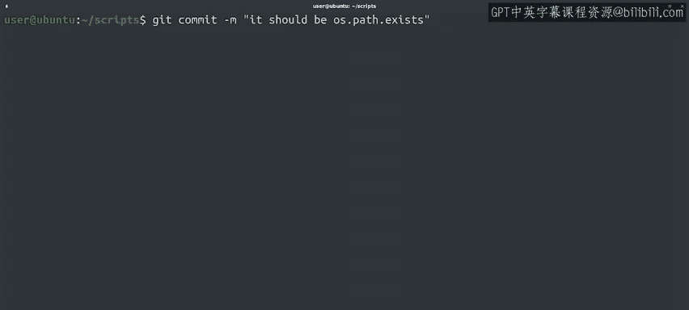

#  021：在提交前撤消更改 🔄

在本节课中，我们将学习如何使用Git来撤消尚未提交的更改。这是版本控制系统最强大的功能之一。我们将探讨几种不同的技术，具体取决于我们需要撤消哪些更改，并了解每种方法的使用场景。

---

能够回滚更改是版本控制系统提供的最强大功能之一。根据我们需要撤消的更改类型，有多种不同的技术可供使用。在本视频及接下来的几个视频中，我们将讨论Git中回滚更改的最常见方法以及每种方法的适用时机。

例如，您可能会遇到这样的情况：您对一个文件进行了一系列更改，但后来决定不想保留这些更改。您可以使用 `git checkout` 命令，后跟要还原的文件名，将文件恢复到其先前的提交状态。

让我们使用我们的 `scriptris` 仓库来尝试一下。

我们将编辑 `all_checks.py` 脚本并删除 `check_reboot` 函数，然后保存并返回命令行。很好，我们已经完成了更改。

让我们运行脚本看看会发生什么。糟糕。🤢 删除该函数后，我们实际上破坏了脚本。让我们看看 `git status` 对此有何说法。

正如预期的那样，我们看到文件已被修改，并且更改尚未暂存。请注意Git如何为我们提供一些关于现在该做什么的有用提示。我们可以运行 `git add` 来暂存更改，或者运行 `git checkout` 来丢弃它们。

如果您需要帮助记住这个命令的作用，可以这样想：您正在从最新存储的快照中检出原始文件。现在让我们这样做。

我们将检出原始文件，然后查看 `git status` 对其有何说法，最后重新运行我们的脚本。

哎呀，看起来我们有一个拼写错误。让我们返回并修复它。完成。

通过这个例子，我们演示了如何在更改被暂存之前，使用 `git checkout` 来还原对已修改文件的更改。此命令会将文件恢复到最新存储的快照，该快照可以是已提交的或已暂存的。因此，如果您在暂存文件后又对其进行了其他更改，您可以将文件恢复到较早的暂存版本。

如果您需要检出单个更改而不是整个文件，可以使用 `-p` 标志来实现。这将逐个更改地询问您是否要恢复到先前的快照。

好的，关于撤消未暂存的更改就讲到这里。如果您已经将更改添加到暂存区了怎么办？

别担心，如果我们意识到将一些实际上不想提交的内容添加到了暂存区，我们可以使用 `git reset` 命令来取消暂存我们的更改。

暂存我们实际上不打算提交的更改是常有的事，特别是当我们使用像 `git add *` 这样的命令时，其中 `*` 是bash中使用的文件通配模式，会扩展为所有文件。此命令最终会将工作树中完成的任何更改添加到暂存区。虽然有时这可能是我们想要的，但也可能导致一些意外情况。

让我们用一个例子来试试。首先，我们假装正在尝试调试脚本中的一个问题。为此，我们创建了一个包含脚本输出的临时文件。然后，我们将使用 `git add *` 添加工作树中所有未暂存的更改，最后使用 `git status` 检查状态。

我们可以看到，这个本应用于调试的临时输出文件现在已被暂存到我们的仓库中，但我们并不想提交它。方便的是，`git status` 命令在输出中直接告诉我们如何取消暂存该文件。示例输出中提到了 `HEAD` 别名。还记得它的含义吗？没错，它就是当前检出的快照。因此，通过运行建议的命令，我们将把更改重置为当前快照中的内容。让我们试试看。

该文件在我们的工作树中再次变为未跟踪状态，并且不再被暂存。

您可以将 `reset` 视为 `add` 的对应操作。使用 `add`，您可以将更改添加到暂存区；使用 `reset`，您可以从暂存区移除更改。您还可以使用 `git reset -p` 让Git询问您想要重置哪些特定的更改。

但是，等等，让我们记得提交我们的拼写错误修复。

---

通过以上内容，我们已经了解了如何还原未暂存和已暂存的更改。但是，如果您已经创建了一个包含想要撤消的更改的提交，该怎么办呢？这是一个很好的问题，我们将在下一个视频中探讨。

---

**本节课总结**

在本节课中，我们一起学习了如何在Git中撤消提交前的更改。我们掌握了两个关键命令：
*   使用 **`git checkout <文件名>`** 来丢弃工作区中对文件的修改，将其恢复到最近一次暂存或提交的状态。
*   使用 **`git reset HEAD <文件名>`** 来将已暂存但未提交的更改移出暂存区，使其变回未暂存状态。

我们还了解到，可以通过为这些命令添加 `-p` 标志来进行更精细的、逐个更改的交互式操作。这些技能对于在提交前清理工作区和修正错误至关重要。