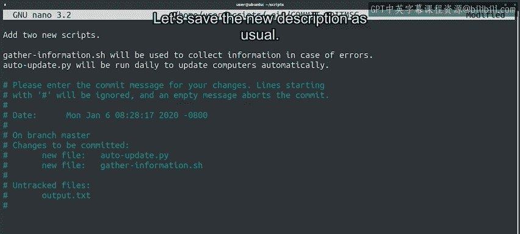

#  022：修改提交 ✏️


在本节课中，我们将学习如何使用Git的 `--amend` 选项来修改最近一次提交的内容或提交信息。这对于修正遗漏的文件或改进提交描述非常有用。

## 概述

通常，我们努力确保提交包含所有正确的更改和描述。但人难免犯错，开发者和IT专家时常会发现最近的提交中存在错误。因此，了解如何采取行动并修复这些错误至关重要。

## 修改提交的场景

假设你刚刚完成了最新一批工作的提交，但忘记添加一个属于同一更改的文件。你希望更新提交以包含该更改。或者，文件是正确的，但你意识到提交信息描述得不够充分，想修复描述以添加指向该提交所解决错误的链接。这时该怎么办？

我们可以使用 `git commit --amend` 命令来解决这类问题。

## 使用 `git commit --amend`

当我们运行 `git commit --amend` 时，Git会获取当前暂存区中的所有内容，并运行Git提交工作流程来覆盖之前的提交。

让我们通过一个例子来看看。我们将进入脚本目录，使用 `touch` 命令创建两个新文件，然后使用 `ls` 列出目录内容，添加我们的Python脚本，并提交它，声称我们添加了两个文件。

```bash
cd scripts
touch script1.py script2.py
ls
git add script1.py
git commit -m "Added two files"
```

如你所见，Git打印的消息显示只添加了一个文件。我们的提交信息说添加了两个文件，但我们忘记添加其中一个。别慌，我们可以修复它。

## 修正遗漏的文件

我们首先添加遗漏的文件，然后修改我们的提交。

```bash
git add script2.py
git commit --amend
```

我们调用了 `git commit --amend`，随后一个编辑器打开，显示了我们正在处理的提交信息和提交统计信息。此提交的已添加文件列表现在包含了我们想要添加的两个文件。

## 改进提交信息



现在文件已添加，我们还可以改进初始的提交信息，它原本有点简短。我们将保留现有的描述作为提交的第一句，然后添加一行描述每个文件的预期用途。

完成这些后，我们的提交就准备好被修改了。像往常一样保存新的描述。

## 仅修改提交信息

你也可以仅通过运行 `git commit --amend` 命令来更新前一次提交的信息，而无需更改暂存区的内容。

## 重要注意事项

虽然 `git --amend` 适用于修复本地提交，但你不应将其用于公共提交，即那些已推送到公共或共享仓库的提交。这是因为使用 `--amend` 会重写Git历史，移除之前的提交并用修改后的提交替换它。在与他人合作时，这可能导致一些混乱的情况，应绝对避免。

所以请记住：使用 `amend` 修复本地提交是很好的，你可以在修复后将其推送到共享仓库，但应避免修改已经公开的提交。如果现在听起来有些困惑，别担心，我们将在讨论通过共享仓库与他人协作时再次提及。

## 总结

本节课中，我们一起学习了如何修复暂存和非暂存的更改，以及如何修复不完整的提交。我们介绍了 `git commit --amend` 命令的使用方法和适用场景，并强调了其仅适用于本地提交的重要限制。

接下来，我们将讨论如果遇到需要完全回滚的错误提交时该怎么办。