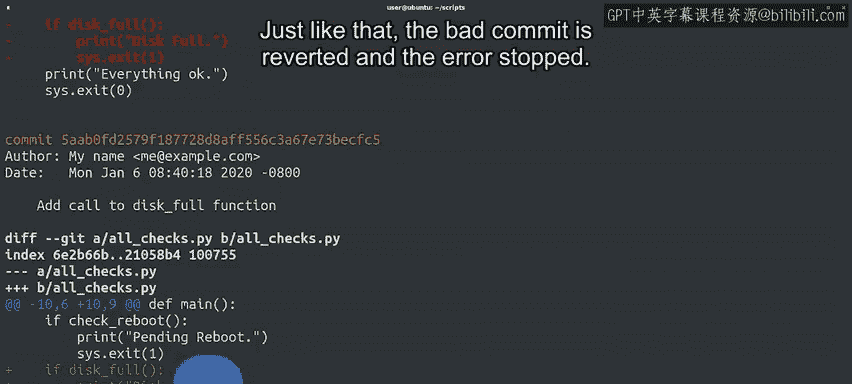

#  023：Git回滚操作详解 🔄

在本节课中，我们将学习如何使用Git的`revert`命令来回滚已提交的更改。我们将了解回滚的原理、具体操作步骤，以及它如何帮助我们在不破坏项目历史记录的情况下修复错误。

---

在提交前修复工作内容是理想的做法，但如果更改已经被Git快照记录了，该怎么办？

假设你在公司服务器上托管了一个Git仓库，其中包含你和同事使用的各种有用的自动化脚本。

某个早晨，在喝咖啡之前，你对其中一个脚本做了一些修改，并提交了更新后的文件。

几小时后，你开始收到用户提交的工单，指出脚本的某些部分出现了故障。

根据他们描述的错误信息，问题似乎与你最近的更改有关。

你可以查看更新的代码，尝试找出错误所在。

但工单数量不断增加，你需要尽快修复问题。

你决定是时候进行回滚操作了。

---

## 回滚的方法与原理

有多种方法可以回滚提交。目前，我们将重点介绍使用`git revert`命令。

`git revert`并不仅仅意味着“撤销”。相反，它会创建一个新的提交，其中包含了错误提交中所做所有更改的**反向操作**，以此来抵消它们。

例如，如果在错误的提交中添加了某一行代码，那么在还原提交中，同一行代码将被删除。

这样，你就能达到撤销更改的效果，同时项目的提交历史记录保持一致，完整地记录了所发生的一切。

因此，`git revert`会创建一个新的提交，该提交与给定提交中的所有内容相反。

我们可以使用之前提到的`HEAD`别名来还原最新的提交，因为我们可以将`HEAD`视为指向你当前提交快照的指针。

当我们向`revert`命令传递`HEAD`时，我们是在告诉Git回退那个当前提交。

---

## 实践操作：添加并回滚错误提交

为了验证这一点，我们首先在我们的示例仓库中添加一个有错误的提交。

好的，我们已经在脚本中添加了一些代码。让我们保存并提交这个更改。

现在，我们的代码已经提交了。我们甚至没有测试它，这是一个坏主意。如果你在实际操作中这样做，可能已经发现了我们代码中的问题。

此时，我们的用户开始提交工单，说功能损坏了。于是我们运行脚本来看看发生了什么。

糟糕。我们调用了一个忘记定义的函数。

好的，是时候回滚了。让我们通过输入`git revert HEAD`来清除这段有问题的代码。

---

## 执行回滚命令

一旦我们发出`git revert`命令，就会看到之前见过的文本编辑器提交界面。

在这种情况下，我们可以看到Git已经自动在提交信息中添加了一些文本，表明这是一个回滚操作。第一行提到它正在还原我们刚刚完成的名为“add call to disk Full function”的提交。

额外的描述甚至包括了被还原提交的标识符。

虽然我们可以直接使用这个描述，但通常最好添加一个解释，说明我们为什么要进行回滚。

请记住，这些描述的目的是帮助我们未来的自己理解事情发生的原因。在本例中，我们将解释回滚的原因是代码调用了一个未定义的函数。

输入完描述后，我们可以像往常一样退出并保存。

---

## 检查回滚结果

你会注意到，`git revert`命令的输出看起来与`git commit`命令的输出相似。

这是因为`git revert`为我们创建了一个提交。由于我们的还原是一个普通的提交，我们可以在日志中看到原始提交和还原提交。

让我们使用`-p`和`-2`作为参数来查看日志中的最后两个条目。

如前所述，`-p`参数让我们可以看到提交创建的补丁，而`-2`参数将输出限制在最后两个条目。

在这个日志中，我们可以看到，当我们调用`revert`时，Git创建了一个新的提交，它是前一个提交的反向操作。这删除了我们在前一个提交中添加的行。

我们可以看到，原始提交通过前面的加号显示了我们添加的行。同样的行在较新的提交信息中显示为减号，表明它们已被删除。

就这样，错误的提交被还原了，错误也随之停止。

---

## 总结与展望

在本例中，我们还原了仓库中的最新提交。

但如果我们需要还原更早的提交呢？

准备好你的时间机器，因为在下一个视频中，我们将进行更大幅度的时光倒流。

---

本节课中，我们一起学习了`git revert`命令的核心概念和操作流程。我们了解到回滚是通过创建一个反向提交来安全地撤销更改，从而保留了完整且清晰的项目历史。记住，清晰的提交信息对于未来的维护至关重要。