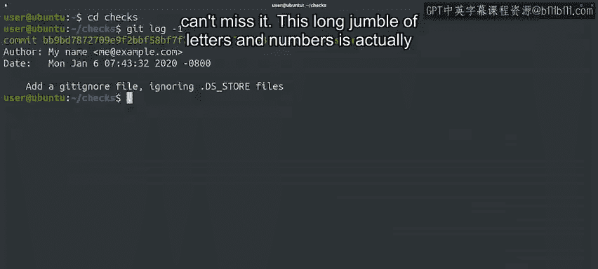
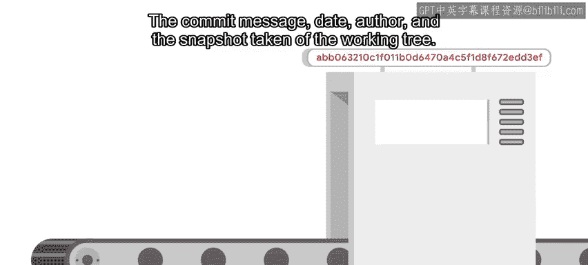
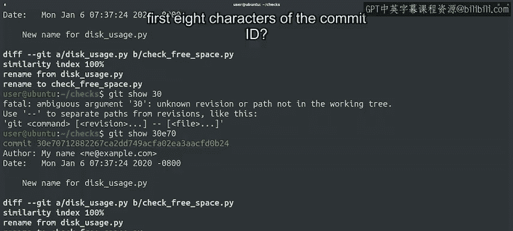

#  024：Git提交识别与回滚 🎯

在本节课中，我们将学习如何识别Git历史中的特定提交，并使用提交ID来回滚到过去的某个版本。我们将了解提交ID的生成原理及其重要性，并掌握回滚非最近提交的操作方法。

## 概述

到目前为止，我们使用 `HEAD` 别名来指定Git历史中最近检出的提交。在我们的错误快照示例中，错误恰好发生在最近创建的提交中。但错误有时可能需要一段时间才能被发现，因此我们可能需要回滚更早的提交。我们可以通过使用提交ID来定位特定的提交。

## 提交ID与哈希算法

我们已经多次看到提交ID。它们在我们运行 `git log` 命令时出现，并且我们在上一个例子中也看到了被回滚提交的ID。提交ID是日志消息中“commit”一词后出现的复杂字符串。让我们查看一下我们checks仓库中的最新日志条目。

提交ID是“commit”一词后的40个字符长的字符串。你肯定不会错过它。

这个由字母和数字组成的长字符串实际上是一种称为“哈希”的东西，它是使用名为SHA1的算法计算得出的。本质上，该算法接收一堆数据作为输入，并从这些数据中生成一个40个字符的字符串作为输出。

在Git中，输入是与提交相关的所有信息，而40个字符的字符串就是提交ID。像SHA1这样的加密算法可能非常复杂，因此我们不会深入探讨其含义。如果你感兴趣，可以在接下来的阅读材料中找到更多信息的链接。

然而，你可能会想，为什么使用一长串混乱的字母作为提交的ID，而不是像1、2、3那样递增一个整数？为了回答这个问题，让我们快速看一下Git使用哈希而不是计数器的原因，以及该哈希是如何计算的。

尽管SHA1属于加密哈希函数类别，但Git并不真正将这些哈希用于安全目的，而是用它们来保证我们仓库的一致性。

拥有一致的数据意味着我们得到的结果与预期完全一致。引用Git的创建者Linus Torvalds的话：“你可以验证你取回的数据与你放入的数据完全相同。”这在像Git这样的分布式系统中非常有用，因为每个人都有自己的仓库，并且传输自己的数据片段。

计算哈希可以保持数据的一致性，因为它是根据构成提交的所有信息计算得出的：提交消息、日期、作者以及工作树的快照。两个不同的提交产生相同哈希（通常称为“碰撞”）的几率极小，小到几乎不可能偶然发生。

需要大量的处理能力才能故意使这种情况发生。如果你使用哈希来保证一致性，那么如果不改变SHA1哈希，你就无法更改Git提交中的任何内容。

还记得我们关于使用 `git commit --amend` 命令修复提交的讨论吗？每次我们修改提交时，提交ID都会改变。这就是为什么在已公开的提交上不使用 `--amend` 很重要的原因。

提交ID提供的数据完整性意味着，如果坏的磁盘或网络链路损坏了你仓库中的某些数据，或者更糟的是，如果有人故意损坏某些数据，Git可以使用哈希来发现这种损坏。它会说：“你得到的数据不是你期望的数据。出错了。”谢谢你，Git侦探。你又一次拯救了这一天。

好了，背景故事讲得够多了。你如何使用提交ID来指定要处理的特定提交，比如在回滚期间？让我们使用 `git log -2` 命令查看我们仓库中的最后两个条目。

## 识别与回滚特定提交

假设我们意识到我们实际上喜欢脚本的旧名称，因此我们想要回滚重命名它的那个提交。首先，让我们使用之前视频中提到的 `git show` 命令查看那个特定的提交。

我们复制并粘贴了我们想要显示的提交ID，这很有效。或者，我们可以只提供标识提交的前几个字符给命令，Git将足够智能地猜测哪个提交ID以这些字符开头。只要只有一个匹配的可能性，让我们试试这个。两个字符不够，但通常四到八个字符就足够了。

现在我们已经看到了如何识别我们想要回滚的提交，让我们用这个标识符调用 `git revert` 命令。像往常一样，这将打开一个编辑器，我们应该在其中添加回滚的原因。在这种情况下，我们会说之前的名字实际上更好。为反复无常欢呼吧。

正如我们之前提到的，当我们生成回滚时，Git会自动包含我们正在回滚的提交的ID。这在查看包含大量提交的复杂历史的仓库时非常有用。

现在，一旦我们保存并退出提交消息，它实际上将执行回滚并生成一个具有自己ID的新提交。看到在我们提交的名称之前，`revert` 命令已经显示了提交ID的前八个字符。让我们使用 `git show` 来查看它。

## 总结

在本节课中，我们一起学习了如何通过提交ID来精确定位Git历史中的特定提交。我们了解到提交ID是一个由SHA1算法生成的40位哈希值，它保证了仓库数据的完整性和一致性。我们还实践了使用 `git show` 和 `git revert` 命令来查看和回滚非最近的提交。

以下是本课涉及的核心命令回顾：

*   **`git log`**：查看提交历史，获取提交ID。
*   **`git show <commit_id>`**：显示特定提交的详细信息。
*   **`git revert <commit_id>`**：回滚指定的提交，并创建一个新的反向提交。

我们已经成功回滚了一个并非最近的提交。干得好，时间旅行者们。

在过去的几个视频中，我们涵盖了许多撤销操作和修复错误的方法，无论是取消暂存更改、暂存更改、修改提交还是回滚更改。如果还有什么不清楚的地方，现在是在本地计算机上练习这些命令的好时机。尝试操作，并想出更多你想要测试的用例示例。

接下来，我们准备了一个方便的速查表，总结了我们刚刚涵盖的所有内容。当你准备好时，请继续下一个测验，将所有新知识付诸实践。

我们在过去的几个视频中学到了很多复杂的东西，所以一旦你完成了那个测验，你应该奖励自己休息一下，以度过这些技术细节。这是你应得的。喝杯咖啡、茶或吃点零食，让这些概念沉淀一下。我们下一个视频见。