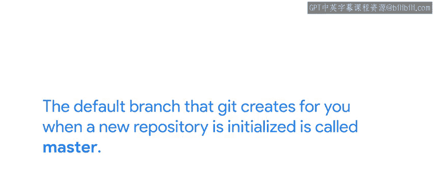
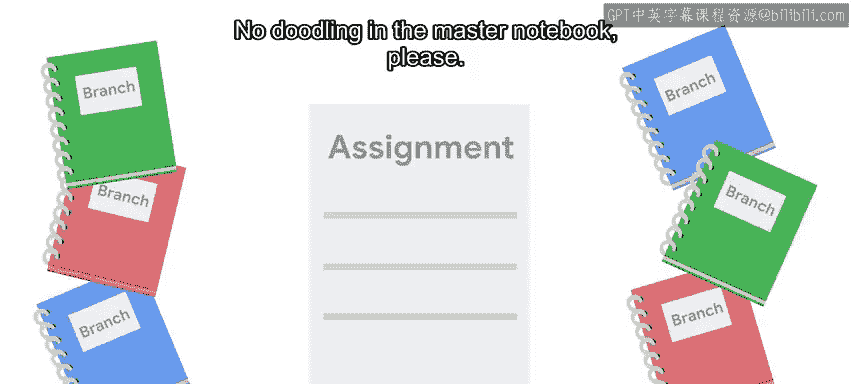

#  025：什么是Git分支？ 🌿

在本节课中，我们将深入学习Git中一个核心概念——分支。我们将探讨分支是什么、为什么使用分支，以及它如何帮助我们在项目中安全地进行并行开发和实验。

---

到目前为止，我们只是简要提及过分支。你可能在提交信息中看到过“on branch master”这段文字，或者记得我们在讨论HEAD指针时提到过分支。

分支是Git工作流程的重要组成部分。因此，在接下来的视频中，我们将深入探讨分支。

那么，什么是分支？分支有什么用？在最基本的层面上，Git分支只是一个指向特定提交的指针。

但更重要的是，它代表了项目中的一个独立开发线，而它所指向的提交正是这条开发历史链中的最新一环。

当初始化一个新仓库时，Git为你创建的默认分支叫做 **master**。

到目前为止，我们所有的示例和开发工作都发生在这个分支上。master分支通常用于代表项目的“已知良好”状态。

当你想在项目中开发一个新功能或尝试一些新东西时，你可以创建一个独立的分支来进行工作，而不用担心破坏当前的工作状态。

如果这听起来令人困惑，也许一个类比会有所帮助。你可以把一个Git项目想象成课堂上老师布置的作业。你在一组笔记本上完成作业，每个笔记本代表一个不同的分支。

你使用一些笔记本来草草记下草稿和实验，但你保持一个笔记本——即master分支——处于整洁状态，并将这些草稿的完善版本复制进去。

请不要在master笔记本上涂鸦。

分支使得在项目中尝试新想法或策略变得非常容易。

当你想添加功能或修复某些东西时，你可以创建一个新分支并在那里进行开发。当你得到满意的结果时，可以将其合并回master分支；如果尝试不成功，也可以丢弃更改而不会产生负面影响。

在Git中，分支作为正常开发工作流程的一部分被频繁使用。

举个例子，回想一下我们在之前视频中修复的那个有问题的提交：我们添加了对`disk_full`函数的调用，但忘记实际定义这个函数。因此我们不得不回滚它，因为用户看到了错误。

以我们现在所学的知识来看，我们本可以在一个独立的分支上完成那项工作，也许可以命名为类似 **add_disc_full** 的分支。

那样的话，我们就可以在那个分支上迭代我们的代码，直到它正确工作，而不会影响master分支。只有在代码准备好部署时，我们才会将这些更改合并回master分支。

在接下来的几个视频中，我们将学习如何创建新分支以及如何将其内容合并到master分支。我们还将介绍如果遇到棘手的合并冲突该怎么办。

请注意，接下来的内容会变得相当复杂，因此请确保在你的计算机上跟随我们所有的练习，并持续练习，尝试使用分支和合并的新方法，直到你对我们展示的每个步骤都感到得心应手。

---

**本节课总结**

在本节课中，我们一起学习了Git分支的核心概念。我们了解到分支本质上是一个指向提交的指针，它代表了一条独立的开发线。master分支是默认的“稳定”分支，而创建新分支允许我们安全地实验和开发新功能，而不会干扰主线的稳定状态。理解分支是掌握高效、协作式Git工作流的关键一步。