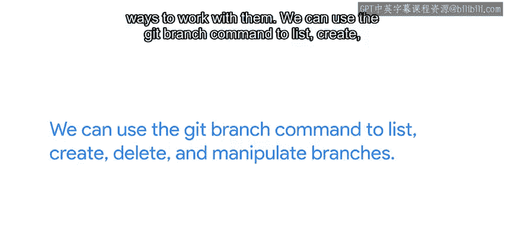
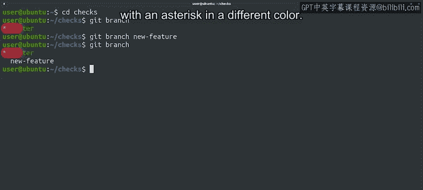
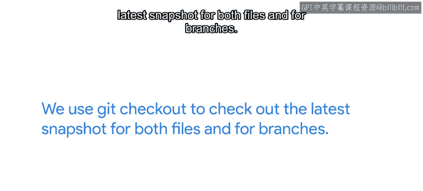
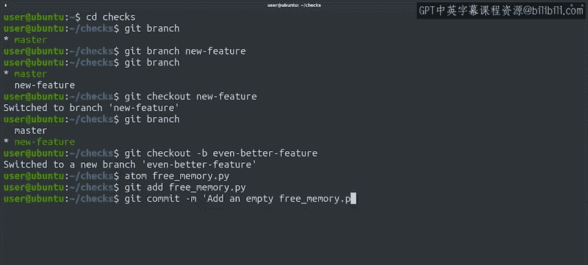

#  026：Git分支操作入门 🎯

在本节课中，我们将学习Git中一个核心概念——分支。我们将了解如何创建、切换分支，以及如何在分支上进行独立的开发工作。分支是多人协作和功能开发的基础，掌握它是高效使用Git的关键。

## 分支的重要性与基本操作

上一节我们介绍了Git的基本概念，本节中我们来看看如何实际操作分支。分支在Git的工作流程中至关重要，因此存在多种操作方式。我们可以使用 `git branch` 命令来列出、创建、删除和管理分支。直接运行 `git branch` 命令会显示仓库中所有分支的列表。

让我们在 `checks` 仓库中尝试一下。目前我们的列表看起来相当空，但别担心，创建分支非常简单。我们通过调用 `git branch` 加上新分支的名称来创建。

以下是创建并列出分支的步骤：
1.  创建一个名为 `new_feature` 的新功能分支。
2.  再次使用 `git branch` 列出所有分支。

我们的新分支是基于 `HEAD` 的值创建的。请记住，这不一定是 `master` 分支。我们得到的列表显示我们仍然在 `master` 分支上。我们可以分辨出来，因为当前分支在命令输出中用一个星号（通常以不同颜色显示）来指示。

## 切换分支

我们稍后会探讨 `git branch` 命令允许我们对分支进行的其他操作，但现在我们想切换到一个新分支。为此，我们需要使用 `git checkout` 命令。我们之前看到过如何使用 `git checkout` 将修改的文件恢复到最新提交的状态。

检出分支在原理上是相似的，工作树会被更新以匹配所选分支，包括文件和Git历史记录。如果一开始觉得有点困惑，这很正常。我最初也觉得难以理解。但请放心，在我们使用这些命令一段时间后，它会变得更清晰。记住我们使用 `git checkout` 来检出文件和分支的最新快照，这可能会有所帮助。

好的，让我们通过调用 `git checkout new_feature` 切换到我们的新功能分支，然后再次列出我们的分支。之前我们在 `master` 分支上工作，但现在我们切换到了新分支，星号已经移到了 `new_feature`。

## 高效创建并切换分支

创建分支并立即切换到它是一个非常常见的任务，常见到Git为我们提供了一个有用的快捷方式，可以用一个命令创建新分支并切换到它。我们可以使用 `git checkout -b <new_branch>` 来做到这一点。

请看，消息显示我们已经切换到了一个新分支。我们仅用一个命令就创建了新分支并切换到它，非常高效，对吧？

## 在新分支上工作

现在我们已经有了闪亮的新分支，让我们在其中创建一个新文件。我们将创建一个新的Python 3文件，它将包含常用的 `shebang` 行、一个空的 `main` 函数以及对该函数的调用。

这个文件是空的，因为它只是我们工作的开始。由于它在一个独立的分支中，尚未完成是可以的。现在让我们保存文件并将其提交到当前分支。

好的，我们已经在这个分支中添加了一个提交，情况看起来更好了。让我们检查日志中的最后两个条目。我们看到这个分支中的最后两次提交，请注意在最新提交ID旁边，Git显示这是 `HEAD` 指向的位置，并且该分支名为 `even_better_feature`。而在前一次提交旁边，Git显示 `master` 和 `new_feature` 分支都指向该项目的快照。通过这种方式，我们可以看到 `even_better_feature` 分支领先于 `master` 分支。

## 总结

本节课中我们一起学习了如何在Git中创建新分支、使用 `git checkout` 切换分支，以及利用 `git checkout -b` 快捷方式一步完成创建和切换。我们还实践了在独立分支上进行开发并提交更改。通过这些操作，我们看到了分支如何允许我们在不影响主线代码的情况下并行开发新功能。你的分支知识已经打下了坚实的基础。接下来，我们将学习更多关于操作分支的内容，敬请期待。